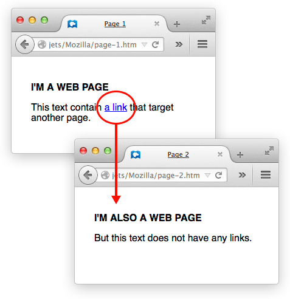

> Hyperlinks, usually called links, are a foundational concept behind the Web. To explain what links are, we need to step back to the very basics of Web architecture.

Back in 1989, Tim Berners-Lee, the Web's inventor, spoke of the three pillars on which the Web stands:

- [URL](https://developer.mozilla.org/en-US/docs/Glossary/URL), an address system that keeps track of Web documents
- [HTTP](https://developer.mozilla.org/en-US/docs/Glossary/HTTP), a transfer protocol to find documents when given their URLs
- [HTML](https://developer.mozilla.org/en-US/docs/Glossary/HTML), a document format allowing for embedded hyperlinks

Everything on the Web revolves around documents and how to access them. The Web's original purpose was to provide an easy way to reach, read, and navigate through text documents. Since then, the Web has evolved to provide access to images, videos, and binary data, but these improvements have hardly changed the three pillars.

Before the Web, it was quite hard to access documents and move from one to another. Being human-readable, URLs already made things easier, but it's hard to type a long URL whenever you want to access a document. This is where hyperlinks revolutionized everything. Links can correlate any text string with a URL, such that the user can instantly reach the target document by activating the link.

Links stand out from the surrounding text by being underlined and in blue text. Tap or click a link to activate it, or if you use a keyboard, press Tab until the link is in focus and hit Enter or Spacebar.

As we said, a link is a text string tied to a URL, and we use links to allow easy jumping from one document to another. That said, there are some nuances worth considering:

### Types of links

- [Internal link](https://developer.mozilla.org/en-US/docs/Learn_web_development/Howto/Web_mechanics/What_are_hyperlinks#internal_link)

A link between two webpages, where both webpages belong to the same website, is called an internal link. Without internal links, there's no such thing as a website (unless, of course, it's a one-page website).

- [External link](https://developer.mozilla.org/en-US/docs/Learn_web_development/Howto/Web_mechanics/What_are_hyperlinks#external_link)

A link from your webpage to someone else's webpage. Without external links, there is no Web, since the Web is a network of webpages. Use external links to provide information besides the content available through your webpage.

- [Incoming links](https://developer.mozilla.org/en-US/docs/Learn_web_development/Howto/Web_mechanics/What_are_hyperlinks#incoming_links)

A link from someone else's webpage to your site. It's the opposite of an external link. Note that you don't have to link back when someone links to your site.

When you're building a website, focus on internal links, since those make your site usable. Find a good balance between having too many links and too few. We'll talk about designing website navigation in another article, but as a rule, whenever you add a new webpage, make sure at least one of your other pages links to that new page. On the other hand, if your site has more than about ten pages, it's counter-productive to link to every page from every other page.

✏️ _When you're starting out, you don't have to worry about external and incoming links as much, but they are very important if you want search engines to find your site (see below for more details)._

### Anchors

Anchors
Most links tie two webpages together. Anchors tie two sections of one document together. When you follow a link pointing to an anchor, your browser jumps to another part of the current document instead of loading a new document. However, you make and use anchors the same way as other links.

### Links and Search Engines

Links matter both to users and search engines. Every time search engines crawl a webpage, they index the website by following the links available on the webpage. Search engines not only follow links to discover the various pages of the website, but they also use the link's visible text to determine which search queries are appropriate for reaching the target webpage.

Links influence how readily a search engine will link to your site. The trouble is, it's hard to measure search engines' activities. Companies naturally want their sites to rank highly in search results. We know the following about how search engines determine a site's rank:

- A link's visible text influences which search queries will find a given URL.
- The more incoming links a webpage can boast of, the higher it ranks in search results.
- External links influence the search ranking both of source and target webpages, but it is unclear by how much.

[SEO](https://en.wikipedia.org/wiki/Search_engine_optimization) (search engine optimization) is the study of how to make websites rank highly in search results. Improving a website's use of links is one helpful SEO technique.

📖 _read more on [What_are_hyperlinks?](https://developer.mozilla.org/en-US/docs/Learn_web_development/Howto/Web_mechanics/What_are_hyperlinks)_