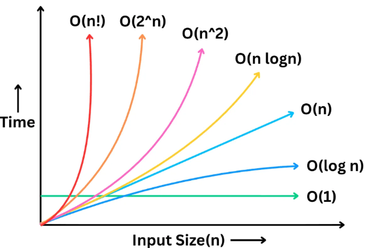

> **Big O Notation** is a way to measure how efficiently your code performs as the input size grows.

You’ve probably seen code that works perfectly on **small inputs** but **slows down**, **crashes**, or **times out** when the input becomes large.

Understanding `Big O` helps you avoid slow, inefficient solutions and write code that actually scales.



It’s also one of the most important topics in coding interviews.

You’ll almost always be asked to explain the time and space complexity of your solution and the more efficient your approach, the stronger your chances of passing the interview.

In this article, I’ll break down:

1. What Big O Notation actually means

2. The most common time complexities you’ll come across

3. What is space complexity

4. and rules to calculate Big O for any piece of code

## What is **Big O** ?

> `Big O` is a mathematical way to describe how the performance of an algorithm changes as the size of the input grows.

❌ It doesn’t tell you the exact time your code will take.

✅ Instead, it gives you a** high-level growth trend**, how fast the number of operations increases relative to the input size.

For example: if your input doubles, does your algorithm take twice as long? Ten times as long? Or does it barely change at all?

`Big O` helps you answer those questions without even running the code so you can choose the most efficient algorithm for large inputs.

📌 `Big O` is **machine-independent**.

It doesn’t matter whether your code runs on a fast laptop or a slow server, the growth pattern stays the same.

The key variable that drives `BIG O` is the input size `N`. As `N` increases, `Big O` helps you predict whether the algorithm will still be efficient or become impractical.

## Time Complexities

### Constant Time **O(1)**

- This is the fastest and most efficient time complexity.

- An algorithm is `O(1)` if it performs a fixed number of operations meaning the execution time does not depend on the size of the input.

  ```js:title=Accessing_An_Element_In_An_Array_By_Index
  a = [10, 20, 30, 40];

  let x = a[3];

  console.log(x);
  ```

- It doesn’t matter if the array has 10 elements…or 10 million, the time it takes to access an element stays exactly the same.

### Logarithmic Time **O(log n)**

- An algorithm runs in `O(log n)` time when every step reduces the problem size by a constant factor (most often, by half).

- This means the amount of work grows very slowly, even when the input becomes massive.

  ```js:title=Binary_Search
  binarySearch(a:number[], target:number):number {
      int lo = 0, hi = a.length - 1;

      while (lo <= hi) {
          int mid = lo + (hi - lo) / 2;
          if (a[mid] == target)
          return mid;
          if (a[mid] < target)
          lo = mid + 1;
          else
          hi = mid - 1;
      }
      return -1;
  }
  ```

- Each step discards 50% of the remaining data.

- To put that into perspective, here are the number of steps binary search takes for different input sizes.

  - Input size = 8 → max 3 steps
  - Input size = 1,000 → max 10 steps
  - Input size = 1,000,000 → max 20 steps
  - Input size = 1,000,000,000 → still just 30 steps!

### Linear Time **O(n)**

- An algorithm is `O(n)` when its running time grows directly in proportion to the size of the input.

- If the input doubles, the number of operations also doubles.

  ```js:title=Find_Max_In_An_Array
  findMax(array:number[]):number {
      let max = array[0];
      for (int i = 1; i < array.length; i++) {
          if (array[i] > max) {
              max = array[i];
          }
      }
      return max;
  }
  console.log(findMax([2,5,12,3,9,10])) //12
  ```

- You start with some initial max
- Then you scan every element and compare it to the current max
- Each comparison is O(1), but you do it n times so the overall time complexity becomes O(n).

So with 10 elements, you do 10 comparisons. With 1 million elements, you do 1 million comparisons.

Any algorithm that visits every element exactly once is linear time.

### Linearithmic Time **O(n log n)**

- Algorithms with `O(n log n)` time complexity combine two behaviors:

- A `log n` factor from repeatedly splitting the input

- An `n` factor from processing or merging the pieces

- It’s often described as **logarithmic splitting** with **linear merging**.

  ```js:title=Merge_Sort
  function merge(arr, left, mid, right) {
      const n1 = mid - left + 1;
      const n2 = right - mid;

      // Create temp arrays
      const L = new Array(n1);
      const R = new Array(n2);

      // Copy data to temp arrays L[] and R[]
      for (let i = 0; i < n1; i++)
          L[i] = arr[left + i];
      for (let j = 0; j < n2; j++)
          R[j] = arr[mid + 1 + j];

      let i = 0, j = 0;
      let k = left;

      // Merge the temp arrays back into arr[left..right]
      while (i < n1 && j < n2) {
          if (L[i] <= R[j]) {
              arr[k] = L[i];
              i++;
          } else {
              arr[k] = R[j];
              j++;
          }
          k++;
      }

      // Copy the remaining elements of L[], if there are any
      while (i < n1) {
          arr[k] = L[i];
          i++;
          k++;
      }

      // Copy the remaining elements of R[], if there are any
      while (j < n2) {
          arr[k] = R[j];
          j++;
          k++;
      }
  }

  function mergeSort(arr, left, right) {
      if (left >= right)
          return;

      const mid = Math.floor(left + (right - left) / 2);
      mergeSort(arr, left, mid);
      mergeSort(arr, mid + 1, right);
      merge(arr, left, mid, right);
  }

  // Driver code
  const arr = [38, 27, 43, 10];
  mergeSort(arr, 0, arr.length - 1);
  console.log(arr.join(" "));
  ```

- First, it recursively splits the array in half over and over. That’s the log n part.

- Then, it merges the sorted halves back together and that takes n steps in total.

Multiply those together and you get O(n log n).

This complexity is slightly slower than linear time, but still very efficient and it’s the backbone of many fast sorting algorithms

### Quadratic Time **O(n<sup>2</sup>)**

- In an `O(n²)` algorithm, the number of operations grows proportionally to the square of the input size. So if you have n elements, you perform roughly n × n operations.

- This typically happens when you have nested loops, where for each element you iterate over all other elements.

  ```js:title=NSquare
  class NSquare {
  nsquare(a) {
      const n = a.length;
      let pairSum = 0;

      for (let i = 0; i < n; i++) {
      for (let j = i + 1; j < n; j++) {
          pairSum += a[i] * a[j];
      }
      }

      return pairSum;
  }
  }

  // Example usage
  const obj = new NSquare();
  const arr = [1, 2, 3, 4];
  console.log("Pair sum:", obj.nsquare(arr));
  // Output: Pair sum: 35
  ```

Classic examples include simple sorting algorithms like:

- **Bubble Sort**
- **Selection Sort**
- **Insertion Sort** (worst case)

All of them compare or swap elements in nested loops, leading to `O(n²)` behavior.

These algorithms are fine for small inputs, but they become painfully slow as n grows:

For **n = 1000**, you’re doing around **1 million operations**. And if **n = 10,000**, you’re looking at **100 million operations**.

In coding interviews and wherever performance matters, you’ll often want to avoid `O(n²)` and look for ways to bring it down to **O(n log n) or better**.

### Exponential Time **O(2<sup>n</sup>)**

Exponential time algorithms usually appear when we try to solve a problem by c**hecking every possible combination** often through brute force or backtracking.

Think of it as the opposite of binary search: Instead of eliminating half the work at each step, you are often **doubling** the work with each extra input element.

This happens in problems where each element can branch into multiple recursive calls.

A classic example is generating all **subsets of a set** (also called the power set):

If the set has n elements, there are **2ⁿ** possible subsets.

That means, just for 30 elements, you’re looking at over **1 billion** possibilities. And for 40? Over **1 trillion**.:

- n = 20 → ~1 million possibilities
- n = 30 → ~1 billion possibilities
- n = 40 → ~1 trillion possibilities

This kind of growth becomes **unmanageable very quickly**. Even a small increase in n makes the runtime explode.

But the good news is that many exponential-time problems can be optimized using techniques like **memoization** or **dynamic programming**

These techniques prevent us from recomputing the same subproblems, often reducing the time from **O(2ⁿ)** down to a much more practical **polynomial time**, which makes the solution usable in real-world scenarios.

In general, exponential algorithms are fine only for **very small inputs**. For anything larger, you must either optimize or rethink the approach.

### Factorial Time **O(n!)**

And finally… we’ve reached the most explosive time complexity of them all: **Factorial Time**, or `O(n!)`

- This is what you get when an algorithm tries **every possible arrangement** of a set of **n** elements.

- The number of possibilities grows **faster than any other complexity** we’ve seen.

- By definition, **n!** (n factorial) means: **n** × **(n - 1)** × **(n - 2)** × ... × **1**, which means

  - 3! = 3 × 2 × 1 = 6
  - 5! = 120
  - 10! = 3.6 million
  - 15! = over 1 trillion

- Even at **n = 15**, the numbers are already in the **trillions** which makes it completely impractical to compute.

- A classic example of `O(n!)` is generating all permutations of a string.

  ```js:title=Permutation_Of_String
  // Generate all permutations using swap + backtracking
  function getPermutations(str) {
  const result = [];
  const arr = str.split(""); // convert string to array for easy swapping

  function backtrack(start) {
      // Base case: if we've fixed all positions, push the permutation
      if (start === arr.length - 1) {
      result.push(arr.join(""));
      return;
      }

      // Try each possibility for the current position
      for (let i = start; i < arr.length; i++) {
      // Swap current index with i
      [arr[start], arr[i]] = [arr[i], arr[start]];

      // Recurse on the next position
      backtrack(start + 1);

      // Backtrack: undo the swap
      [arr[start], arr[i]] = [arr[i], arr[start]];
      }
  }

  backtrack(0);
  return result;
  }

  // Example usage
  const input = "ABC";
  const permutations = getPermutations(input);

  console.log(`Permutations of "${input}":`);
  console.log(permutations);
  // Output: [ 'ABC', 'ACB', 'BAC', 'BCA', 'CBA', 'CAB' ]

  ```

If you have a string of length 10 and try to print every permutation, that’s already several million operations and increasing n by just 1 doubles or triples the workload instantly.

These kinds of brute-force solutions are mostly used for very small inputs. Instead, we rely on smarter techniques like **dynamic programming, branch and bound** , or heuristics to reduce the problem space.

## Space Complexity

**What it means**

- `Time complexity` → how fast an algorithm runs.
- `Space complexity` → how much extra memory it uses beyond the input.
- Important in interviews: analyze both `speed` and `memory`.

**Sources of extra memory**

- Temporary data structures (arrays, hash maps, stacks, queues).
- Recursion call stack frames.
- Intermediate buffers during computation

### Constant Space **O(1)**

Key Points to Remember

- `swap` is a utility function to exchange two elements in an array.
- Uses `destructuring` assignment for concise syntax.

  ```js:title=In-place_swap
  function swap(arr, i, j) {
  [arr[i], arr[j]] = [arr[j], arr[i]];
  }

  let numbers = [10, 20, 30, 40];
  swap(numbers, 1, 3); // swap elements at index 1 and 3
  console.log(numbers);
  ```

- swapping is often used in sorting and permutation generation as below

  ```js:title=swap_used_in_bubble_sort
  function bubbleSort(arr) {
  for (let i = 0; i < arr.length; i++) {
    for (let j = 0; j < arr.length - i - 1; j++) {
        if (arr[j] > arr[j + 1]) {
            swap(arr, j, j + 1);
        }
    }
  }
  return arr;
  }

  console.log(bubbleSort([5, 3, 8, 4]));
  // Output: [3, 4, 5, 8]
  ```

### Logarithmic Space **O(log n)**

- Each recursive call adds a **stack frame** to memory.
- Binary search halves the array each time → recursion depth is about **log₂(n)**.
- So the extra memory used is proportional to the recursion depth, i.e. `O(log n)`.

  ```js:title=Recursive_BinarySearch
  function binarySearch(arr, target, left = 0, right = arr.length - 1) {
    if (left > right) return -1;
    const mid = Math.floor((left + right) / 2);

    if (arr[mid] === target)
        return mid;
    if (arr[mid] > target)
        return binarySearch(arr, target, left, mid - 1);

    return binarySearch(arr, target, mid + 1, right);
  }

  let arr = [3,9,10,27,38]
  let target = 9
  print(binarySearch(arr, target)) // 1
  ```

### Linear Space **O(n)**

- Suppose the input array has **n** elements.
- In the worst case, if half are even → about **n/2** elements stored in the new list.
- That still counts as `O(n)` space, because Big O ignores constant factors (½ is dropped).
- Extra memory comes from the new array evens.

  ```js:title=CollectEvents
  function collectEvens(arr) {
  const evens = [];

  for (const x of arr) {
      // (x & 1) == 0 means x is even
      if ((x & 1) === 0) {
        evens.push(x);
      }
  }

  return evens;
  }

  // Example usage
  const numbers = [1, 2, 3, 4, 5, 6];
  console.log(collectEvens(numbers));
  // Output: [2, 4, 6]
  ```

If half the numbers are even, that’s roughly **n/2** elements which still counts as `O(n)` space.

### Quadratic Space **O(n<sup>2</sup>)**

Storing a full matrix (like an adjacency matrix or Dynamic Programming (DP) table) of size **n** × **n** takes `O(n²)` space.

- We create a 2D array with n rows and n columns.
- Total elements stored = n\times n=n^2.
- As n grows, memory usage grows quadratically.

  ```js:title=NxN_MultipleTable
  function buildMultiplicationTable(n) {
  const table = [];

  for (let i = 1; i <= n; i++) {
      const row = [];
      for (let j = 1; j <= n; j++) {
        row.push(i * j);
      }
      table.push(row);
  }

  return table;
  }

  // Example usage
  const result = buildMultiplicationTable(4);
  console.log(result);
  /*
  Output:
  [
  [1, 2, 3, 4],
  [2, 4, 6, 8],
  [3, 6, 9, 12],
  [4, 8, 12, 16]
  ]
  */

  ```

### Space from Recursion Time **O(n log n)**

coming soon...

## Rules for Calculating Big O

Now, lets talk about how to **actually calculate** the complexity of a piece of code.

The simplest way is to **break your code down into parts** and analyze each part separately.

### Rule 1:

**Add Complexities of Sequential Operations**

If your algorithm performs one block of work after another, you add their time complexities.

Imagine your code has two separate, sequential loops:

```js:title=Rule1
// Block A: O(n)
for (int i = 0; i < m; i++) {
  // ... do O(1) work
}

// Block B: O(n^2)
for (int i = 0; i < n; i++) {
  for (int j = 0; j < n; j++) {
    // ... do O(1) work
  }
}
```

The total runtime is the time for Block A plus the time for Block B which comes out to be `O(m)` + `O(n^2)`.

### Rule 2:

**Multiply Complexities of Nested Operations**

If you algorithm has nested loop with the outer loop running `n` times and the inner loop running `m` times, the total complexity is `O(n * m)`.

```js:title=Rule2
// Block A: Outer loop runs n times -> O(n)
for (int i = 0; i < n; i++) {

  // Block B: Inner loop runs n times -> O(n)
  for (int j = 0; j < n; j++) {
    // ... do O(1) work
  }
}
```

### Rule 3:

**Drop Constant Factors**

This rule states that we can ignore any constant multipliers in a Big O expression.

When you derive a time complexity expression, you may end up with something like: **O(2n + 5) or O(n² + n + 10).**

Big O is not about the **exact number of steps**, it’s about **how fast your algorithm grows** with input.

Whether your algorithm takes n steps or 5n steps, both grow linearly as n increases, the constant multiplier doesn’t affect the growth trend. If you double the input, the runtime for both will (roughly) double.

So we drop constant factors:

- O(2n^2) simplifies to `O(n^2)`
- O(5n + 100) becomes `O(n)`
- O(n/3) simplifies to `O(n)` since 1/3 is also just a constant factor

### Rule 4:

**Drop Lower-Order Terms**

If your final expression has multiple terms, you keep only the one that grows the fastest, the dominant term, and drop the rest.

Why? Because as **n** becomes very large, slower-growing terms become insignificant.

Lets use the example **O(n^2 + n + 100)**.

Imaging n = 1,000,000.

**n²** which is the dominant term becomes one trillion

while **n** is just one million and the constant term stays at 100

At scale, the lower-order term barely makes a dent in the overall growth. So we only keep the term that dominates.

Here are more examples:

- O(n² + n) simplifies to `O(n²)`
- O(n³ + 10n) becomes `O(n³)`
- O(n³ + n² + n) simplifies to `O(n³)`
