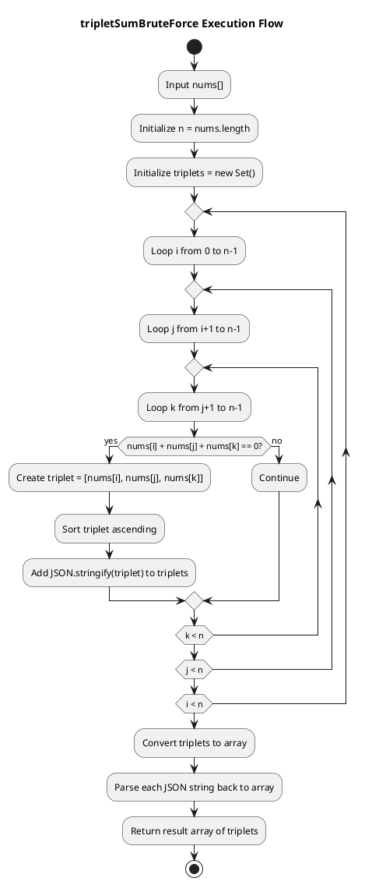
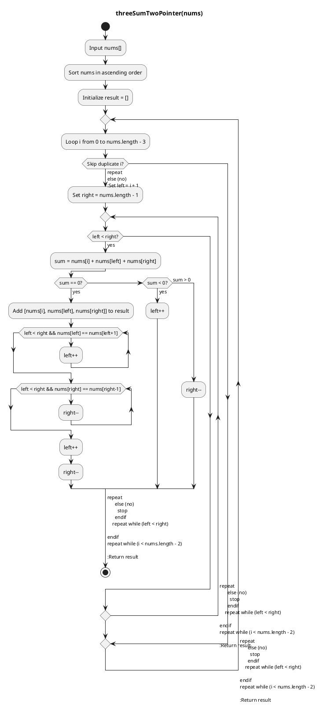
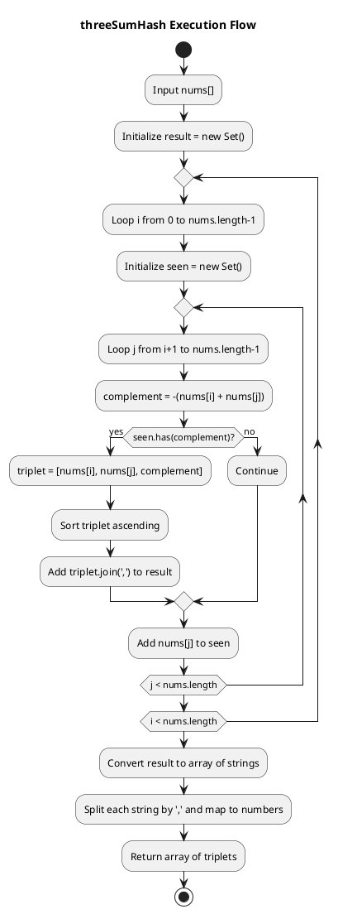

## Problem

Given an array of integers, return all triplets `[a, b, c]` such that `a + b + c = 0`. The solution must not contain duplicate triplets (e.g., `[1, 2, 3]` and `[2, 3, 1]` are considered duplicate triplets). If no such triplets are found, return an empty array.

📌 Each triplet can be arranged in any order, and the output can be returned in any order

**Example:**

**Input:** `nums = [0, -1, 2, -3, 1]`

**Output:** `[[-3, 1, 2], [-1, 0, 1]]`

### Intuition

- A brute-force solution involves checking every possible triplet in the array to see if they sum to zero.
- This can be done using three nested loops, iterating through each combination of three elements.
- Duplicate triplets can be avoided by sorting each triplet, which ensures identical triplets with different representations (e.g., `[1, 3, 2]` and `[3, 2, 1]`) are ordered consistently (`[1, 2, 3]`).
- Once sorted, we can add these triplets to a hash set. This way, if the same triplet is encountered again, the hash set will only keep one instance.

### Approaches

| Method      | Time Complexity | Space Complexity | Best Use Case                                                       |
| ----------- | --------------- | ---------------- | ------------------------------------------------------------------- |
| Brute Force | O(n³)           | O(n³)            | Very Small array (n < 20)                                           |
| Two-Pointer | O(n²)           | O(1)             | Sorted arrays (or when sorting is acceptable) and memory is limited |
| HashMap/Set | O(n²)           | O(n)             | Unsorted arrays and when fast lookup is needed                      |

<div style="display:none;">

## Brute Force

</div>
<details name="iq">
<summary> 3Sum: Brute Force
</summary>
<div>

<div class="div-flex" >
  <div class="div-item">

```js:title=3Sum_BruteForce
/**
 * Finds the indices of three numbers in an array that sum to a zero.
 * @param {number[]} nums - An array of numbers.
 * @returns {number[]} The indices of the three numbers, or an empty array if not found.
 */
function tripletSumBruteForce(nums) {
    const n = nums.length;
    const triplets = new Set();

    for (let i = 0; i < n; i++) {
        for (let j = i + 1; j < n; j++) {
            for (let k = j + 1; k < n; k++) {
                if (nums[i] + nums[j] + nums[k] === 0) {
                    const triplet = [nums[i], nums[j], nums[k]].sort((a, b) => a - b);

                    //// Check uniqueness manually
                    // if (!triplets.some(t => t[0] === triplet[0] && t[1] === triplet[1] && t[2] === triplet[2])) {
                    //     triplets.push(triplet);
                    // }

                    triplets.add(JSON.stringify(triplet));
                }
            }
        }
    }

    // return triplets;
    return Array.from(triplets).map(str => JSON.parse(str));
}
```

<div class="div-flex" >
  <div class="div-item-50">
  <div class="div-flex-column">
    <div>

```js:title=Test_Case
const nums = [0, -1, 2, -3, 1];
console.log(tripletSumBruteForce(nums));
// [ [-1, 0, 1], [-3, 1, 2] ]
```

  </div>
  <div>
<se>

```js:title=input
nums = [0, -1, 2, -3, 1]
```

<hr class="step" data-step="Step 1: Initialize"/>
`n = 5`<br/>
`triplets = new Set()`

<hr class="step" data-step="Step 2: Triple nested loop"/>

<hr class="step" data-step="&nbsp;i = 0 (nums[i] = 0)"/>
j = 1, k = 2 → `0 + (-1) + 2 = 1` ❌  <br/>
j = 1, k = 3 → `0 + (-1) + (-3) = -4` ❌  <br/>
j = 1, k = 4 → `0 + (-1) + 1 = 0` ✅ → push `[-1, 0, 1]`  <br/>
j = 2, k = 3 → `0 + 2 + (-3) = -1` ❌  <br/>
j = 2, k = 4 → `0 + 2 + 1 = 3` ❌  <br/>
j = 3, k = 4 → `0 + (-3) + 1 = -2` ❌

<hr class="step" data-step="&nbsp;i = 1 (nums[i] = -1)"/><br/>
j = 2, k = 3 → `-1 + 2 + (-3) = -2` ❌  <br/>
j = 2, k = 4 → `-1 + 2 + 1 = 2` ❌  <br/>
j = 3, k = 4 → `-1 + (-3) + 1 = -3` ❌

<hr class="step" data-step="&nbsp;i = 2 (nums[i] = 2)"/><br/>
j = 3, k = 4 → `2 + (-3) + 1 = 0` ✅ → push `[-3, 1, 2]`

</se>
  </div>
  </div>
  </div>
  <div class="div-item-50">



  </div>
</div>

### Complexity Analysis

<div class="div-flex">
<div>

**⏰ Time Complexity**

- **Triple nested loops** → `O(n³)`
- **Innermost work** → constant: sum check, sort(3), stringify, set add → `O(1)`
- **Final conversion** → `O(m)`, with `m <= O(n³)`
- Hence **T(n)** → `O(n³)`+ `O(1)` + `O(m)` ~ **`O(n³)`**

> Three loops, cubic cost

</div>
<div>

**📦 Space Complexity**

- **Triplets storage** → up to ( n(n-1)(n-2) ) / 6 ~ `O(n³)`
- **Per triplet** → constant space (3 numbers)
- **Auxiliary** → temp array + sort overhead → `O(1)`
- Hence **S(n)** → `O(n³)` + `O(1)` ~ **`O(n³)`**

> Triplets pile up cubically.

</div>
</div>

📌 This brute-force approach is fine for small arrays, but becomes inefficient for large inputs.

📌 The optimized solution uses a

- "**Two Pointer**" if given input array is ordered with **O(n²) time** with **O(1) space**.
- "**hash map** for unordered input array with **O(n²) time** with **O(n) space**.

</div>
</details>

<div style="display:none;">

## Two Pointer

</div>
<details name="iq">
<summary>3Sum: Two Pointer
</summary>
<div>

<div class="div-flex" >
  <div class="div-item">

```js:title=3Sum_TwoPointer
/**
 * Finds the indices of three numbers in a SORTED array that sum to a zero.
 * @param {number[]} nums - A sorted array of numbers.
 * @returns {number[]} The indices of the three numbers, or an empty array if not found.
 */
function threeSumTwoPointer(nums) {
    nums.sort((a, b) => a - b); // sort the array
    const result = [];

    for (let i = 0; i < nums.length - 2; i++) {
        // Skip duplicate values for i
        if (i > 0 && nums[i] === nums[i - 1]) continue;

        let left = i + 1;
        let right = nums.length - 1;

        while (left < right) {
            const sum = nums[i] + nums[left] + nums[right];

            if (sum === 0) {
                result.push([nums[i], nums[left], nums[right]]);

                // Skip duplicates for left and right
                while (left < right && nums[left] === nums[left + 1]) left++;
                while (left < right && nums[right] === nums[right - 1]) right--;

                left++;
                right--;
            } else if (sum < 0) {
                left++;
            } else {
                right--;
            }
        }
    }

    return result;
}
```

<div class="div-flex" >
  <div class="div-item-50">
  <div class="div-flex-column">
    <div>

```js:title=Test_Case
const nums = [0, -1, 2, -3, 1];
console.log(threeSumTwoPointer(nums));
// [ [-1, 0, 1], [-3, 1, 2] ]
```

  </div>
  <div>
<se>

```js:title=After_sorting
[-3, -1, 0, 1, 2]
```

<hr class="step" data-step="Iteration 1: `i = 0` → `nums[i] = -3`"/>

| Step | i   | left | right | nums[i], nums[left], nums[right] | sum | Action                                               |
| ---- | --- | ---- | ----- | -------------------------------- | --- | ---------------------------------------------------- |
| 1    | 0   | 1    | 4     | -3, -1, 2                        | -2  | sum < 0 → left++                                     |
| 2    | 0   | 2    | 4     | -3, 0, 2                         | -1  | sum < 0 → left++                                     |
| 3    | 0   | 3    | 4     | -3, 1, 2                         | 0   | ✅ triplet found → [-3, 1, 2]; then left++ & right-- |

<hr class="step" data-step="Iteration 2: `i = 1` → `nums[i] = -1`"/>

| Step | i   | left | right | nums[i], nums[left], nums[right] | sum | Action                                               |
| ---- | --- | ---- | ----- | -------------------------------- | --- | ---------------------------------------------------- |
| 1    | 1   | 2    | 4     | -1, 0, 2                         | 1   | sum > 0 → right--                                    |
| 2    | 1   | 2    | 3     | -1, 0, 1                         | 0   | ✅ triplet found → [-1, 0, 1]; then left++ & right-- |

<hr class="step" data-step="Iteration 3: `i = 2` → `nums[i] = 0`"/>

| Step | i   | left | right | nums[i], nums[left], nums[right] | sum | Action            |
| ---- | --- | ---- | ----- | -------------------------------- | --- | ----------------- |
| 1    | 2   | 3    | 4     | 0, 1, 2                          | 3   | sum > 0 → right-- |
| 2    | 2   | 3    | 3     | —                                | —   | loop ends         |

---

```js:title=Result
[ [-1, 0, 1], [-3, 1, 2] ]
```

</se>

  </div>
  </div>
  </div>
  <div class="div-item-50">



  </div>
</div>

### Complexity Analysis

<div class="div-flex">
<div>

**⏰ Time Complexity**

- **Sorting** → `O(n log n)`
- **Double nested loops** → `O(n²)`
- Hence **T(n)** = `n log n` + `O(n²)` ~ **`O(n²)`**

> Two loops, quadratic cost

</div>
<div>

**📦 Space Complexity**

- **Triplets storage** → `O(n³)` in worst case; from `i` up to `O(n)` ~ `O(n²)`
- **Per triplet** → constant space (3 numbers) → `O(1)`
- **Auxiliary** → temp array + sort overhead → `O(1)`
- Hence **S(n)** ~ **`O(1)`** (excluding triplet storage)

> Triplets pile up quadratically.

</div>
</div>

📌 This 2-pointer approach is a major improvement in Complexity

- Time: from `O(n³)` to `O(n²)`
- Space: from `O(n³)` to `O(1)`

</div>
</details>

<div style="display:none;">

## Hashmap

</div>
<details name="iq">
<summary>3Sum: Hashmap
</summary>
<div>

<div class="div-flex" >
  <div class="div-item">

```js:title=3Sum_Hashmap
/**
 * Finds unique triplets that sum to zero using hash set.
 * @param {number[]} nums - Input array of numbers.
 * @returns {number[][]} Array of triplets.
 */
function threeSumHash(nums) {
    const result = new Set();

    for (let i = 0; i < nums.length; i++) {
        const seen = new Set();
        for (let j = i + 1; j < nums.length; j++) {
            const complement = -(nums[i] + nums[j]);
            if (seen.has(complement)) {
                const triplet = [nums[i], nums[j], complement].sort((a, b) => a - b);
                result.add(triplet.join(',')); // store as string for uniqueness
            }
            seen.add(nums[j]);
        }
    }

    // Convert back to arrays
    return Array.from(result).map(str => str.split(',').map(Number));
}
```

<div class="div-flex" >
  <div class="div-item-50">
  <div class="div-flex-column">
    <div>

```js:title=Test_Case
const nums = [0, -1, 2, -3, 1];
console.log(threeSumHash(nums));
// [ [-1, 0, 1], [-3, 1, 2] ]
```

  </div>
  <div>
  <se>

<hr class="step" data-step="Iteration i = 0 (nums[i] = 0)"/>
<br/>j = 1 → complement = -(0 + -1) = 1 → seen = {-1}
<br/>j = 2 → complement = -(0 + 2) = -2 → seen = {-1, 2}
<br/>j = 3 → complement = -(0 + -3) = 3 → seen = {-1, 2, -3}
<br/>j = 4 → complement = -(0 + 1) = -1 → found in seen <br/>
→ triplet = [-1, 0, 1] → result = {"-1,0,1"}

<hr class="step" data-step="Iteration i = 1 (nums[i] = -1)"/>
<br/>j = 2 → complement = -(-1 + 2) = -1 → seen = {2}
<br/>j = 3 → complement = -(-1 + -3) = 4 → seen = {2, -3}
<br/>j = 4 → complement = -(-1 + 1) = 0 → seen = {2, -3, 1}

<hr class="step" data-step="Iteration i = 2 (nums[i] = 2)"/>
<br/>j = 3 → complement = -(2 + -3) = 1 → seen = {-3}
<br/>j = 4 → complement = -(2 + 1) = -3 → found in seen <br/>
→ triplet = [-3, 1, 2] → result = {"-1,0,1", "-3,1,2"}

<hr class="step" data-step="Iteration i = 3 (nums[i] = -3)"/>
<br/>j = 4 → complement = -(-3 + 1) = 2 → seen = {1}

<hr class="step" data-step="Iteration i = 4 (nums[i] = 1)"/>
→ inner loop doesn’t run.
</se>

  </div>
  </div>
  </div>
  <div class="div-item-50">



  </div>
</div>

### Complexity Analysis

<div class="div-flex">
<div>

**⏰ Time Complexity**

- **Double nested loops** → `O(n²)`
- **Hash set operations**: `seen.has()` and `seen.add()` → `O(1)`
- **Result conversion:** → `O(k)`, where `k` is number of unique triplets (≤ `n^3`)
- Hence **T(n)** = `O(n²)` + `O(1)` + `O(k)` ~ **`O(n²)`**

> Two loops, quadratic cost

</div>
<div>

**📦 Space Complexity**

- `seen` set can hold up to `O(n)` elements per iteration.
- `result` set can hold up to `O(n²)` triplets in worst case.
- Hence **S(n)** = `O(n)`+ `O(n²)` ~ **O(n)** (excluding output storage)

</div>
</div>

📌 This hashmap approach has improvement in complexity with tradeoff on memory used

</div>
</details>

<br/>
<br/>
<br/>
<br/>

---

- [3Sum on leetcode](https://leetcode.com/problems/3sum/description/)
