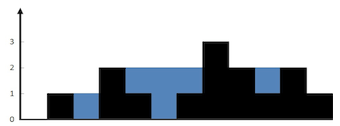
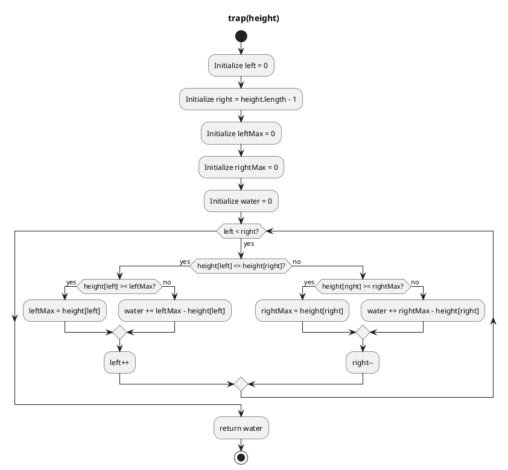

## Problem

Given `n` non-negative integers representing an elevation map where the width of each bar is `1`, compute how much water it can trap after raining.



**Input:** height = `[0,1,0,2,1,0,1,3,2,1,2,1]`

**Output:** 6

**Explanation:** The above elevation map (black section) is represented by above array . In this case, `6` units of rain water (blue section) are being trapped.

**Example 2**:

**Input:** height = [4,2,0,3,2,5]

**Output:** 9

<div class="div-flex" >
  <div class="div-item-50">

  <div class="div-flex-column">
  <div>

```js:title=Traping_rain_water_(total_area)
function trap(height) {
    let left=0,
    right=height.length-1,
    leftMax= 0,
    rightMax =0,
    water=0;
    while(left<right){
        if(height[left]<=height[right]){
            if(height[left]>=leftMax)
                leftMax = height[left];
            else
                water += leftMax - height[left];
            left++;
        }
        else{
            if(height[right]>=rightMax)
                rightMax = height[right];
            else
                water += rightMax - height[right];
            right--;
        }
    }
    return water;
}
```

</div>

<div>

```js:title=Test_Case
height = [0,1,0,2,1,0,1,3,2,1,2,1];
console.log(trap(height)); // 6
```

</div>

<div>



</div>

</div>

</div>

<div class="div-item-50">

<se>

<hr class="step" data-step="Step 1: height[0]=0 <= height[11]=1"/>
 leftMax=0 → update to 0  <br/>
 Move left=1

<hr class="step" data-step="Step 2: height[1]=1 <= height[11]=1"/>
 leftMax=0 → update to 1  <br/>
 Move left=2

<hr class="step" data-step="Step 3: height[2]=0 <= height[11]=1"/>
 leftMax=1 → water += (1-0)=1  <br/>
 Move left=3

<hr class="step" data-step="Step 4: height[3]=2 <= height[11]=1"/> 
   → false, go right side  <br/>
    height[11]=1 >= rightMax=0 → update rightMax=1  <br/>
    Move `right=10

<hr class="step" data-step="Step 5: height[3]=2 <= height[10]=2"/> 
 leftMax=1 → update to 2  <br/>
 Move left=4

<hr class="step" data-step="Step 6: height[4]=1 <= height[10]=2"/> 
 leftMax=2 → water += (2-1)=1 → total=2  <br/>
 Move left=5

<hr class="step" data-step="Step 7: height[5]=0 <= height[10]=2"/> 
 leftMax=2 → water += (2-0)=2 → total=4  <br/>
 Move left=6

<hr class="step" data-step="Step 8: height[6]=1 <= height[10]=2"/> 
 leftMax=2 → water += (2-1)=1 → total=5  <br/>
 Move left=7

<hr class="step" data-step="Step 9: height[7]=3 <= height[10]=2"/>  
→ false, go right side  <br/>
 `height[10]=2 >= rightMax=1 → update rightMax=2`  <br/>
 Move `right=9

<hr class="step" data-step="Step 10: height[7]=3 <= height[9]=1"/> 
 → false, go right side  <br/>
  `height[9]=1 < rightMax=2 → water += (2-1)=1 → total=6  <br/>
  Move `right=8

<hr class="step" data-step="Step 11: height[7]=3 <= height[8]=2"/> 
 → false, go right side  <br/>
  `height[8]=2 >= rightMax=2 → update rightMax=2`  <br/>
  Move `right=7`
</se>

  </div>
</div>

<br/>
<br/>
<br/>
<br/>

---

- [Trapping Rain Water on leetcode](https://leetcode.com/problems/trapping-rain-water/description/)
- [Trapping Rain Water - 2](https://leetcode.com/problems/trapping-rain-water-ii/description/)
- [Escape the spreading fire](https://leetcode.com/problems/escape-the-spreading-fire/description/)
