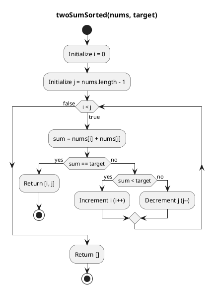
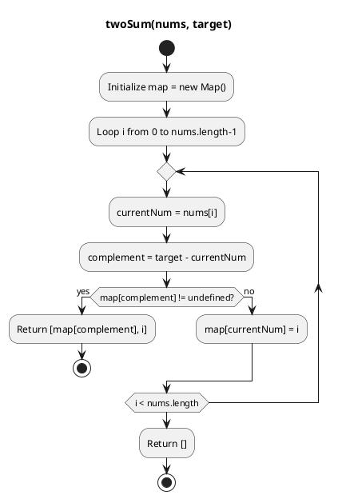

> Finds the indices of two numbers in an array that sum to a target

| Approach        | Time Complexity                                                          | Space Complexity | How It Works                                                                                | Pros                                                       | Cons                                                                                          |
| --------------- | ------------------------------------------------------------------------ | ---------------- | ------------------------------------------------------------------------------------------- | ---------------------------------------------------------- | --------------------------------------------------------------------------------------------- |
| **Brute Force** | O(n²)                                                                    | O(1)             | Check all pairs `(i, j)` until a match is found.                                            | Simple to implement, no extra memory needed.               | Very slow for large arrays.                                                                   |
| **Two Pointer** | O(n log n) due to (sorting) + O(n) due to scanning -> overall O(n log n) | O(1)             | Sort the array, then use two pointers (left/right) to move inward until sum matches target. | Faster than brute force, no extra memory.                  | Sorting changes indices (original positions lost), not suitable if indices must be preserved. |
| **Hash Map**    | O(n)                                                                     | O(n)             | Store each number’s index in a map; for each element, check if its complement exists.       | Fastest approach, preserves original indices, single pass. | Requires extra memory for the map.                                                            |

<details name="iq">
<summary>2Sum: Brute Force
</summary>
<div>

<div class="div-flex" >
  <div class="div-item">

```js:title=Two_Sum_SORTED_Brute_Force
/**
 * Finds the indices of two numbers in a SORTED array that sum to a target.
 * @param {number[]} nums - A sorted array of numbers.
 * @param {number} target - The target sum.
 * @returns {number[]} The indices of the two numbers, or an empty array if not found.
 */
function twoSumBruteForce(nums, target) {
  for (let i = 0; i < nums.length; i++) {
    for (let j = i + 1; j < nums.length; j++) {
      if (nums[i] + nums[j] === target) {
        return [i, j];
      }
    }
  }
  // If no solution is found
  return [];
}
```

<div class="div-flex" >
  <div class="div-item-50">
  <div class="div-flex-column">
    <div>

```js:title=Test_Case
const nums = [1, 3, 4, 6, 8, 10];
const target = 10;
console.log(twoSumBruteForce(nums, target)); // Output: [2, 3]
```

  </div>
  <div class="div-algo">

  </div>
  </div>
  </div>
  <div class="div-item-50">
<se>

<hr class="step" data-step="Outer loop: i = 0 (nums[0] = 1)"/>
<hr class="step" data-step="&nbsp;&nbsp;&nbsp;Inner loop: j = 1"/>→ nums[0] + nums[1] = 1 + 3 = 4 ≠ 10<br/> continue loop:j
<hr class="step" data-step="&nbsp;&nbsp;&nbsp;Inner loop: j = 2"/>→ nums[0] + nums[2] = 1 + 4 = 5 ≠ 10<br/> continue loop:j
<hr class="step" data-step="&nbsp;&nbsp;&nbsp;Inner loop: j = 3"/>→ nums[0] + nums[3] = 1 + 6 = 7 ≠ 10<br/> continue loop:j
<hr class="step" data-step="&nbsp;&nbsp;&nbsp;Inner loop: j = 4"/>→ nums[0] + nums[4] = 1 + 8 = 9 ≠ 10<br/> continue loop:j
<hr class="step" data-step="&nbsp;&nbsp;&nbsp;Inner loop: j = 5"/>→ nums[0] + nums[5] = 1 + 10 = 11 ≠ 10<br/> continue loop:j

<hr class="step" data-step="Outer loop: i = 1 (nums[1] = 3)"/>
<hr class="step" data-step="&nbsp;&nbsp;&nbsp;Inner loop: j = 2"/>→ nums[1] + nums[2] = 3 + 4 = 7 ≠ 10<br/> continue loop:j
<hr class="step" data-step="&nbsp;&nbsp;&nbsp;Inner loop: j = 3"/>→ nums[1] + nums[3] = 3 + 6 = 9 ≠ 10<br/> continue loop:j
<hr class="step" data-step="&nbsp;&nbsp;&nbsp;Inner loop: j = 4"/>→ nums[1] + nums[4] = 3 + 8 = 11 ≠ 10<br/> continue loop:j
<hr class="step" data-step="&nbsp;&nbsp;&nbsp;Inner loop: j = 5"/>→ nums[1] + nums[5] = 3 + 10 = 13 ≠ 10<br/> continue loop:j

<hr class="step" data-step="Outer loop: i = 2 (nums[2] = 4)"/>
<hr class="step" data-step="&nbsp;&nbsp;&nbsp;Inner loop: j = 3"/>→ nums[2] + nums[3] = 4 + 6 = 10 <br/>✅ match found → return [2, 3]
</se>
  </div>
</div>

## Complexity Analysis:BF

1. **⏰ Time Complexity**

- Outer loop runs from `i = 0` to `nums.length - 1` → up to _n iterations_.
- Inner loop runs from `j = i + 1` to `nums.length - 1` → in worst case, about _n iterations_ for each `i`.
- Together, this gives roughly: `n(n-1)/2 ⁓ O(n^2)`
  - _Best case:_ O(1)
  - _Worst case:_ O(n²)
  - Hence T(n) = **O(n²)**

2. **📦 Space Complexity**

- Only a few variables (`i`, `j`, and the return array `[i, j]`).
- No extra data structures proportional to input size.
  - Hence S(n) = **O(1)**

📌 This brute-force approach is fine for small arrays, but becomes inefficient for large inputs.

📌 The optimized solution uses a

- "**Two Pointer**" if given input array is ordered
- "**hash map** for unordered input array
  to achieve **O(n) time** with **O(n) space**.

</div>
</details>

<details name="iq">
<summary>2Sum using TwoPointers, given <strong>sorted</strong> array</strong>
</summary>
<div>

```js:title=Two_Sum_SORTED_using_TwoPointers
/**
 * Finds the indices of two numbers in a SORTED array that sum to a target.
 * @param {number[]} nums - A sorted array of numbers.
 * @param {number} target - The target sum.
 * @returns {number[]} The indices of the two numbers, or an empty array if not found.
 */
function twoSumSorted(nums:number[], target:number):number[] {
  let i = 0,
    j = nums.length - 1;
  while (i < j) {
    const sum = nums[i] + nums[j];
    if (sum === target) return [i, j];
    if (sum < target) i++;
    else j--;
  }
  return [];
}
```

<div class="div-flex" >
  <div class="div-item-50">
  <div class="div-flex-column">
    <div>

```js:title=Test_Case_Match
nums = [1, 3, 4, 6, 8, 10];
target = 10;
consol.log(twoSumSorted(nums, target)); // [2,5]
```

  </div>
  <div class="div-algo">

  </div>
  </div>
  </div>
  <div class="div-item-50">
  <se>
  <hr class="step" data-step="Step 1: i = 0, j = 5"/>nums[i] + nums[j] = 1 + 10 = 11 <br/>→ too small → i++
  <hr class="step" data-step="Step 2: i = 1, j = 5"/>nums[i] + nums[j] = 3 + 10 = 13 <br/>→ too small  → i++
  <hr class="step" data-step="Step 3: i = 2, j = 5"/>nums[i] + nums[j] = 4 + 10 = 14 <br/>→ match  → return [i,j]
  </se>
  </div>
</div>

<div class="div-flex" >
  <div class="div-item-50">
  <div class="div-flex-column">
    <div>
    
```js:title=Test_Case_NoMatch
nums = [1, 3, 4, 6, 8, 10];
target = 15;
consol.log(twoSumSorted(nums, target)); // []
```
  </div>
  <div class="div-algo">



  </div>
  </div>
  </div>
  <div class="div-item-50">
  <se>
  <hr class="step" data-step="Step 1: i = 0, j = 5" />nums[i] + nums[j] = 1 + 10 = 11 <br/>→ too small → i++
  <hr class="step" data-step="Step 2: i = 1, j = 5" />nums[i] + nums[j] = 3 + 10 = 13 <br/>→ too small → i++
  <hr class="step" data-step="Step 3: i = 2, j = 5" />nums[i] + nums[j] = 4 + 10 = 14 <br/>→ too small → i++
  <hr class="step" data-step="Step 4: i = 3, j = 5" />nums[i] + nums[j] = 6 + 10 = 16 <br/>→ too big → j--
  <hr class="step" data-step="Step 5: i = 3, j = 4" />nums[i] + nums[j] = 6 + 8 = 14 <br/>→ too small → i++
  <hr class="step" data-step="Step 6: i = 4, j = 4" />pointers meet <br/>→ No match found → return []
  </se>
  </div>
</div>

## Complexity Analysis:2Pointer

1. **⏰ Time Complexity**

- The function uses a _single while loop_ that moves two pointers (`i` from start, `j` from end) toward each other.
- In each iteration:
  - One of the pointers moves inward by one step.
- Since each element is visited at most once:
  - _Total iterations:_ at most `n` steps.
  - Hence T(n) = **O(n)**

2. **📦 Space Complexity**

- No extra data structures are used.
- Only a few scalar variables (`i`, `j`, `sum`).
  - Hence S(n) = **O(1)**

📌 This approach **only works** if the input array is sorted.

📌 If the array is unsorted, you must sort it first → adds **O(n log n)** time and loses original indices.

📌 For preserving indices in unsorted arrays, use the **hash map** approach.

</div>
</details>

<details name="iq">
<summary>2Sum using Hashmap, given <strong>unordered</strong> array and <strong>preserve</strong> original indices
</summary>
<div>

```js:title=Two_Sum_SORTED_using_Hash_Map
/**
 * Finds the indices of two numbers in a SORTED array that sum to a target.
 * @param {number[]} nums - A sorted array of numbers.
 * @param {number} target - The target sum.
 * @returns {number[]} The indices of the two numbers, or an empty array if not found.
 */

function twoSum(nums, target) {
  // Create a map to store seen numbers and their indices
  const map = new Map();
  for (let i = 0; i < nums.length; i++) {
    const currentNum = nums[i];
    const complement = target - currentNum;
    // Check if the complement exists in the map
    if (map[complement] !== undefined) {
      // If found, return the complement's index and the current index
      return [map[complement], i];
    }
    // If not found, add the current number and its index to the map
    map[currentNum] = i;
  }
  // If no solution is found (problem statement guarantees one solution exists)
  return [];
}
```

<div class="div-flex" >
  <div class="div-item-50">
  <div class="div-flex-column">
  <div>

```js:title=TestCase
const nums = [1, 3, 4, 6, 8, 10];
const target = 10;
console.log(twoSum(nums, target)); // Output: [2, 3]
```

  </div>
  <div class="div-algo">



  </div>
  </div>

  </div>
  <div class="div-item-50">

<se>

<hr class="step" data-step="Step 1: i = 0" />
currentNum = nums[0] = 1
<br/>complement = target - currentNum = 10 - 1 = 9
<br/>map = {} → complement (9) not found
<br/>→ Store currentNum: map[1] = 0

<hr class="step" data-step="Step 2: i = 1" />
currentNum = nums[1] = 3
<br/>complement = 10 - 3 = 7
<br/>map = {1: 0} → complement (7) not found
<br/>→ Store currentNum: map[3] = 1

<hr class="step" data-step="Step 3: i = 2" />
currentNum = nums[2] = 4
<br/>complement = 10 - 4 = 6
<br/>map = {1: 0, 3: 1} → complement (6) not found
<br/>→ Store currentNum: map[4] = 2

<hr class="step" data-step="Step 4: i = 3" />
currentNum = nums[3] = 6
<br/>complement = 10 - 6 = 4
<br/>map = {1: 0, 3: 1, 4: 2} → complement (4) found at index 2
<br/>→ Return [2, 3]

</se>
  </div>
</div>

## Complexity Analysis:Hashmap

1. **⏰ Time Complexity**

- The function iterates through the array once (`for` loop over `nums`).
- For each element:
  - Lookup in the map (`map[complement] !== undefined`) → `O(1)` average case.
  - Insertion into the map (`map[currentNum] = i`) → `O(1)` average case.
- Therefore:
  - _Best case:_ `O(1)` (if the solution is found at the very beginning).
  - _Worst case:_ `O(n)` (must scan the entire array).
  - Hence T(n) = **O(n)**

2. **📦 Space Complexity**

- The map stores at most `n` elements (each number and its index).
- No other data structures grow with input size.
  - Hence S(n) = **O(n)**

📌 Much more efficient than the brute-force approach (`O(n²)` time, `O(1)` space).

</div>
</details>

<br/>
<br/>
<br/>
<br/>

---

- [2Sum on leetcode](https://leetcode.com/problems/two-sum/description/)
- [2Sum : Sorted on leetcode](https://leetcode.com/problems/two-sum-ii-input-array-is-sorted/description/)
