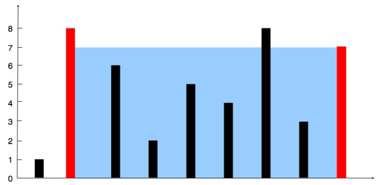

## Problem

- You are given an integer array height of length `n`. There are `n` vertical lines drawn such that the two endpoints of the ith line are (i, 0) and (i, height[i]).
- Find two lines that together with the **x-axis** form a container, such that the container contains the most water.
- Return the maximum amount of water a container can store.



**Example:**

**Input:** height = [1,8,6,2,5,4,8,3,7]

**Output:** 49

**Explanation:** The above vertical lines are represented by array [1,8,6,2,5,4,8,3,7]. In this case, the max area of water (blue section) the container can contain is 49

```js:title=Container_with_most_water_(max_area)
function maxArea(height) {
  let i = 0,
    j = height.length - 1,
    best = 0;
  while (i < j) {
    const area = (j - i) * Math.min(height[i], height[j]);
    best = Math.max(best, area);
    if (height[i] < height[j]) i++;
    else j--;
  }
  return best;
}
```

<div class="div-flex" >
  <div class="div-item">

```js:title=Test_Case
height = [1, 8, 6, 2, 5, 4, 8, 3, 7];
console.log(maxArea(height)); // 49
```

  </div>
  <div class="div-item">
<se>
<hr class="step" data-step="Step 1: i = 0, j = 8"/>area = (8 - 0) x min(1, 7) = 8 x 1 = 8 <br/>→ best = 8 → height[i] < height[j] → i++
<hr class="step" data-step="Step 2: i = 1, j = 8"/>area = (8 - 1) x min(8, 7) = 7 x 7 = 49 <br/>→ best = 49 → height[i] > height[j] → j--
<hr class="step" data-step="Step 3: i = 1, j = 7"/>area = (7 - 1) x min(8, 3) = 6 x 3 = 18 <br/>→ best = 49 → height[i] > height[j] → j--
<hr class="step" data-step="Step 4: i = 1, j = 6"/>area = (6 - 1) x min(8, 8) = 5 x 8 = 40 <br/>→ best = 49 → height[i] == height[j] → j--
<hr class="step" data-step="Step 5: i = 1, j = 5"/>area = (5 - 1) x min(8, 4) = 4 x 4 = 16 <br/>→ best = 49 → height[i] > height[j] → j--
<hr class="step" data-step="Step 6: i = 1, j = 4"/>area = (4 - 1) x min(8, 5) = 3 x 5 = 15 <br/>→ best = 49 → height[i] > height[j] → j--
<hr class="step" data-step="Step 7: i = 1, j = 3"/>area = (3 - 1) x min(8, 2) = 2 x 2 = 4 <br/>→ best = 49 → height[i] > height[j] → j--
<hr class="step" data-step="Step 8: i = 1, j = 2"/>area = (2 - 1) x min(8, 6) = 1 x 6 = 6 <br/>→ best = 49 → height[i] > height[j] → j--
<hr class="step" data-step="Step 9: i = 1, j = 1"/>inters meet <br/>→ return best = 49
</se>
  </div>
</div>

<br/>
<br/>
<br/>
<br/>

---

- [container-with-most-water on leetcode](https://leetcode.com/problems/container-with-most-water/description/)
