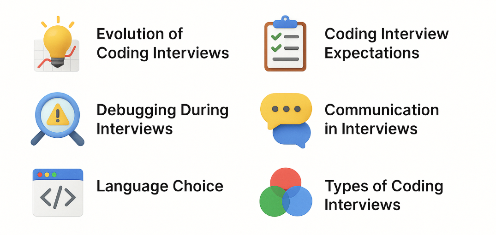
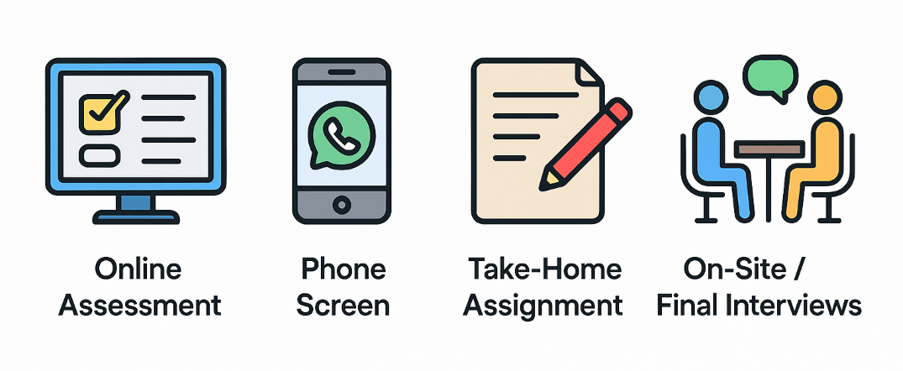
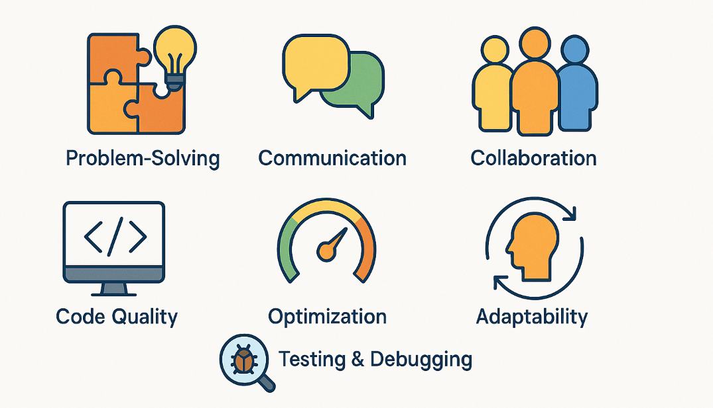
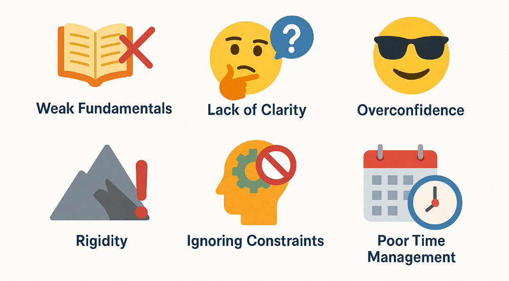
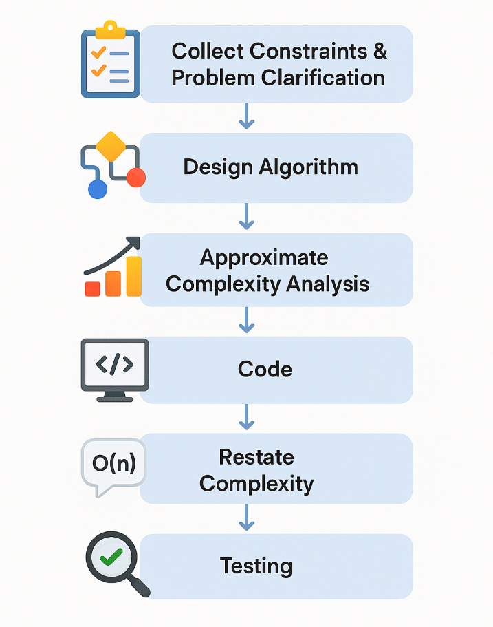
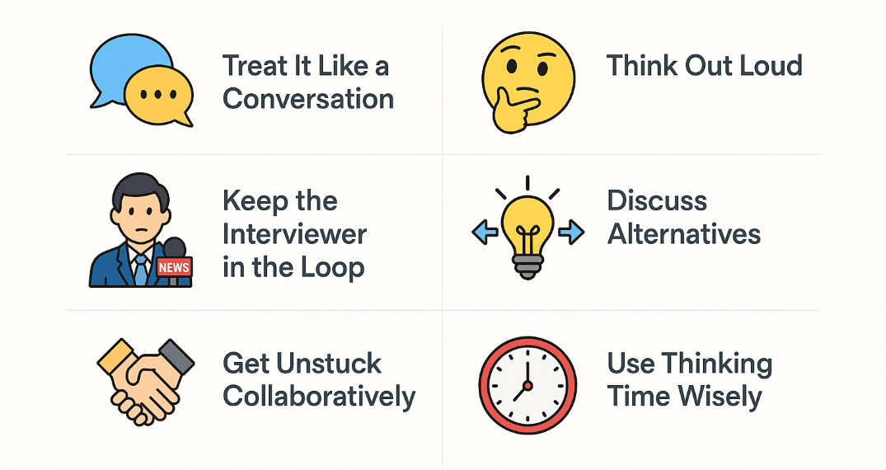

## Why it matters

  
Why did tech companies shift from brain teasers to coding interviews

  

    
Brain teasers failed to assess true programming skills and experience. Coding interviews offer a more inclusive way to evaluate problem-solving and technical ability.

  

  
What do interviewers look for during a coding interview

  

    
They assess your approach to problems, coding efficiency, debugging skills, and how clearly you communicate your reasoning.

  

  
Is it okay to make minor mistakes during a coding interview

  

    
Yes — identifying and fixing bugs on the fly shows strong debugging skills and attention to detail.

  

  
Why is it important to explain your thought process while coding

  

    
It helps interviewers understand your decisions, trade-offs, and overall problem-solving approach.

  

  
How should you choose your coding language for an interview

  

    
Confirm your preferred language with the recruiter beforehand to ensure alignment with the role.

  

  
Why is it important to understand different coding interview formats

  

    
Each format has unique expectations and challenges — knowing them helps you prepare effectively.

  

  
What is the purpose of an online assessment

  

    
Timed remote test with coding challenges or MCQs to evaluate technical skills.

  

  
What happens during a phone screen

  

    
30–60 min call to assess role understanding, team fit, and possibly technical skills.

  

  
What’s expected in a take-home assignment

  

    
Solve a coding task with clean structure, testing, and documentation at your own pace.

  

  
What do final interviews involve

  

    
Series of technical/behavioral rounds with whiteboard or online coding tools.

  

## Signals in an Interview

  
What shows strong problem-solving

  

    
Mastery of data structures and algorithms, applied efficiently.

  

  
Why is communication important

  

    
Explaining reasoning and trade-offs helps interviewers follow your thought process.

  

  
How do you show collaboration

  

    
Ask questions, engage with the interviewer, refine your solution together.

  

  
What kind of code stands out

  

    
Clean, readable, efficient, and correct.

  

  
What does optimization involve

  

    
Improving time and space complexity of your solution.

  

  
How do you show adaptability

  

    
Accept feedback and consider alternative approaches.

  

  
What testing skills matter

  

    
Proactively test and debug to ensure correctness.

  

  
Why is weak knowledge a red flag

  

    
Limits your ability to solve problems effectively.

  

  
What happens if you can’t explain your approach

  

    
Interviewers can’t assess your reasoning.

  

  
Why is arrogance harmful

  

    
It’s off-putting — humility is preferred.

  

  
What does rigidity signal

  

    
Poor adaptability and resistance to feedback.

  

  
Why are constraints important

  

    
Missing them shows lack of thoroughness.

  

  
How does time mismanagement hurt

  

    
You may not finish or show complete thinking.

  

## Problem-Solving Framework

  
What’s the first step when approaching a coding interview problem

  

    
Restate the problem, ask clarifying questions, and gather constraints and edge cases.

  

  
How should you begin designing your solution

  

    
Start with a brute-force approach, discuss alternatives, and use pseudocode to outline logic.

  

  
Why estimate time and space complexity early

  

    
It shows awareness of efficiency and helps guide design decisions.

  

  
What makes your code interview-ready

  

    
Use clean structure, meaningful variable names, helper functions, and custom classes if needed.

  

  
What should you do after coding

  

    
Reassess and explain final time and space complexity, noting changes from initial estimates.

  

  
How should you test your solution

  

    
Use simple cases, edge cases, boundary values, and ensure correctness across valid input ranges.

  

## Effective Communication in an interview

  
How does time mismanagement hurt

   

You may not finish or show complete thinking.

  
Why is thinking out loud important in interviews

   

It helps the interviewer follow your reasoning and see how you tackle problems from different angles.

  
What should you do to ensure the interviewer understands your approach

   

Regularly check in, clarify confusion, and correct misunderstandings to stay aligned.

    

  
How should you handle multiple solution paths

   

Share your options, compare pros and cons, and explain your final decision.

    

  
What should you do if you’re stuck

   

Explain your thought process, what you’ve tried, and why you’re stuck—this invites guidance.

    

  
Is it okay to pause during an interview

   

Yes—just let the interviewer know you’re taking a moment to think, so they understand you’re processing.

    

