<details>
  <summary>What is really happening inside a React app?</summary>
  <div>
  
> `React` architected to build high‑performance browser UIs

- `React` is **100% component‑based model**.
- All `React` app starts by rendering a single **root component**
- Understanding how that root component renders to a browser helps explain `React`’s internal architecture.

### **`JSX`** is not **JavaScript** — React creates elements using `createElement()`

When you write `JSX`, React does **not** run that directly. `JSX` is converted into plain JavaScript using [Babel](https://babeljs.io/).

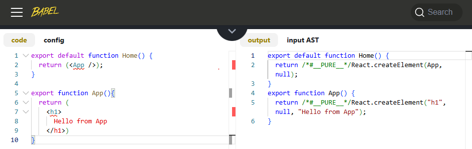

📌 At Output, `React` is the library itself.

📌 **first key insight**: React apps are just **JavaScript objects** created by `React.createElement`.

### How the root component is rendered

All React apps are built with popular toolchains like `Next.js`, `Remix`, `Gatsby`, `RedwoodJs` if not you are using customer `Webpack+Babel` start by rendering a root component.

<div class="gatsby-code-title gatsby-remark-code-title">Demo with Next.js /app/page.js</div>

```js
"use client";
import App from "../src/App";

export default function Home() {
  return <App />;
}
```

- At app start, component in /app/page.js is launched
- The `page.js` contains the **root element** our React app (entire **React component tree**)
- It's possible to write React apps with little understanding
- Always helpful to understand what's happening inside.
  - React is a library
  - What it means to be Single-page app `SPA`
  - Create a web app with only native DOM calls
  - Convert DOM calls to React without JSX
  - Convert React Javascript to use JSX
  - Explain the meaning of F(G(X)) in a component tree

### Why this matters

Most developers treat **React** as “magic,” but knowing how **`JSX`**, `createElement()`, the **virtual DOM**, and the **toolchain** work gives you:

- Better debugging skills
- Better performance optimization
- Better architectural decisions

Understanding the internals makes you a stronger React engineer.

  </div>
</details>

<details>
  <summary>Why React is a library and not a framework</summary>
  <div>

- A **library** is defined as a group of related functions or classes that perform unique operations.

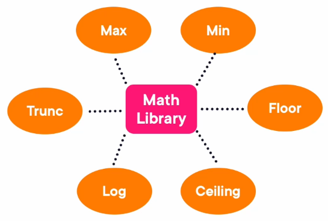

- A **framework** is a collection of programming tools with a specific goal in mind.
- React is a library because **you call React** — React does not call you.

### React is essentially two libraries

```js:title=In_most_React_apps_you_import_two_separate_libraries_at_the_top
// index.js
import React from "react";
import ReactDOM from "react-dom/client";
```

- **react** → core library (createElement, hooks, component logic)
- **react-dom** → browser-specific library (DOM rendering)

### Using React without JSX

```js:title=index.html
<!DOCTYPE html>
<html>
    <head>
        <title>Simple SPA</title>
        <script type="module">
            import React from "https://esm.sh/react@19/?dev"
            import ReactDOM from "https://esm.sh/react-dom@19/client/?dev"
            const element = React.createElement("h1", null, "Hello React Without JSX");
            ReactDOM.createRoot(document.getElementById("root")).render(element);
        </script>
    </head>
    <body>
        <div id="root"></div>
    </body>
</html>
```

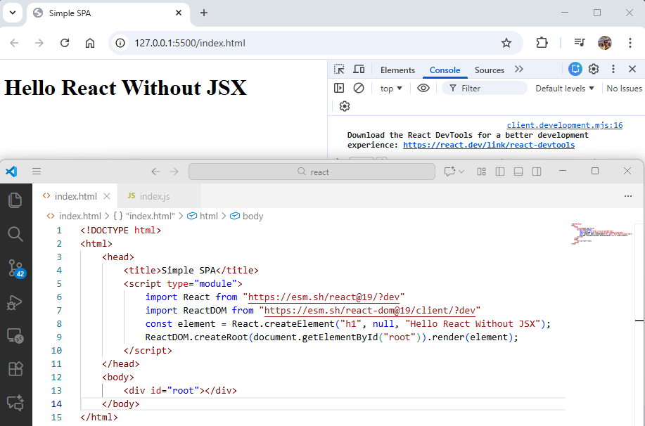

📌 This shows React is just a set of functions you call — exactly what a library is.

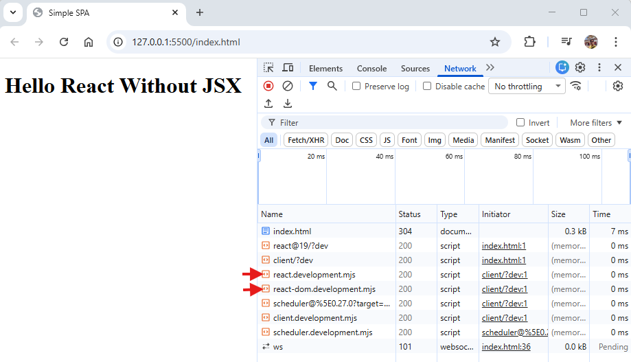

- **react** → includes createElement, useState, useEffect, etc.
- **react-dom** → includes DOM rendering functions

This separation reinforces that React is not a full framework — it only handles UI logic.

### What React provides vs. what it does NOT provide

**React provides:**

- Component model
- Virtual DOM
- Hooks (useState, useEffect, etc.)
- Rendering logic

**React does NOT provide:**

- Routing
- Data fetching
- Build system
- File-based routing
- Deployment pipeline

📌 This is why React is a **library**, not a framework.

### Library vs Framework — control flow difference

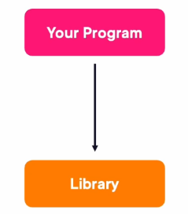

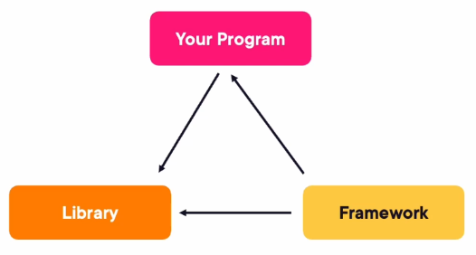

📌 React fits the first model — **you call React**.

```js:title=React_as_a_library_you_control_the_flow
function App() {
    return <h1>Hello</h1>;
}

const root = ReactDOM.createRoot(document.getElementById("root"));
root.render(<App />);
```

📌 You decide when and how rendering happens.

### Example: Framework controlling the flow (`Next.js`)

`Next.js` automatically calls your components — you don’t call ReactDOM yourself.

<div class="gatsby-code-title gatsby-remark-code-title">app/page.js</div>

```js
import React from "React";
export default function Page() {
  return <App />;
}
```

`Next.js` handles:

- Routing
- Rendering
- Bundling (Webpack/SWC)
- Server-side rendering
- API routes

📌 This is why `Next.js` is a **framework** built on top of the React library.

### React ecosystem: library + framework

**React (library)** gives you UI building blocks.
**`Next.js` (framework)** gives you everything else:

- Node.js runtime
- Webpack or SWC bundling
- PostCSS
- Jest for testing
- Routing system
- Server components

### Why you almost always use a framework with React

Using React alone means manually handling:

- Routing
- Bundling
- Transpiling `JSX`
- Optimizing assets
- Deployment

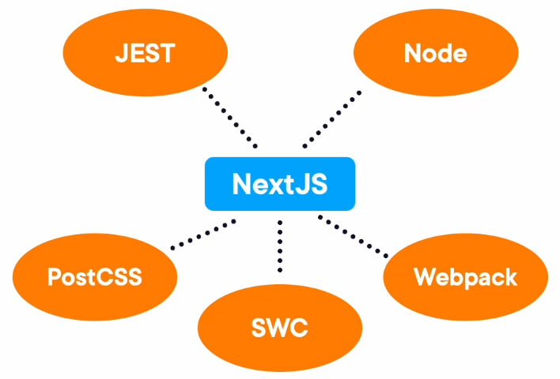

📌 React is a **UI library** that gives you the tools to build components. Frameworks like `Next.js` wrap React and provide the full application structure.

📌 In React, **you control the flow**. In a framework, **the framework controls the flow**.

  </div>
</details>

<details>
  <summary>What it means that React is a Single‑Page App `SPA`</summary>
  <div>

> A `SPA` is a **web app** that **loads a single minimal HTML page once**, then **updates the UI dynamically using JavaScript** without **performing full page reloads**.

`Gmail`, `Yahoo Mail`, and `Hotmail` have been `SPA`s for years — long before the term became popular.

### What makes an app a SPA?

- The browser loads **one HTML file** initially.
- **JavaScript** dynamically updates the UI afterward.
- **No full‑page refreshes** occur after the first load.
- Server calls still happen — but **only data is fetched**, not full pages.

```js:title=Traditional_multi‑page_app_MPA
// Clicking a link reloads the entire page
<a href="/profile">Go to Profile</a>

```

```js:title=SPA_navigation_React
// No page reload — React swaps components internally
<Link href="/profile">Go to Profile</Link>
```

### Building a tiny SPA without React (to understand the concept)

This example shows what React does internally — but manually.

```html:title=index.html
<!DOCTYPE html>
<html lang="en">
  <head>
    <meta charset="UTF-8" />
    <meta name="viewport" content="width=device-width, initial-scale=1.0" />
    <title>Single Page App (SPA)</title>
    <script src="index.js"></script>
  </head>

  <body>
    <div id="root"></div>
  </body>
</html>
```

```js:title=index.js
// Adding interactivity (like React does)
window.onload = function () {
  const rootElement = document.getElementById("root");
  const button = document.createElement("button");
  button.innerHTML = "Click me for current date";

  button.addEventListener("click", () => {
    rootElement.innerHTML = new Date().toString();
  });

  rootElement.appendChild(button);
};
```

This is already a SPA — JavaScript updates the UI without reloading the page.

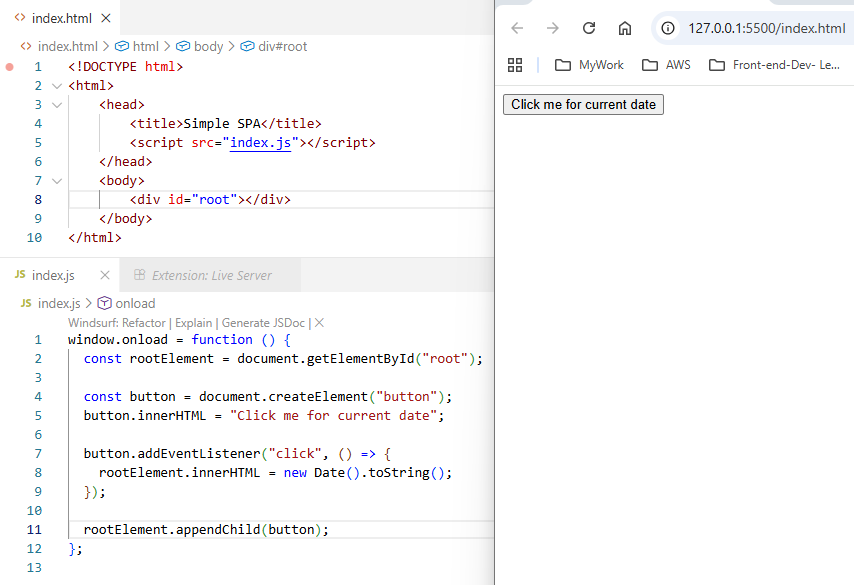

Now the UI updates instantly when the button is clicked — no page reload.

This is exactly how `React` works, but `React` uses a virtual DOM and components instead of manual DOM manipulation.

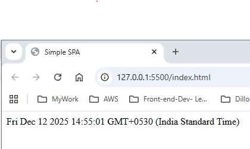

### How React turns this into a real SPA

```js:title=React_version_of_the_same_behavior
import React from "React";

function App() {
const [date, setDate] = useState("");

    return (
        <div>
            <button onClick={() => setDate(new Date().toString())}>
            Click me for current date
            </button>
            {date}
        </div>
    );
}
```

React handles:

- UI updates
- DOM diffing
- Efficient rendering
- State management

But the core idea is the same: **update the UI without reloading the page**.

### Why SPAs feel fast

- No full page reloads
- Only small pieces of UI update
- JavaScript handles rendering locally
- Network calls fetch data, not HTML pages

```js:title=Fetching_data_in_a_SPA
async function loadData() {
    const res = await fetch("/api/messages");
    const data = await res.json();
    setMessages(data);
}
```

📌 The page stays loaded — only the data changes.

📌 A `SPA` loads once and updates the UI dynamically using JavaScript.

📌 React automates this process using components, state, and the virtual DOM, making `SPA`s easier to build, maintain, and scale.

  </div>
</details>

<details>
  <summary>Understanding React without a build chain or `JSX` syntax</summary>
  <div>

- `React` does not require `JSX` or a build chain to work.
- At its core, `React` is just a `JavaScript` library that exposes functions like `React.createElement` and `ReactDOMClient.createRoot`.
- Understanding `React` without `JSX` helps you see how React truly works under the hood.

### Rendering a list using plain JavaScript (no React)

Start with a simple SPA that updates the DOM manually.

```js:title=index.html
<!DOCTYPE html>
<html lang="en">
  <head>
    <meta charset="UTF-8" />
    <meta name="viewport" content="width=device-width, initial-scale=1.0" />
    <title>Single Page App (SPA)</title>
    <script src="index.js"></script>
  </head>
  <body>
    <div id="root"></div>
  </body>
</html>

```

```js:title=index.js
// manual DOM manipulation
window.onload = function () {
  const rootElement = document.getElementById("root");
  let ul = document.createElement("ul");
  ul.id = "list";
  const ints = [1, 2, 3];
  ints.forEach((i) => {
    let li = document.createElement("li");
    li.innerHTML = i;
    ul.appendChild(li);
  });
  rootElement.appendChild(ul);
};
```

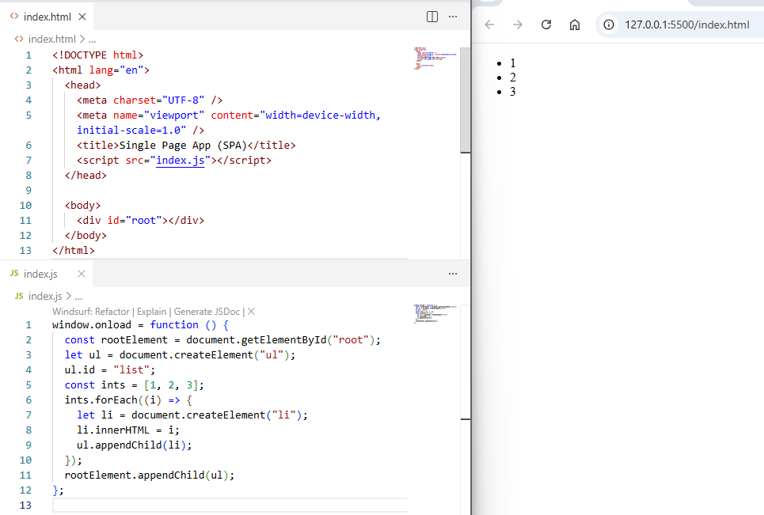

This is pure JavaScript updating the browser DOM — no React involved.

### Adding React to the page without `JSX` or a build tool

Load React directly using ESM CDN imports and Rendering the same list using React without `JSX`

```js:title=index.html
<!DOCTYPE html>
<html lang="en">
  <head>
    <meta charset="UTF-8" />
    <meta name="viewport" content="width=device-width, initial-scale=1.0" />
    <title>React SPA without JSX</title>
    <script type="module">
      import React from "https://esm.sh/react@19/?dev";
      import ReactDOMClient from "https://esm.sh/react-dom@19/client/?dev";

      window.onload = function () {
        const rootElement = document.getElementById("root");
        // from here all our interaction will be with virtual DOM
        const root = ReactDOMClient.createRoot(rootElement);
        const ints = [1, 2, 3];
        const childs = ints.map((i) =>
          React.createElement("li", { key: i }, i)
        );
        const ul = React.createElement("ul", null, childs);
        root.render(ul);
      };
    </script>
  </head>
  <body>
    <div id="root"></div>
  </body>
</html>
```

📌 This produces the exact same UI as the DOM‑only version — but now React manages the virtual DOM.

### Why React is not faster in this example

Both versions do the same work:

- Create 3 - ` elements
- Insert them into the DOM

📌 `React` is not faster here because nothing is changing. `React`’s performance advantage appears when the UI updates frequently.

### Where React becomes powerful: updating values

```js:title=Manual_DOM_update_hard_to_maintain
li.innerHTML = newValue;
```

```js:title=React_update_virtual_DOM_diffing
root.render(React.createElement("li", { key: 0 }, newValue));
```

📌 `React` compares the old `virtual DOM` with the new one and updates only what changed — not the entire DOM tree.

  </div>
</details>

<details>
  <summary>Creating a React app with the `Next.js` toolchain/framework</summary>
  <div>

## Toolchain

> React's Mission: "Build a JS Library that helps to build high performance web site efficiently"

- While React can run without any toolchain using plain `React.createElement` and `ReactDOMClient.createRoot`, almost no real-world apps are built this way.
- Modern React development relies on a toolchain to support `JSX`, **routing**, **bundling**, **optimization**, and **server-side rendering**.
- Today, `Next.js` is the most popular and recommended toolchain for building React apps.

### Why a toolchain is needed

- React alone does not support `JSX` — a toolchain must transpile it.
- React does not include routing, bundling, or server rendering.
- Toolchains automate optimization, code splitting, and asset handling.

```js:title=JSX_requires_a_build_step
// `JSX` (not valid JavaScript)

<h1>Hello React</h1>

// What Babel converts it into
React.createElement("h1", null, "Hello React");

```

📌 Without a toolchain, you would need to write the second version manually — which is why toolchains exist.

### Evolution of React toolchains

- **Create-React-App** `CRA` — introduced in 2016, once the standard.
- **`Next.js`** — now the dominant toolchain, actively maintained by **Vercel**.
- Other options: `Remix`, `Gatsby`, `RedwoodJS`, or `custom Webpack` setups.

`CRA` is no longer recommended in the official React docs. `Next.js` is now the preferred choice.

## Creating a new `Next.js` app

> The plan now is to buildthe identical appwe already built with just React API, but instead with `Toolchain` and `JSX`

Open a terminal and run: `npx create-next-app@latest`

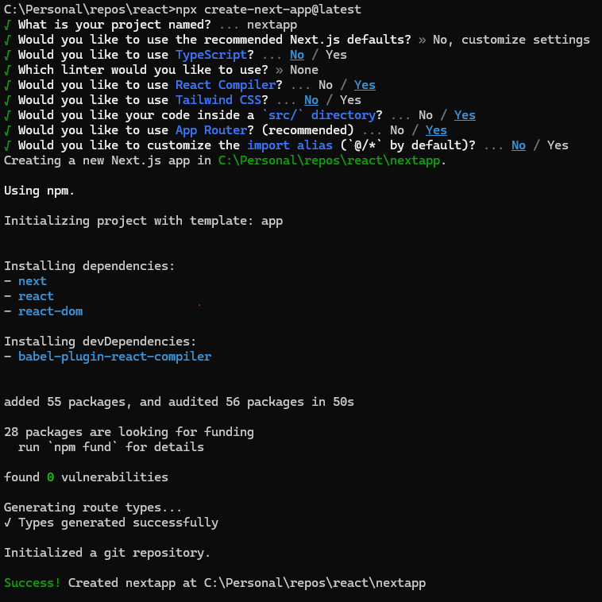

📌 This generates a complete `React` + `Next.js` project with `routing`, `bundling`, and `server components` enabled.

### Understanding the generated folder structure

```text
nextapp/
├── src/
│    └── app/
│         ├── page.js     ← root route (localhost:3000)
|         ├── layout.js
├── package.json
├── next.config.js
└── node_modules/
```

Remove unused files and simplify below files

```js:title=src/app/page.js
export default function Home() {
  return <h1>Hello from Next App</h1>;
}
```

```js:title=src/app/layout.js

export const metadata = {
  title: "Create Next App",
  description: "Generated by create next app",
};

export default function RootLayout({ children }) {
  return (
    <html lang="en">
      <body>{children}</body>
    </html>
  );
}
```

run: `npm run dev` and `Next.js` starts a development server at: `http://localhost:3000`


### How routing works in `Next.js`

`Next.js` uses a file-based routing system. Creating a new folder with a `page.js` file automatically creates a new route.

```js:title=src/app/mylist/page.js
export default function MyList() {
    return <h2>This is the MyList page</h2>;
}
```


### Server components vs client components

By default, `page.js` files are **server components**:

- They run on the Node.js server.
- They cannot use React hooks like `useState` or `useEffect`.

To use hooks, you must mark a component as a client component: `"use client"`

```js:title=src/app/page.js
"use client";
import { useState } from "react";

export default function Home() {
  const [ints, setInts] = useState([1, 2, 3]);
  function ListItems() {
    return (
      <>
        {ints.map((i) => (
          <li key={i}>{i}</li>
        ))}
      </>
    );
  }
  return (
    <ul>
      <button onClick={() => setInts([...ints, ints.length + 1])}> + </button>
      <ListItems />
    </ul>
  );
}
```


### Why `Next.js` is the preferred toolchain

- Built-in routing
- Server components
- Automatic code splitting
- Image optimization
- API routes
- Zero-config bundling (SWC)
- First-class React support

`Next.js` provides everything needed to build production-grade React apps.

  </div>
</details>

<details>
  <summary>Converting React library calls to `JSX` syntax</summary>
  <div>

Once a React app is scaffolded using a toolchain like `Next.js`, you no longer need to manually create a virtual DOM or call `React.createElement`. The toolchain handles all of that behind the scenes, allowing you to write clean `JSX` instead of low-level React API calls.

### Launching the `Next.js` development server

After creating the project with `create-next-app`,

start the dev server: `npm run dev`

This starts a Node.js server at:`http://localhost:3000`

Your browser automatically loads the root route, which is controlled by `/src/app/page.js`.

### Replacing the default page with a simple `JSX` component

Open `/src/app/page.js` and replace the generated code with a simple component:

```js:title=page.js
export default function Page() {
    return <h1>Hello from React App</h1>;
}
```

This is `JSX` — a developer-friendly syntax that `Next.js` automatically transpiles into React library calls.

### Making the component a client component

By default, `page.js` is a **server component** (runs on Node.js). To use browser-only features like `useState`, mark it as a client component:

```js:title=page.js
"use client";

export default function Page() {
    return <h1>Hello from React App</h1>;
}
```

This tells `Next.js` to render this component in the browser instead of on the server.

### Comparing `JSX` to raw React library calls

```js:title=JSX_version_what_you_write
<h1>Hello from React App</h1>
```

```js:title=What_Babel_converts_it_into_what_React_actually_runs
React.createElement("h1", null, "Hello from React App");
```

📌 `Next.js` handles this conversion automatically — no manual calls needed.

### Cleaning up the scaffolded project

You can safely delete unused files like:

- `favicon.ico`
- `page.module.css`

And simplify `globals.css` to your preferred styling.

### What `Next.js` does for you automatically

Unlike building React manually, you do **not** need to:

- Create a base `index.html`
- Call `ReactDOMClient.createRoot`
- Call `root.render()`
- Manage the virtual DOM
- Transpile `JSX`

`Next.js` handles all of this behind the scenes. You only write components.

### Example: `JSX` vs manual React API (side-by-side)

```js:title=Manual_React_no_JSX
const element = React.createElement(
  "div",
  null,
  React.createElement("h1", null, "Hello")
);

root.render(element);
```

```js:title=JSX_with_Nextjs
export default function Page() {
  return (
    <div>
      <h1>Hello</h1>
    </div>
  );
}
```

Both produce the same UI — `JSX` is simply a cleaner, more expressive syntax.

  </div>
</details>

<details>
  <summary>Expanding `JSX` syntax to handle lists and child components</summary>
  <div>

- `JSX` is one of `React`’s most powerful features because it allows developers to mix `JavaScript` expressions with `HTML`‑like syntax.
- To understand `JSX` deeply, it helps to expand beyond simple text rendering and build lists, reusable components, and nested component trees.

### Starting with simple `JSX`

```js:title=component_returning_static_JSX
export default function Page() {
  return <div>Hello from React App</div>;
}

```

This works, but `JSX` becomes far more useful when rendering dynamic lists and child components.

### Rendering a simple list without advanced `JSX`

```js:title=component_returning_JSX_with_a_static_list
export default function Page() {
    return (
        <ul>
          <li>1</li>
          <li>2</li>
          <li>3</li>
        </ul>
    );
}
```

This works, but it’s not dynamic or reusable.

### Creating a child component inside the same file

React components must return a single element. To return multiple items, wrap them in a **React Fragment**:

```js
function ListItems() {
  return (
    <>
      <li>1</li>
      <li>2</li>
      <li>3</li>
    </>
  );
}

export default function Page() {
  return <ListItems />;
}
```

**Fragments** (`<></>`) allow returning multiple elements without adding extra DOM nodes.

### Rendering a list dynamically using JavaScript expressions

`JSX` allows embedding JavaScript inside `{ }`. This is where `JSX` becomes powerful.

```js:title=Create_an_array_of_integers
const ints = [1, 2, 3];
```

```js:title=Render_the_list_using_map()
export default function Page() {
  const ints = [1, 2, 3];

  return (
      {ints.map((num) => (
        <li key={num}>{num}</li>
      ))}
  );
}
```

📌 **Why map works but forEach does not:**

- `map()` returns a new array → React can render it.
- `forEach()` returns `undefined` → nothing to render.

### Combining dynamic lists with child components

Extract the list item into its own component for cleaner `JSX`:

```js
function Item({ value }) {
  return- {value};
}

export default function Page() {
  const ints = [1, 2, 3];

  return (

      {ints.map((num) => (
        <Item key={num} value={num} />
      ))}

  );
}
```

📌 This demonstrates how `JSX` naturally builds component trees.

### `JSX` rules demonstrated

- Components must start with an uppercase letter (`ListItems`, `Item`).
- Components must return a single element → use fragments when needed.
- JavaScript expressions go inside `{ }`.
- Lists must include a `key` prop for each item.

  </div>
</details>

<details>
  <summary>What F(G(X)) means when rendering React component trees</summary>
  <div>

> functional programming is language of **F(G(X))**

In functional programming, **F(G(X))** represents **function composition** — one function returns another function, which returns another, and so on.

This pattern allows complex behavior to be built by combining smaller, reusable functions. React uses this exact idea to build component trees.

### Functional composition: the idea behind F(G(X))

From previous example, rename **Home** -> `F` and **ListItems** -> `G`

```js:title=src/app/page.js
"use client";
import { useState } from "react";

export default function F() {
  const [ints, setInts] = useState([1, 2, 3]);
  function G() {
    return (
      <>
        {ints.map((i) => (
          <li key={i}>{i}</li>
        ))}
      </>
    );
  }
  return (
    <ul>
      <button onClick={() => setInts([...ints, ints.length + 1])}> + </button>
      <G />
    </ul>
  );
}
```

- Functional composition means function `F` return function `G` as output, function `G` receives `X` to produce output, where `X` is React's prop or state.
- Each function transforms data and passes it along. This is the foundation of React’s component architecture.

### Adding state → the real X in React apps

When state is introduced, X becomes dynamic:

```js:title=src/app/page.js
"use client";
import { useState } from "react";

export default function F() {
  const [count, setCount] = useState(0); // X = count
  function G({ value }) {
    return <>{value}</>;
  }
  return (
    <ul>
      <button onClick={() => setCount(count + 1)}>Add</button>
      <G value={count} />
    </ul>
  );
}
```

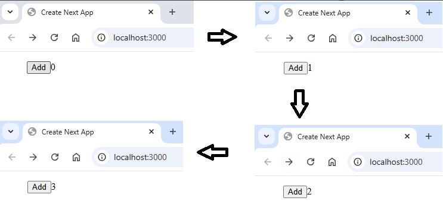

📌 Every time `count` changes, React recomposes the UI.

### Why this matters

- Shows you understand React as a functional system, not just JSX.
- Explains why React components are small, pure functions.
- Demonstrates how props/state flow through the component tree.
- Reveals how React re-renders efficiently using composition.

  </div>
</details>

<details>
  <summary>What makes React apps reactive</summary>
  <div>

- `React` apps are **reactive** because `React` maintains **component state** — special data that, when updated, automatically triggers a re‑render of the component tree.
- Unlike normal `JavaScript` variables, `React` state persists across renders and notifies the `React` engine to update the UI.

### Why normal variables don’t trigger UI updates

```js
let count = 0;
count = 5; // UI does NOT update
```

📌 `React` has no idea this variable changed. It only reacts to state updates.

### Introducing component state with useState

`React` state is created using the `useState` hook:

```js
import { useState } from "react";

const [ints, setInts] = useState([1, 2, 3]);
```

- `ints` → current state value
- `setInts` → function to update state

📌 Updating state automatically re-renders the component.

### Passing state from parent to child (props)

```js:title=Parent_component
function App() {
    const [ints, setInts] = useState([1, 2, 3]);

    return <ListItems ints={ints} />;
}
```

```js:title=Child_component_receiving_props
function ListItems({ ints }) {
    return (
        <ul>
            {ints.map((n) => (
            <li key={n}>{n} />
            ))}
        </ul>
    );
}
```

### Updating state from a child (passing functions down)

To allow a child to update parent state, pass a function as a prop.

```js:title=Parent
function App() {
    const [ints, setInts] = useState([1, 2, 3]);

    function addValue() {
        const max = Math.max(...ints);
        setInts([...ints, max + 1]);
    }

    return <ListItems ints={ints} addValue={addValue} />;
}
```

```js:title=Child
function ListItems({ ints, addValue }) {
    return (
    <>
        <button onClick={addValue}>Add Item</button>
        <ul>
        {ints.map((n) => (
            <li key={n}>{n} <li/>
        ))}
        </ul>
    </>
    );
}
```

📌 Clicking the button updates state → React re-renders → UI updates.

### Passing data back up using an anonymous function

To pass custom values from child → parent, wrap the parent function:

```js:title=Parent
function addValue(increment) {
    const max = Math.max(...ints);
    setInts([...ints, max + increment]);
}
```

```js:title=Child
function ListItems({ ints, addValue }) {
    const incrementBy = 3;

    return (
    <>
        <button onClick={() => addValue(incrementBy)}>
        Add Item
        </button>

        <ul>
        {ints.map((n) => (
            <li key={n}>{n} />
        ))}
        </ul>
    </>
    );
}
```

📌 Now each click adds **+3** instead of **+1**.

### Why React needs keys when rendering lists

Keys help React track which items changed between renders.

```js
{
  ints.map((n) => <li key={n}>{n}/>);
}
```

📌 Without keys, React cannot efficiently update the DOM.

### Why React apps are “reactive”

- State changes trigger re-renders automatically.
- React diffs the virtual DOM to find what changed.
- Only the necessary parts of the UI update.
- Parent → child data flows via props.
- Child → parent communication happens via callback functions.

  </div>
</details>

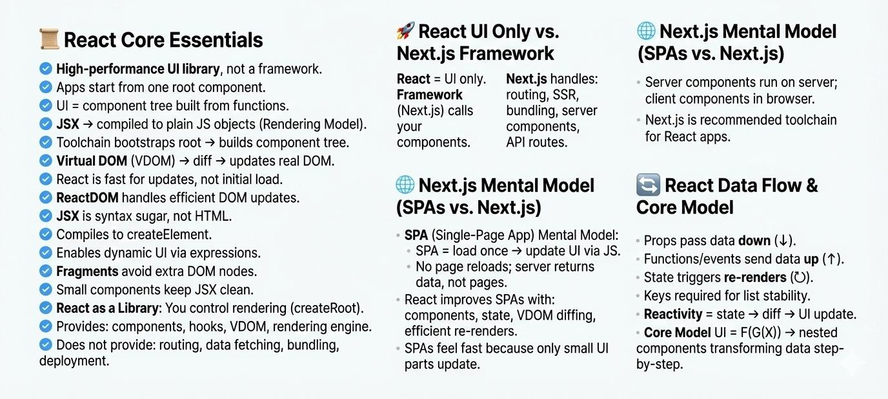
