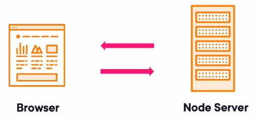
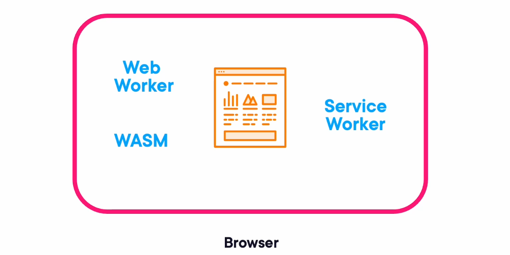
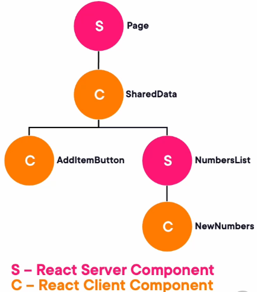

<details>
  <summary>How <strong>React</strong> and <strong>ReactDOM</strong> work together to update a web browser</summary>
  <div>

## Building Apps for React and ReactNative

> React separates the building and managing of components from their rendering to a device

- `React` is a **UI library** that manages component **logic**, **state**, and the **virtual DOM**, intentionally designed to be independent of any specific rendering environment.
- `ReactDOM` is the **Browser-specific renderer** that takes `React` elements and mounts them into the physical DOM.
- `ReactNative` is the **Mobile-specific renderer** that takes `React` elements and mounts them into the physical DOM (both iOS and Android).
- Together, they separate **what to render `React`** from **where to render it `ReactDOM` for browsers or `ReactNative` for mobile**.

> Skills you develop for building React apps can be leveraged in React Native apps

📌 There is no **Write once, run everywhere** for `React` and `ReactNative`
📌 **Separate components required** for UIs in `React` and `ReactNative`
📌 You can build **shared components** between `React` and `ReactNative`

### `React` manages components **— not the browser**

`React` builds and manages a **component tree** using `JavaScript`. It knows:

- Which **component**s exist
- How they relate to each other
- What **state** and **props** they hold
- How to generate a virtual DOM representation

📌 `React` is responsible for:

- Creating React Element
- Creating UIs
- Linking Components together
- `React` does **not** know how to draw UI on a screen. That job belongs to a renderer like `ReactDOM` or `React Native`.

### `ReactDOM` renders React components **into the browser**

```js:title=ReactDOM_takes_the_virtual_DOM_created_by_React_and_updates_the_real_browser_DOM
import React from "react";
import ReactDOM from "react-dom/client";
import App from "./App";

const root = ReactDOM.createRoot(document.getElementById("root"));
root.render(<App />);

```

📌 `ReactDOM` is responsible for:

- Building initial DOM tree
- Mounting the **root** component
- Listening for state/prop changes **Diffing** the **virtual DOM**
- Performing minimal DOM updates by **Updating** only the **changed DOM** nodes

### `React Native` uses the same React library — but a different renderer

`React Native` uses `React` for component logic, but renders using native **mobile UI** elements instead of `HTML`.

```js:title=React_for_Web
import React from "React";

export default function App() {
  return (
    <div>
      <b>Hello from React App</b>
    </div>
  );
}

```

```js:title=ReactNative_for_Mobile
import { View, Text } from "react-native";

export default function App() {
  return (
  <View>
    <Text style={{ fontWeight: "bold" }}>
      Hello from React Native App
    </Text>
  </View>
  );
}

```

📌 The `JSX` syntax and component structure are identical — **only the renderer changes**.

### Why `React` and `ReactDOM` are separate libraries

This separation allows React to support multiple platforms:

- **ReactDOM** → browsers
- **React Native** → iOS & Android
- **React Three Fiber** → WebGL
- **React PDF** → PDF rendering

📌 React stays focused on component logic, while renderers handle platform-specific UI.

### What ReactDOM actually does

```js:title=React_updates_only_what_changed
function Counter() {
  const [count, setCount] = useState(0);

  return (
    <button onClick={() => setCount(count + 1)}>
      Count: {count}
    </button>
  );
}

```

📌 ReactDOM updates only the text node containing `{count}`, not the entire button.

  </div>
</details>

<details>
  <summary>Understanding React <strong>Reconciliation</strong></summary>
  <div>

## Reconciliation

- `React reconciliation` is the process `React` uses to determine **what changed** in the UI when component state updates.
- Instead of re-rendering the entire DOM, React compares the **old virtual DOM** with the **new virtual DOM** and updates only what is necessary.
- This makes React apps **fast**, **efficient**, and **responsive**.

### How rendering works in every React app

- At the start of React app (using Fx or not) there is call to `ReactDOM.createRoot()` that returns an object i.e. root of your app
- After that when you call `root.render()`, the React app renders to the browser

```js:title=Every_React_app_begins_with
const root = ReactDOM.createRoot(document.getElementById("root"));

root.render(<App />);

```

Assuming the root of your app is rendered, Whenever state changes inside any component, React:

- **Rebuilds** the virtual DOM for the updated component tree
- **Compares** it with the previous virtual DOM
- **Updates only the changed** parts of the real DOM

📌 This comparison step is called **reconciliation**.

### Example: To‑Do app re-rendering

When the user types a new task and clicks **Add Item**:

- The virtual DOM updates with the new list item
- React calls `root.render()` internally
- React compares old vs new virtual DOM
- Only the new `<li>` is added to the real DOM

```html:title=Before
  <ul>
    <li>Buy Sugar</li>
    <li>Eat Carrots</li>
  </ul>
```

```html:title=After_clicking_Add
<ul>
  <li>Buy Sugar</li>
  <li>Eat Carrots</li>
  <li>Walk Dog</li>   <!-- Only this node is added -->
</ul>
```

📌 React does **not** re-render the entire list — only the new item.

### Why React cannot re-render the entire DOM

Rebuilding the entire DOM on every state change would:

- Destroy event listeners
- Cause layout thrashing
- Make the UI flicker
- Be extremely slow for large apps

📌 Reconciliation avoids all of this.

### How reconciliation works internally

React keeps two virtual DOM trees:

- **oldVDOM** → previous render
- **newVDOM** → after state update

```js:title=React_compares_them_node_by_node
if (oldNode.type !== newNode.type) {
// Replace the entire subtree
} else {
// Update only changed props or children
}

```

📌 This is called the **diffing algorithm**.

### Why keys matter in reconciliation

```js:title=Keys_help_React_identify_which_list_items_changed
{items.map(item => (
<li key={item.id}>{item.text}</li>
))}

```

📌 Without keys, React cannot match old and new nodes efficiently.

### Complexity of naive diffing

Mathematically, comparing two trees of `n` nodes is **O(n³)**.  
For 200 nodes → 6 million comparisons.

React avoids this by using smart heuristics:

- Elements of different types are never compared
- Lists use keys to avoid expensive comparisons
- Most components re-render only their subtree

📌 This makes reconciliation **extremely fast** in real apps.

### Example: Minimal DOM updates

```js:title=State_update
setItems([...items, "New Task"]);
```

```js:title=React_updates_only_this
<li>New Task</li>
```

📌 Everything else stays untouched.

  </div>
</details>

<details>
  <summary><strong>Distributed React Components</strong> (Server‑side + Client‑side Execution)</summary>
  <div>

Modern React apps can run components in two different environments:

- Some components execute on a **Node.js server**
- While others execute in the **browser**.



Together, these form a **distributed React architecture** where different parts of the UI are computed in different places but still behave like a single unified React app.

### What “distributed components” means in React

React components can run in two places:

- **Server‑executed components** → run inside **Node.js**
- **Browser‑executed components** → run inside the client’s **browser**

📌 Both environments run `JavaScript`, so both can execute `React` components. The server can compute UI, fetch data, and pass results down to browser‑executed components.

### Why this is possible

`Node.js` and browsers both run JavaScript engines (**V8**, **Chakra**, etc.). This means:

- React components can run on the server
- React components can run in the browser
- Data can flow between them as props

📌 This creates a **distributed execution model** where some components render early on the server, and others render later in the browser.

### Example: Distributed rendering flow

```js:title=Server_executed_component
// Runs on Node.js
export default function ProductsPage() {
  const products = fetchProductsFromDB(); // server-only work
  return (
    <div>
      <h1>Products</h1>
      <ProductList items={products} />
    </div>
  );
}
```

```js:title=Browser_executed_component
// Runs on client's browser
"use client";

export function ProductList({ items }) {
  const [selected, setSelected] = useState(null);

  return (
    <ul>
  {items.map(p => (
    <li key={p.id} onClick={() => setSelected(p)}>
    {p.name}
    </li>
  ))}
  </ul>
  );
}

```

📌 The server computes `products` and passes them to the browser component as **props**.

### Why distributed components matter

This architecture allows:

- **Heavy work** (database queries, API calls) to run on the server
- **Interactive work** (clicks, state updates) to run in the browser
- Faster initial page loads
- Less JavaScript shipped to the client

📌 It’s the best of both worlds: **server efficiency** + **client interactivity**.

### Future of distributed React

Today, distributed React means **server** + **browser** execution.


In the future, components may run in:



- **Web Workers** (background threads)
- **Service Workers** (offline logic)
- **WebAssembly (WASM)** (high‑performance execution)
- New browser processes not yet invented

📌 This will allow `React` to distribute work even more efficiently across multiple execution environments.

  </div>
</details>

<details>
  <summary>What’s behind server component technology</summary>
  <div>

## Server Component technology

- To understand server component technology, it helps to start with the simplest possible example:
- A `pure JavaScript SPA` that renders `HTML` in the browser and updates the DOM when the user interacts with it.
- From there, we can evolve the idea into how `React` server-rendered pages work before switching into `SPA` mode.

### Pure JavaScript SPA: Everything happens in the browser

In the earliest example, the browser loads a single `HTML` file and a `JavaScript` file.

The JavaScript:

- creates a list of numbers
- renders them into the DOM
- adds a button
- updates the DOM when the button is clicked

```js:title=index.js
// (pure JavaScript SPA)
const root = document.getElementById("root");
let numbers = [1, 2, 3];

function renderList() {
  return `
  <ul>
    ${numbers.map((n) => `<li>${n}</li>`).join("")}
  </ul>
`;
}

function renderButton() {
  return `<button id="addBtn">Add Item</button>`;
}

root.innerHTML = renderList() + renderButton();

document.getElementById("addBtn").addEventListener("click", () => {
  numbers.push(numbers.length + 1);
  root.innerHTML = renderList() + renderButton();
});
```

📌 This is a pure SPA — everything happens in the browser after the initial page load.

### Why this matters for understanding server components

Server components allow React to:

- Render the initial HTML on the server
- Send that HTML to the browser
- Then let the browser take over as a SPA

📌 This is exactly what our pure JavaScript example does — except the “server-rendered HTML” is replaced by **JavaScript writing HTML into the DOM**.

### Moving toward server-rendered HTML

To simulate what React server components do, we evolve the example:

- Instead of using Live Server, we **use a Node.js server**
- The server sends a **fully rendered HTML page to the browser**
- After that, **browser-side JavaScript handles interactivity**

```js:title=Server_sends_static_HTML
// server.js (Node)
import http from "http";

const html = `
<html>
  <body>
    <div id="root">
      <ul><li>1</li><li>2</li><li>3</li></ul>
      <button id="addBtn">Add Item</button>
    </div>
    <script src="/client.js"></script>
  </body>
</html>
`;

http.createServer((req, res) => {
  res.end(html);
}).listen(3000);

```

```js:title=Browser_JavaScript_takes_over_after_load
// client.js
let numbers = [1, 2, 3];

document.getElementById("addBtn").addEventListener("click", () => {
numbers.push(numbers.length + 1);
document.getElementById("root").innerHTML = `
  <ul>
    ${numbers.map(n => `<li>${n}</li>`).join("")}
  </ul>
  <button id="addBtn">Add Item</button>
`;
});

```

This is the exact pattern React server components follow:

- Server renders `HTML`
- Browser loads it
- Browser JavaScript takes over and runs as a `SPA`

### How this maps to React server components

React server components:

- Run on the `Node.js` server
- Produce `HTML` (or serialized component payloads)
- Send that HTML to the browser
- Browser hydrates the UI and becomes interactive

```js:title=Server_component_example
// Runs on the server
export default function Page() {
  const items = [1, 2, 3]; // server-side data
  return (
    <div>
      <List items={items} />
    </div>
  );
}

```

```js:title=Client_component_example
"use client";

export function List({ items }) {
  const [nums, setNums] = useState(items);

  return (
    <>
      <button onClick={() => setNums([...nums, nums.length + 1])}>
        Add Item
      </button>

      <ul>
        {nums.map(n => <li key={n}>{n}</li>)}
      </ul>
    </>
  );
}

```

📌 The server renders the initial list.  
📌 The browser handles updates after hydration.

### Why this architecture exists

Server components allow React to:

- Render faster initial pages
- Reduce JavaScript sent to the browser
- Fetch data securely on the server
- Offload heavy computation to Node.js
- Still behave like a SPA after hydration

  </div>
</details>

<details>
  <summary>Converting a JavaScript SPA to a Node server‑based app</summary>
  <div>

## JS SPA to a Node server app

- To understand how **React server components** work, it helps to first convert a simple **JavaScript SPA** into a **Node‑rendered app**.
- This demonstrates how HTML can be rendered on the server first, then enhanced with browser JavaScript — the same pattern React uses for server‑side rendering and server components.

### Starting point: a pure JavaScript SPA

The original SPA:

- Loads a single HTML file
- Renders a list of numbers using JavaScript
- Adds a button that appends new numbers to the list
- Updates the DOM entirely in the browser

```js:title=index.js
// (SPA)
const root = document.getElementById("root");
let numbers = [1, 2, 3];

function generateListHTML() {
  return `
  <ul>
    ${numbers.map((n) => `<li>${n}</li>`).join("")}
  </ul>
`;
}

function generateButtonHTML() {
  return `<button id="addBtn">Add Item</button>`;
}

root.innerHTML = generateListHTML() + generateButtonHTML();

document.getElementById("addBtn").addEventListener("click", () => {
  numbers.push(numbers.length + 1);
  root.innerHTML = generateListHTML() + generateButtonHTML();
});
```

📌This is a **classic SPA** — everything happens in the browser.

### Step 1: Wrap the SPA inside a Node.js HTTP server

```js:title=server.js
import http from "http";

http.createServer((req, res) => {
res.writeHead(200, { "Content-Type": "text/html" });

res.end(`
  <html>
    <body>
      <div id="root"></div>
      <script src="/client.js"></script>
    </body>
  </html>
`);
}).listen(3000);

```

📌 Run it:`node server.js`, Now the SPA is served by Node instead of Live Server.

### Step 2: Move rendering logic from browser → server

Move the list‑generation functions into `server.js`:

```js:title=server.js
// server.js
const numbers = [1, 2, 3];

function generateListHTML() {
  return `
    <ul>
      ${numbers.map(n => `<li>${n}</li>`).join("")}
    </ul>
  `;
}

function generateButtonHTML() {
  return `<button id="addBtn">Add Item</button>`;
}

```

📌 Now the server generates the initial HTML before sending it to the browser.

### Step 3: Insert server‑generated HTML into the response

```js
const initialListHTML = generateListHTML();
const buttonHTML = generateButtonHTML();

res.end(`
<html>
  <body>
    <div id="root">
      ${initialListHTML}
      ${buttonHTML}
    </div>

    <script>
      const numbers = ${JSON.stringify(numbers)};
    </script>

    <script src="/client.js"></script>
  </body>
</html>
`);
```

Now the browser receives:

- A fully rendered list
- A button
- A JavaScript array containing the initial numbers

### Step 4: Browser JavaScript handles updates

Update `client.js` to remove initial rendering logic:

```js:title=client.js
document.getElementById("addBtn").addEventListener("click", () => {
numbers.push(numbers.length + 1);

document.getElementById("root").innerHTML = `
  ${generateListHTML(numbers)}
  <button id="addBtn">Add Item</button>
`;
});

```

📌 The browser still handles interactivity — but the initial HTML now comes from the server.

### What this demonstrates

This hybrid model shows the foundation of React server components:

- **Server renders initial HTML** → fast first paint
- **Browser hydrates and takes over** → SPA behavior
- **State updates happen client‑side**
- **Server can precompute UI before sending it down**

📌 This is exactly how React server components + client components work together.

  </div>
</details>

<details>
  <summary>Converting a Server‑Rendered JavaScript App to React (Server + Client Components)</summary>
  <div>

- When apps grow beyond trivial DOM manipulation, managing what runs on the server vs. what runs in the browser becomes difficult.
- React solves this by introducing **Server Components** and **Client Components**, allowing you to split logic cleanly between `Node.js` and the `browser`.
- Using Next.js, this architecture becomes easy to implement and scales extremely well.

### The problem with server‑rendered JavaScript apps

In the earlier example, we:

- Rendered HTML on the server
- Sent it to the browser
- Used browser JavaScript to add interactivity

📌 This works for small apps, but becomes unmanageable when:

- state must be shared across components
- logic is duplicated between server and browser
- DOM updates become complex
- data fetching and UI rendering mix together

📌 React solves this by letting you write components that run either on the server or in the browser — but still feel like one unified app.

### Next.js determines where components run

Using the `App Router`, the **root** component is always:`/app/page.js`

By default, **page.js is a Server Component** (runs in Node.js)

- Any component imported by a Server Component is also a Server Component
- To make a component run in the browser, add `"use client"` at the top

### Example project structure

```text
app/
├── page.js                ← Server Component
├── SharedDataProvider.js  ← Client Component
├── NumbersList.js         ← Server Component
└── AddItemButton.js       ← Client Component

```

### Server Component: Rendering initial HTML

**page.js** runs on the server and renders the initial list:

```js:title=page.js
// app/page.js (Server Component)
const initialNumbers = [1, 2, 3];

export default function Page() {
  return (
    <SharedDataProvider initial={initialNumbers}>
      <NumbersList />
      <AddItemButton />
    </SharedDataProvider>
  );
}

```

📌 This behaves like your earlier Node server example — the list is rendered before the browser loads any JavaScript.

### Server Component: Rendering the list

```js:title=NumbersList.js
// app/NumbersList.js (Server Component)
export default function NumbersList({ numbers }) {
  return (
    <ul>
      {numbers.map(n => <li key={n}>{n}</li>)}
    </ul>
  );
}

```

📌 Because this runs on the server, the list appears instantly on first load.

### Client Component: Handling interactivity

```js:title=AddItemButton.js
// app/AddItemButton.js (Client Component)
"use client";

import { useSharedData } from "./SharedDataProvider";

export default function AddItemButton() {
  const { numbers, setNumbers } = useSharedData();

  return (
    <button onClick={() => setNumbers([...numbers, numbers.length + 1])}>
      Add Item
    </button>
  );
}

```

📌 This component runs in the browser, so it can attach event listeners and update state.

### Client Component: Sharing state between components

```js:title=SharedDataProvider.js
// app/SharedDataProvider.js (Client Component)
"use client";

import { createContext, useContext, useState } from "react";

const DataContext = createContext();

export default function SharedDataProvider({ initial, children }) {
const [numbers, setNumbers] = useState(initial);

return (
  <DataContext.Provider value={{ numbers, setNumbers }}>
    {children}
  </DataContext.Provider>
);
}

export function useSharedData() {
  return useContext(DataContext);
}

```

This allows:

- **NumbersList** to show the initial server-rendered list
- **AddItemButton** to update the list in the browser
- **NewNumbers** (another client component) to show new items



📌 This architecture mirrors your earlier Node + browser example, but React handles all the complexity for you.

### Why this scales better than pure JavaScript

- Server Components fetch data **without shipping JS** to the browser
- Client Components handle **interactivity cleanly**
- **State is shared** through **React context** instead of global variables
- **Rendering is declarative**, not manual DOM manipulation
- Large apps stay **maintainable** and **predictable**

  </div>
</details>

<details>
  <summary>How React renders external data from sources like databases</summary>
  <div>

-` React`’s reactivity is not limited to local browser events like button clicks. -` React` can also update the UI when **external asynchronous data** arrives — such as results from a database query, REST API call, or any remote data source.

- The key idea is that **React re-renders whenever state changes**, regardless of where the new data comes from.

### Local events vs external data

So far, examples focused on:

- Button clicks
- Input changes
- Local state updates

📌 But React doesn’t care _why_ state changes — only that it **did**.  
📌 External data (like a database query) can update state the same way.

### Why browsers cannot talk directly to databases

Browsers cannot connect to databases like `SQLite`, `MySQL`, or `PostgreSQL` because:

- There is **no browser protocol** for database connections
- It would be a **massive security risk**

Therefore, we need a **server layer** to fetch data.

### The solution: REST API endpoint

The server (Node.js in this example) can access the database and expose a REST endpoint:

```js:title=Nodejs_Rest_Endpoint
app.get("/products", async (req, res) => {
  const rows = await db.all("SELECT * FROM products");
  res.json(rows);
});

```

This endpoint:

- Connects to `SQLite`
- Runs the `SQL` query
- Returns `JSON` to the browser

You can test it directly in the browser:`http://localhost:3000/products`

### React retrieves the data using fetch()

React calls the REST endpoint and updates state when the data arrives.

```js
import { useState } from "react";

export default function Products() {
  const [products, setProducts] = useState([]);
  const [loading, setLoading] = useState(false);

  async function retrieveData() {
    setLoading(true);

    const res = await fetch("/products");
    const data = await res.json();

    setProducts(data);
    setLoading(false);
  }

  return (
    <div>
      <button onClick={retrieveData}>Retrieve Data</button>
      {loading && <p>Loading...</p>}
      <ul>
        {products.map((p) => (
          <li key={p.id}>{p.name}</li>
        ))}
      </ul>
    </div>
  );
}
```

React re-renders automatically when:

- `loading` changes
- `products` changes

### What React is actually doing

React’s job is simple:

- Call the REST endpoint
- Wait for the async response
- Store the result in state
- Re-render the UI with the new data

📌 React does not fetch data itself — it reacts to state changes.

### Visual flow of external data rendering

```text

Browser (React) ---- fetch() ----> Node Server ---- SQL ----> Database
Browser (React) <--- JSON Response --- Node Server
Browser (React) updates state ---> React re-renders UI

```

  </div>
</details>

<details>
  <summary>Rendering in React with just component state updates</summary>
  <div>

- `React SPA`s render external data by combining **state updates** with asynchronous calls.
- The key idea is simple: **whenever state changes, React re-renders** the UI.
- That state can be updated by local events (like button clicks) or by external data arriving from a REST API or database query.

### The basic pattern

- Click a button → update `loading` state
- React re-renders → shows a loading message
- Async fetch completes → update `data` state
- React re-renders again → shows the retrieved data

```js:title=React_SPA_fetching_products
import { useState } from "react";

export default function Products() {
  const [loading, setLoading] = useState(false);
  const [data, setData] = useState([]);

  async function retrieveData() {
    setLoading(true); // state update → re-render with "Loading..."
    const res = await fetch("http://localhost:3000/api/products");
    const products = await res.json();
    setData(products); // state update → re-render with data
    setLoading(false);
  }

  return (
    <div>
      <button onClick={retrieveData}>Retrieve Data</button>

      {loading && <p>Loading...</p>}

      <ul>
        {data.map(p => (
          <li key={p.id}>{p.name}</li>
        ))}
      </ul>
    </div>
  );
}

```

This example uses only two pieces of state:

- `loading` → boolean flag for showing a loading message
- `data` → array of products retrieved from the database

### What React is doing under the hood

- Initial render → empty list, no loading message
- Click button → `loading` set to true → React re-renders with "Loading..."
- Fetch completes → `data` set to products → React re-renders with product list
- `loading` set to false → React re-renders again, removing the loading message

### Why this pattern is so common

- **Simple**: only two states (`loading` and `data`)
- **Universal**: works with any REST API or GraphQL endpoint
- **Scalable**: can be extended to multiple components and tables
- **Declarative**: React handles DOM updates automatically

  </div>
</details>

<details>
  <summary>Replacing Component State with <strong>Suspense</strong> and <strong>Promises</strong></summary>
  <div>

- Before React 18, developers **used component state** (`loading`, `data`) to manage async operations like fetching data.
- With React 18’s concurrent rendering, **Suspense + Promises** can replace much of this state management, simplifying async UI flows and avoiding race conditions.

### The old pattern: state-driven async rendering

Traditional React apps use:

- `loading` state → show loading message
- `data` state → show fetched data
- `useEffect` → trigger fetch

This works, but becomes messy when:

- multiple async calls overlap
- race conditions occur
- many components depend on async data

React 18 introduces a cleaner alternative.

### The new pattern: Suspense + Promises

React `Suspense` lets you declaratively say:

> Render this fallback UI until the promise resolves.

`Suspense` works by:

- Wrapping a component in `<Suspense fallback="Loading...">`
- Inside the child component, calling `use(promise)`
- React pauses rendering until the promise resolves
- When resolved, Suspense replaces the fallback with the real UI

### Updated parent component using Suspense

```js:title=app/products/page.js
import Products from "./products";

export default function ProductPage(){
  return (
    <div>
      <h1>Products</h1>
      <Products />
    </div>
  )
}
```

```js:title=app/products/products.js
"use client"
import { Suspense, useState, useEffect } from "react";
import ProductsDisplay from "./products-display";

export default function Products() {
  const [show, setShow] = useState(false);

  useEffect(() => {
    setShow(true); // auto-load on mount
  }, []);

  return !show
    ? (null)
    :(
      <>
        <Suspense fallback={<div>Loading...</div>}>
          <ProductsDisplay />
        </Suspense>
      </>
    );
}
```

Notice what’s missing:

- No `loading` state
- No `data` state
- No `useEffect` for fetching

Suspense handles all async rendering automatically.

### The child component uses `use()` with a promise

```js:title=products-display.js
import { use } from "react";
import { fetchDataPromise } from "./fetch-data-promise";

export default function ProductsDisplay() {
  const products = use(fetchDataPromise("https://fakestoreapi.com/products"));

  const cellStyle = { borderBottom: "1px solid #ddd", padding: ".5rem" };
  const nameStyle = {
    maxWidth: "15rem",
    whiteSpace: "nowrap",
    overflow: "hidden",
    textOverflow: "ellipsis",
    ...cellStyle,
  };
  return (
    <table
      style={{
        borderCollapse: "collapse",
        borderSpacing: ".5rem",
      }}
    >
      <thead>
        <tr>
          <th style={cellStyle}>Id</th>
          <th style={nameStyle}>Name</th>
          <th style={cellStyle}>Price</th>
          <th style={cellStyle}>Category</th>
        </tr>
      </thead>
      <tbody>
        {products.map((p) => (
          <tr key={p.id}>
            <td style={cellStyle}>{p.id}</td>
            <td style={nameStyle}>{p.title}</td>
            <td style={cellStyle}>{p.price}</td>
            <td style={cellStyle}>{p.category}</td>
          </tr>
        ))}
      </tbody>
    </table>
  );
}
```


When `use()` receives a pending promise:

- React **suspends rendering**
- Suspense **shows the fallback UI**
- When the **promise resolves**, React **re-renders** with the data

### The promise function with caching

```js:title=fetch-data-promise.js
const cache = {};

export function fetchDataPromise(url) {
  if (!cache[url]) {
    cache[url] = getData(url);
  }
  return cache[url];
}

async function getData(url) {
  const res = await fetch(url);
  return res.json();
}

// Why caching?

// - React may re-render components multiple times
// - Without caching, the fetch would run repeatedly
// - Suspense expects stable promises
```

### What Suspense gives you

- No more `loading` state variables
- No more `data` state variables
- No more race conditions
- No more deeply nested async logic
- Cleaner, declarative async UI

### Visual flow

```text

User loads page
  ↓
Suspense renders fallback ("Loading...")
  ↓
ProductsDisplay calls use(fetchPromise)
  ↓
React waits for promise to resolve
  ↓
Promise resolves → Suspense renders real UI

```

  </div>
</details>

<details>
  <summary>Introducing <strong>React Server Components</strong> with <strong>Async Data</strong></summary>
  <div>

- React Server Components `RSC`s allow `React` apps to run components directly on the `Node.js` server, not just in the browser. - This unlocks powerful capabilities: **server‑side** data fetching, direct database access, and reduced **client‑side** JavaScript — all while still supporting interactive client components.

### Why React Server Components exist

In a traditional client‑only React app:

- The browser must fetch data using `fetch()`
- The browser calls a REST API
- The REST API talks to the database
- The browser receives JSON and updates state

With React Server Components:

- React runs directly inside Node.js
- Server components can call databases directly
- No REST API is required for server‑side data
- Client components receive data (or promises) from server components

📌 This dramatically simplifies data loading and reduces client‑side complexity.

### Server Component example (Next.js)

Because `page.js` has no `"use client"` directive, it runs on the server:

<div class="gatsby-code-title gatsby-remark-code-title">app/page.js (Server Component)</div>

```js
export default async function Page() {
  const productsPromise = db.query("SELECT * FROM products"); // direct DB call
  const products = await productsPromise; // wait before rendering

  return (
    <div>
      <ProductsDisplay products={products} />
    </div>
  );
}
```

Key behavior:

- The component waits for the database query to finish
- No HTML is sent to the browser until the await completes
- This is why the browser shows nothing for ~2 seconds

📌 This is a fully server‑rendered experience.

### Why Suspense fallback does not show

Even though the UI uses:

```js:title=Suspense_Fallback_at_client
<Suspense fallback="Loading...">
```

...the fallback does not appear because:

- Server components block rendering until async work completes
- No HTML is streamed to the browser until the await finishes

📌 Thus, the browser receives only the final HTML.

### Improving the design: pass a promise to a Client Component

Instead of awaiting the database call in the server component, we pass the promise to a client component

<div class="gatsby-code-title gatsby-remark-code-title">app/page.js (Server Component)</div>

```js:title=
// app/page.js (Server Component)
export default function Page() {
  const productsPromise = db.query("SELECT * FROM products");
  return <ProductsDisplay productsPromise={productsPromise} />;
}

```

📌 React automatically serializes the promise and sends it to the browser.

### Client Component using `use()` to resolve the promise

<div class="gatsby-code-title gatsby-remark-code-title">app/ProductsDisplay.js (Client Component)</div>

```js
"use client";

import { use } from "react";

export default function ProductsDisplay({ productsPromise }) {
  const products = use(productsPromise); // like await, but for client components

  return (
    <ul>
      {products.map((p) => (
        <li key={p.id}>{p.name}</li>
      ))}
    </ul>
  );
}
```

**use(promise)** works like **await**, but inside a client component.

- When the promise is pending, Suspense shows the fallback.
- When it resolves, the UI renders the data.

### Data serialization limitations

Because data flows from Node → browser, React must serialize it.

Therefore, you can only pass:

- numbers
- strings
- booleans
- plain objects/arrays composed of primitives

You **cannot** pass:

- functions
- class instances
- symbols
- DOM nodes

📌 React will throw an error if you try.

### Architecture comparison

1. **React Server + Client Components**

```text

Node Server:
- SQLite
- React Server Component (fetches data)

Browser:
- React Client Component (uses promise via use())

```

- ✅ No REST API needed
- ✅ Less client-side JS
- ✅ Simpler async logic

2. **Client‑only React**

```text

Node Server:
- SQLite
- REST API endpoint
- FetchDataPromise()

Browser:
- React Client Component (fetches data via fetch())

```

- ❌ More moving parts
- ❌ More code
- ❌ Must manage loading + error states manually

### Why React Server Components are simpler

- Direct database access from React
- No REST API layer required
- Less client-side JavaScript
- Suspense handles async UI automatically
- Cleaner separation of server logic vs browser interactivity

📌 However, this only works if your production environment runs Node.js.

  </div>
</details>

## Key Takeaway

1. ✅ **1. React vs ReactDOM vs React Native**

- React builds the **virtual DOM** + manages **component logic**
- ReactDOM handles **browser DOM rendering**
- React Native uses **React** but with a **native renderer**
- JSX works the same everywhere — only **elements differ**
- React = **what to render**, ReactDOM = **where/how to render**

2. ⚡ **2. Rendering & Reconciliation**

- ReactDOM performs **efficient DOM updates** via diffing
- Reconciliation compares **old vs new virtual DOM**
- Only **changed nodes** update in the real DOM
- Keys help React **match list items** efficiently
- React avoids **O(n³)** diffing using heuristics
- Reconciliation runs on **every state update**
- This is why React apps feel **fast & reactive**

3. 🌍 **3. Multi‑Environment Execution (Server + Browser)**

- React can run components in **multiple environments**
- Server components: **data fetching + heavy computation**
- Client components: **interactivity + state updates**
- Data flows **server → client** via props
- Reduces **client‑side JS** and improves performance
- Future React may run in **workers, WASM, new browser processes**

4. 🖥️ **4. Server Components & Hydration**

- Server components render **HTML on the server**
- Browser hydrates → becomes a **normal SPA**
- Server components run **DB queries/API calls** without shipping JS
- Client components handle **events + state**
- Mirrors the classic **Node‑rendered SPA** pattern
- Server‑rendered HTML appears in **View Source**
- Dynamic updates appear only in the **live DOM**
- Next.js decides execution using **"use client"**
- Server Components reduce **bundle size** + boost performance

5. 🔌 **5. Data Fetching & Async Flow**

- React cannot talk to DBs directly → needs **server endpoints**
- REST/GraphQL are standard for external data
- React re-renders on **any state change**
- Async flow: **DB → server → REST → React → state → UI**
- Loading states improve UX during async calls
- Pattern used in **~99%** of real apps
- Complex apps add **errors, caching, multi-component flows**

6. 🌀 **6. React 18: Concurrent Rendering & Suspense**

- React 18 introduced **concurrent rendering**
- Suspense replaces manual **loading/data state**
- `use(promise)` triggers Suspense boundaries
- Caching prevents **repeat fetches** during re-renders
- Greatly simplifies async UI in large apps
- RSCs fetch data **directly in Node.js**
- Client components use `use()` to resolve promises
- Suspense shows **fallback UI** while waiting
- Server → client data must be **serializable**
- RSCs reduce need for REST APIs
- Works only when React runs on a **Node server**
