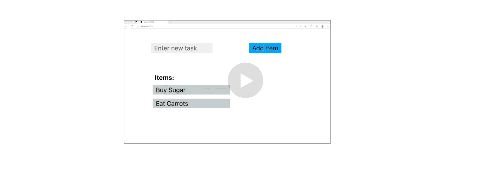
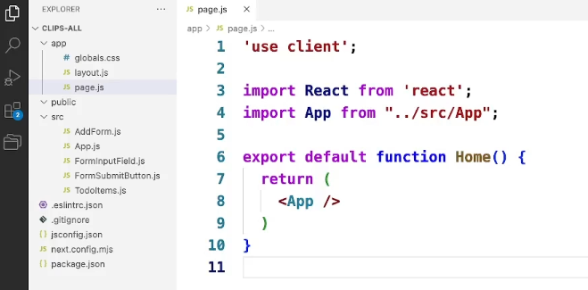
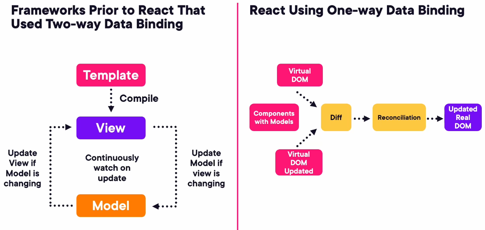
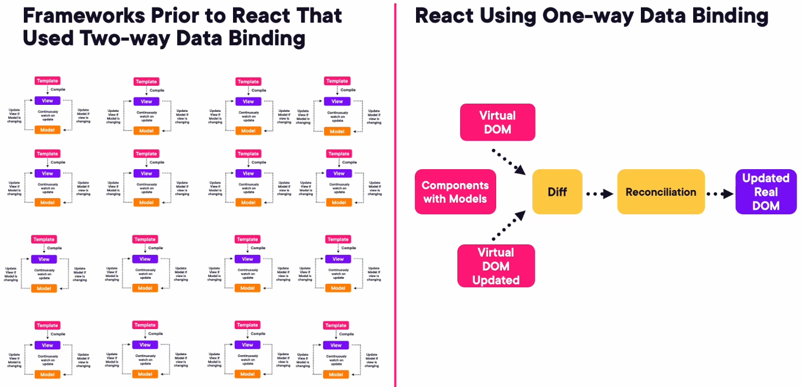

<details>
  <summary>A React app and its component tree</summary>
  <div>

`React` is an open‑source `JavaScript library` created by **Facebook** to make rendering complex UIs fast and efficient.
It powers major apps like **Facebook**, **Netflix**, **Walmart**, **Airbnb**, and **Salesforce**, with over 7 million websites built using it.

At the core of React is its **component model**.


- A React app is structured as a **tree of components**, starting from a single root component.
- Each component can have zero or more children, making the UI modular and easy to manage.



In the To‑Do List example, the root **App** component has two children:

- **AddForm** (with TextInput and AddButton)
- **ToDoItems** (containing multiple Item components).

User actions like adding or deleting items trigger `JavaScript` events inside components, updating the component tree.

```js:title=App_component_returning_its_children
export default function App() {
    return (
        <div>
            <AddForm />
            <ToDoItems />
        </div>
    );
}
```

React’s engine then updates the browser UI almost instantly. When a new item is added, the value flows from the input to AddForm, then to App, and finally to ToDoItems, which creates a new Item component.

```js:title=Adding_a_new_item
// Inside AddForm
function AddForm({ onAdd }) {
    const [text, setText] = useState("");

    return (
        <button onClick={() => onAdd(text)}>Add Item</button>
    );
}

// Inside App
function App() {
    const [items, setItems] = useState(["Buy Sugar", "Eat Carrots"]);

    const addItem = (value) => setItems([...items, value]);

    return <ToDoItems entries={items} />;
}
```

Removing an item works similarly, with the child notifying its parent to update the list.

```js:title=Removing_an_item
// Inside Item component
function Item({ value, onRemove }) {
    return (
    <li onClick={() => onRemove(value)}>
        {value}

    );
}
```

React achieves high performance because UI updates happen faster than a single browser frame (30–60 FPS).

The component tree updates in `JavaScript`, and `React` efficiently updates only the necessary parts of the browser `DOM`, making React apps smooth and responsive.

  </div>
</details>

<details>
  <summary>What does a React component look like</summary>
  <div>

- A React app is built as a tree of components, each represented in JavaScript as either a **function** or a **class**.
- Since React 16.8 (the `Hooks` release), **function components** are recommended because they are **simpler**, more **powerful**, and **better optimized**.

```js:title=Example_of_a_function_component
function App() {
  return <h1>Hello React!</h1>;
}
export default App;
```

```js:title=Example_of_a_class_component_old
class App extends React.Component {
  render() {
    return <h1>Hello React!</h>;
    }
}

export default App;
```

In the To‑Do app example, the component tree includes five components:

- the root **App** component,
- its children **AddForm** and **ToDoItems**,
- their nested components like **TextInput**, **AddButton**, and repeated **Item** components.


The entry point `/app/page.js` is a simple JavaScript function that returns the `<App />` component. This function is exported using the ECMAScript module system so it can be used throughout the project.

<div class="gatsby-code-title gatsby-remark-code-title">Example: /app/page.js</div>

```js
"use client";

import App from "../source/App/App";

export default function Home() {
  return <App />;
}
```

React components return `JSX`, a special syntax that looks like `HTML` but is not valid `JavaScript`. Tools like Babel transpile **`JSX`** into standard `JavaScript` before the browser runs it.

```js:title=JSX_example
function Greeting() {
  return <div className="message">Welcome!</div>;
}

```

```js:title=What_Babel_converts_it_into
function Greeting() {
  return React.createElement("div", { className: "message" }, "Welcome!");
}
```

The key takeaway is that `JSX` is a developer-friendly abstraction: it isn’t real `JavaScript`, but it compiles into `JavaScript` that renders your components and their children efficiently.

  </div>
</details>

<details>
  <summary>How React Components Link to Each Other</summary>
  <div>

React apps are built as **component trees**, where each component is just a JavaScript function that returns JSX.

Components link to each other through **composition** — one component renders another as its child.

This is the foundation of how React structures UI.



### The root component launches the app

In a Next.js app, the root is usually `page.js`. It receives no props and simply renders the top-level component of your UI:

```js:title=app/page.js
import App from "../source/App/App";

export default function Home() {
  return <App />;
}
```

📌 **Key idea:** `page.js` is just a launcher. The real component tree begins at `<App />`.

### App.js composes child components

`App.js` is the top of your actual UI tree. It renders two child components:

```js:title=src/App.js
import React, {useState} from "React";
import TodoItems from "./TodoItems";
import AddForm from "./AddForm";

export default function App() {
  const [toDoList, setToDoList] = useState([
    { text: "Buy Sugar",id:113142134},
    { text: "Eat Carrots",id:113153434}
  ]);

  function deleteTask(id){
    setToDoList((toDoList)=> toDoList.filter(rec => id !== rec.id));
  }
  const addTask = (userInput) =>{
    const newTask = {text:userInput, id: Date.now()};
    setToDoList((todoList)=>[newTask, ...toDoList]);
  }

  return (
    <div className="container">
        <AddForm addTask={addTask}/>
        <ToDoItems entries={toDoList} deleteItem={deleteTask}/>
    </div>
  );
}
```

📌 This is how React components “link” — one returns JSX that includes other components.

### JSX looks like HTML but is 100% JavaScript

`JSX` is not `HTML`. It is a JavaScript syntax extension that compiles to `React.createElement()` calls.

```js:title=JSX
<AddForm />

// Compiled JS
React.createElement(AddForm, null);
```

📌 This is why React components can return what looks like HTML — but it’s actually JavaScript describing UI.

### Component logic vs rendering logic

React lets you choose how to organize your code:

- Some developers keep logic and `JSX` together in one function
- Others extract logic into helper functions for clarity

📌 Both styles are valid. React does not enforce a specific pattern.

### Visualizing the component tree

```text
Home (page.js)
 └── App
      ├── AddForm
      └── ToDoItems
```

📌 Each component is just a function returning `JSX`, and each `JSX` element can contain other components — that’s how the tree grows.

### Key takeaways

- React components are plain JavaScript functions.
- Components link together through composition — one renders another.
- `page.js` is just a launcher; `App` is the real root of the UI tree.
- JSX looks like HTML but compiles to JavaScript.
- You can separate logic and rendering or keep them together — React is flexible.

  </div>
</details>

<details>
  <summary>How React components pass data to their children</summary>
  <div>

React passes data from parent components to child components using `props`.
In `JSX`, `props` look like HTML attributes, but they are actually JavaScript values being passed down the component tree.

```javascript{1}:title=Passing_props_from_parent_to_child
// Parent component
import React, {useState} from "React";
import TodoItems from "./TodoItems";
import AddForm from "./AddForm";

export default function App() {
  const [toDoList, setToDoList] = useState([
    { text: "Buy Sugar",id:113142134},
    { text: "Eat Carrots",id:113153434}
  ]);

  function deleteTask(id){
    setToDoList((toDoList)=> toDoList.filter(rec => id !== rec.id));
  }
  const addTask = (userInput) =>{
    const newTask = {text:userInput, id: Date.now()};
    setToDoList((todoList)=>[newTask, ...toDoList]);
  }

  return (
    <div className="container">
        <AddForm addTask={addTask}/>
        <ToDoItems entries={toDoList} deleteItem={deleteTask}/>
    </div>
  );
}
```

- In the To‑Do app example, the `App` component stores its list of items using the `useState` hook, which initializes and tracks state over the component’s lifetime.

- The `App` component then passes this list to its child component `ToDoItems` like this:

```js:title=src/ToDoItems.js
import React from "React";

function ToDoItems({ entries, deleteItems }) {
  return (
      <ul>
        <p> Items: </p>
        {entries.map(({id, text}) => (
          <li
            key={id}
            onClick={()=>{deleteItem(Id)}}>
            {text}
          </li>
        ))}
      </ul>
  );
}
```

- The component receives the data through its function parameters.
- Using **destructuring** the component can directly access the entries prop

```js:title=Same_example_using_props_old_style
import React from "React";

function ToDoItems(props) {
  const entries = props.entries;
  const deleteItems = props.deleteItems;

  return (
      <ul>
        <p> Items: </p>
        {entries.map(({id, text}) => (
          <li
            key={id}
            onClick={()=>{deleteItem(Id)}}>
            {text}
          </li>
        ))}
      </ul>
  );
}
```

**Destructuring** makes it clear which props the component expects and avoids accidentally using unwanted values.

```js:title=Passing_props_further_down_grandchild
// ToDoItems → Item
function Item({ value }) {
  return - {value};
}
```

**`JSX`** allows embedding **JavaScript** inside `{ }`, enabling dynamic rendering.

```js:title=Mapping_over_the_entries_array_produces_multiple_child_components
{entries.map((item) => <Item value={item} />)}
```

```js:title=Conditional_rendering_inside_JSX
{entries.length === 0 && No items yet!}

```

```js:title=Passing_functions_as_props_child_triggers_parent_update
// Parent
function App() {
  const [items, setItems] = useState([]);

  const removeItem = (value) => {
    setItems(items.filter((i) => i !== value));
  };

  return <ToDoItems entries={items} onRemove={removeItem} />;
}

// Child
function ToDoItems({ entries, onRemove }) {
  return (

      {entries.map((item) => (
        <Item value={item} onRemove={onRemove} key={item} />
      ))}

  );
}

// Grandchild
function Item({ value, onRemove }) {
  return (
    <li onClick={() => onRemove(value)}>
      {value}

  );
}
```

This combination of **props**, **state**, and **`JSX`** makes React components reactive—UI updates automatically when state changes.
Although `JSX` may feel confusing at first, it becomes intuitive with practice and is one of React’s most powerful features.

  </div>
</details>

<details>
  <summary>Why is one‑way data binding key to React’s scalability</summary>
  <div>



- Traditional frameworks using **two‑way data binding** rely on tightly coupled MVC loops where HTML templates and data models must constantly synchronize.
  As apps grow, these repeated model‑view updates slow performance.

  ```js:title=Example_of_two_way_binding_angular_style
  <input [(ngModel)]="username" />
  Hello {{ username }}
  ```

- Here, UI → model and model → UI constantly update each other, creating many sync loops.

- React avoids this by using **one‑way data binding** and **components** instead of HTML templates.
- Each component contains both its UI and the logic to update it, forming a single **virtual DOM** fully managed in JavaScript.

  ```js:title=Example_of_one_way_binding_in_React
  function App() {
    const [name, setName] = useState("");

    return (
      <div>
        <input
          value={name}
          onChange={(e) => setName(e.target.value)}
        />

        Hello {name}
      </div>
    );
  }
  ```

Data flows **one direction**: user event → state → UI.

When data changes

- React updates only the `virtual DOM` — an extremely fast operation.
- After all updates, React compares the old and new virtual DOMs and performs a single optimized browser DOM update through a process called **reconciliation**.

```js:title=Virtual_DOM_update_flow
// State update triggers virtual DOM update
setCount(count + 1);

// React internally:
// 1. Creates new virtual DOM
// 2. Diffs it with the previous virtual DOM
// 3. Updates only the changed DOM nodes
```

This approach scales far better because:

- No constant syncing loops between model and view
- No frequent direct browser DOM updates (which are slow)
- All component updates happen locally in JavaScript
- Only one final DOM update occurs after reconciliation

```js:title=React_updates_only_what_changed
// `JSX`

  {items.map(item => <li key={item.id}>{item.text})}


// If only one item changes,
// React updates only that - , not the whole .
```



📌 As apps grow and components increase,

- _Two‑way data-binding_
  - Many MVC loops must continuously synchronize
  - Causes performance overhead.
- React’s \_one‑way data flow
  - Components updates virtual DOM, which is blazing fast
  - Single Merge Step
  - Real DOM is updated in one pass

This keep _React performance fast and predictable_, making it ideal for large‑scale applications.

  </div>
</details>

<details>
  <summary>What to expect from this React course</summary>
  <div>

- This course aims to give you a solid understanding of

  1. **What React is**
  2. How it **helps developers** build fast, efficient, and scalable web applications with **great UI experiences**.

- Whether you're building large enterprise apps like `Netflix` or smaller apps that still require high performance, the course explains the value `React` brings to modern development.

- As you progress, you'll become

  1. **Comfortable designing component architectures**
  2. **Assembling `functional components`**.

- However, jumping into building apps without understanding how `React` works behind the scenes may lead to unexpected behavior or performance issues.

- `React` may initially feel magical—components link together and the UI updates automatically—but this course reveals the mechanisms behind that behavior.
- By understanding how `React` processes your components, you'll be better equipped to build apps that `React` can optimize effectively, resulting in a smooth and responsive user experience.

  </div>
</details>
