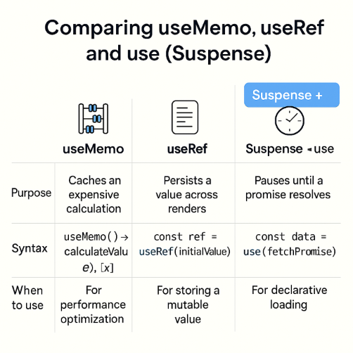

<details>
  <summary>What does <strong>rendering</strong> mean in React?</summary>
  <div>

## Rendering vs UI Update

- **Rendering:** Executing the component function → returns JSX.
- **UI Update:** React uses **reconciliation** to update the DOM efficiently.
- **Initial render:** Component function runs once → JSX is returned → browser renders UI.
- **Re-render:** Component function runs again when **state or props change**.
- **Important distinction:**
  - Rendering = function execution.
  - UI update = DOM diffing via reconciliation.

📌 Rendering is **pure computation**, reconciliation is **efficient DOM mutation**.

  </div>
</details>

<details>
  <summary>When and why does React <strong>re-render</strong>?</summary>
  <div>

## Re-rendering Triggers

- **State change:** `useState` setter called → component flagged for re-render.
- **Prop change:** Parent re-renders → child receives new props → child re-renders.
- **Re-render behavior:**
  - Entire component function re-executes.
  - JSX is regenerated.
  - React compares old vs new tree → updates only changed parts.
- **State persistence:** React stores state in internal arrays → ignores initial value on re-renders.
- **Rule of hooks:** Hooks must be called in the same order → no conditional `useState`.

📌 React re-renders when **data changes**, but only updates the **minimal DOM** thanks to reconciliation.

  </div>
</details>

<details>
  <summary>How does <strong>reconciliation</strong> work?</summary>
  <div>

## Reconciliation

- **Process:**
  1. JSX → `createElement` → virtual DOM tree.
  2. On state/prop change → new tree is built.
  3. React compares old vs new → finds differences.
  4. Only changed parts are updated in the real DOM.
- **Key prop:** Helps React track list items → avoids full re-renders.
- **Performance:** Minimizes browser updates → most expensive part of rendering.

📌 Reconciliation is React’s **diffing engine** — it ensures performance by updating only what’s necessary.

  </div>
</details>

<details>
  <summary>What are <strong>pure functions</strong> and why do they matter?</summary>
  <div>

## Pure Functions

- **Definition:** Always return the same output for the same input.
- **Benefits:** Predictable, testable, cacheable.
- **React requirement:** Component functions should be pure → same props + state → same JSX.
- **Example:**

```jsx:title=Pure_Functions
function HouseRow({ house }) {
  return (
    <tr>
      <td>{house.address}</td>
      <td>{house.country}</td>
      <td>{house.price}</td>
    </tr>
  );
}
```

📌 Pure components make React’s rendering predictable and **enable memoization**.

  </div>
</details>

<details>
  <summary>How does <strong>React.memo</strong> help performance?</summary>
  <div>

## Memoizing Components

- **Purpose:** Prevent re-renders when props haven’t changed.
- **Usage:** Wrap component with `React.memo()` → caches output.
- **Example:**

```jsx:title=Memoizing_Components_with_React.memo
import React from "react";

const HouseRow = React.memo(function HouseRow({ house }) {
  return (
    <tr>
      <td>{house.address}</td>
      <td>{house.country}</td>
      <td>{house.price}</td>
    </tr>
  );
});
```

- **Behavior:**
  - Shallow compares props.
  - Skips re-render if props are unchanged.
- **When to use:**
  - Component is pure.
  - Props change infrequently.
  - JSX is non-trivial.
  - Performance gain is measurable (use profiler).
- **Caution:** Avoid overuse → adds overhead.
  - Complex props (objects/arrays) may still trigger re-renders unless reference is stable.

📌 `React.memo` is a **selective optimization tool** — use it when measurable gains exist.

  </div>
</details>

<details>
  <summary>What are <strong>side effects</strong> in React?</summary>
  <div>

## Side Effects

- **Definition:** Operations that interact with the outside world or cause observable changes beyond the component.
- **Examples:**
  - Fetching data from APIs
  - Accessing browser APIs (`document`, `window`)
  - Setting timers (`setTimeout`, `setInterval`)
  - Subscribing to event streams
- **Why separate them:** Side effects are **impure** and should not be part of the component’s render logic.
- **Tool:** Use the `useEffect` hook to isolate and manage side effects.

📌 Side effects are **non-deterministic** — React isolates them via `useEffect` to preserve rendering purity.

  </div>
</details>

<details>
  <summary>How does useEffect work?</summary>
  <div>

## `useEffect` Hook

- **Syntax:** `useEffect(() => { /* effect code */ }, [dependencies])`
- **Execution timing:**
  - Runs **after render** and **after DOM update**.
  - Does **not block rendering**.
- **Rules of hooks apply:**
  - Must be called at top level.
  - Only inside function components or custom hooks.
- **Async effects:**
  - `useEffect` cannot accept an async function directly.
  - Wrap async logic inside a nested function and call it.

```jsx:title=Example_usEffect
useEffect(() => {
  async function fetchData() {
    const res = await fetch("http://localhost:4000/api/houses");
    const data = await res.json();
    setHouses(data);
  }
  fetchData();
}, []);
```

📌 `useEffect` is React’s **side-effect sandbox** — it runs after render and keeps impure logic out of the render flow.

  </div>
</details>

<details>
  <summary>What is the dependency array and why is it important?</summary>
  <div>

## Dependency Array

- **Purpose:** Controls when the effect runs.
- **Scenarios:**
  - `[]` → run only once on initial mount.
  - `[counter]` → run on mount and when `counter` changes.
  - No array → run on **every re-render** (can cause infinite loops).
- **Infinite loop risk:**
  - If effect updates state → triggers re-render → effect runs again → loop.
  - Fix: use dependency array to limit execution.

```jsx:title=Example_Dependency_Array_With_usEffect
useEffect(() => {
  document.title = `Count: ${counter}`;
}, [counter]);
```

📌 The dependency array is the **guardrail** for effects — it prevents unnecessary or infinite executions.

  </div>
</details>

<details>
  <summary>How do you clean up effects?</summary>
  <div>

## Cleanup Function

- **Purpose:** Unsubscribe or clean up resources when component unmounts or before effect re-runs.
- **Syntax:** Return a function from inside `useEffect`.
- **Called when:**
  - Component unmounts
  - Dependencies change → before re-running effect

```jsx:title=Example_Cleanup_Function_With_usEffect
useEffect(() => {
  const subscription = stream.subscribe((data) => setData(data));
  return () => {
    subscription.unsubscribe();
  };
}, []);
```

📌 Cleanup functions are **essential for resource management** — they prevent memory leaks and stale subscriptions.

  </div>
</details>

<details>
  <summary>Can you use multiple useEffect calls?</summary>
  <div>

## Multiple `useEffect` Calls

- **Yes, absolutely.**
- Each `useEffect` handles a separate concern.
- Each can have its own dependency array.
- Keeps logic modular and readable.

```jsx:title=Example_useEffect
useEffect(() => {
  fetchData();
}, []);

useEffect(() => {
  document.title = `Count: ${counter}`;
}, [counter]);
```

📌 Multiple `useEffect` calls allow **separation of concerns** — each effect stays focused and maintainable.

  </div>
</details>

<details>
  <summary>What is <strong>Suspense</strong> and the new <strong>use</strong> function in React 19?</summary>
  <div>

## Suspense + use (React 19)

- **Suspense:** A React component that pauses rendering while child components are “suspended” (waiting for async data).
- **use function:**
  - New in React 19.
  - **Not a hook** → rules of hooks don’t apply.
  - Accepts a **promise** and returns its resolved value.
  - While unresolved → component is suspended → Suspense fallback UI is shown.
- **Benefit:** Simplifies async code → no need for `useEffect` + state boilerplate.

### Example

```jsx:title=/app/HouseList.js
import { Suspense, use } from "react";

const fetchHouses = fetch("http://localhost:4000/api/houses").then((res) =>
  res.json()
);

function HouseList() {
  const houses = use(fetchHouses); // Suspends until resolved
  return (
    <table>
      <tbody>
        {houses.map((h) => (
          <tr key={h.id}>
            <td>{h.address}</td>
            <td>{h.country}</td>
            <td>{h.price}</td>
          </tr>
        ))}
      </tbody>
    </table>
  );
}
```

```jsx:title=/App.js
function App() {
  return (
    <Suspense fallback={<div>Loading houses...</div>}>
      <HouseList />
    </Suspense>
  );
}
```

- **Problem:** If the promise is created inside the component, rerenders can cause infinite loops.
- **Solution:** Use caching libraries like **TanStack Query** to manage promises.

📌 Suspense + `use` make async rendering **declarative and clean**, but caching is essential for real-world apps.

  </div>
</details>

<details>
  <summary>How does <strong>useMemo</strong> optimize performance?</summary>
  <div>

## `useMemo`

- **Purpose:** Memoizes expensive calculations → avoids recomputation on every rerender.
- **Syntax:** `useMemo(() => calculation, [dependencies])`.
- **Behavior:** Runs calculation on mount and when dependencies change. Returns cached value otherwise.

```jsx:title=Example_useMemo
const totalValue = useMemo(() => {
  return houses.reduce((sum, h) => sum + h.price, 0);
}, [houses]);
```

- **Caution:** Adds overhead → only use when calculation is expensive and rerenders are frequent.
- **Analogy:** Think of `useMemo` as a **performance cache** for values inside components.

📌 `useMemo` is about **selective optimization** — measure before using it everywhere.

  </div>
</details>

<details>
  <summary>What does <strong>useRef</strong> do?</summary>
  <div>

## `useRef`

- **Purpose:** Store values across renders **without causing rerenders**.
- **Returns:** An object `{ current: value }`.
- **Differences from state:**
  - State changes trigger rerenders.
  - Ref changes do **not** trigger rerenders.
- **Use cases:**
  - Persist values (e.g., render count).
  - Access DOM elements directly.

```jsx:title=Example_Persisted_Value
const renderCount = useRef(0);
renderCount.current++;
console.log("Rendered:", renderCount.current);
```

```jsx:title=Example_DOM_Access
const inputEl = useRef(null);

function FocusInput() {
  return (
    <>
      <input ref={inputEl} />
      <button onClick={() => inputEl.current.focus()}>Focus Input</button>
    </>
  );
}
```

📌 `useRef` is a **persistent container** for values or DOM references that survive rerenders without triggering them.

> React 19’s `use` with `Suspense` simplifies async rendering by pausing components until promises resolve.

📌 For performance, `useMemo` caches expensive calculations, while `useRef` persists values or DOM references across renders without causing rerenders.

> Together, they give developers fine-grained control over rendering, performance, and side effects.

  </div>
</details>



| Feature            | Purpose                        | Behavior                                        | When to Use                 | Caution                      |
| ------------------ | ------------------------------ | ----------------------------------------------- | --------------------------- | ---------------------------- |
| **Suspense + use** | Async rendering                | Suspends component until promise resolves       | Declarative data fetching   | Avoid in loops/callbacks     |
| **useMemo**        | Memoization of computed values | Caches result unless dependencies change        | Expensive calculations      | Avoid for trivial operations |
| **useRef**         | Persistent mutable reference   | Stores value across renders without rerendering | DOM access, render counters | Doesn’t trigger UI updates   |

📌 React gives us fine-grained control over async rendering (`Suspense + use`), performance (`useMemo`), and persistent values (`useRef`). Each tool solves a different problem — knowing when and why to use them is key to writing efficient components.”
