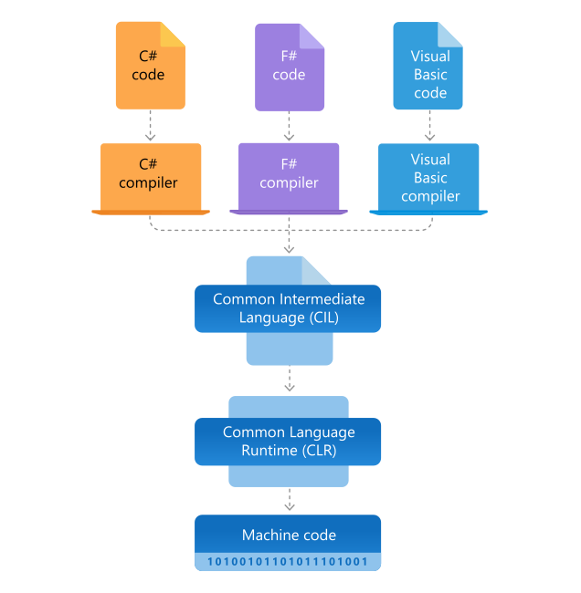
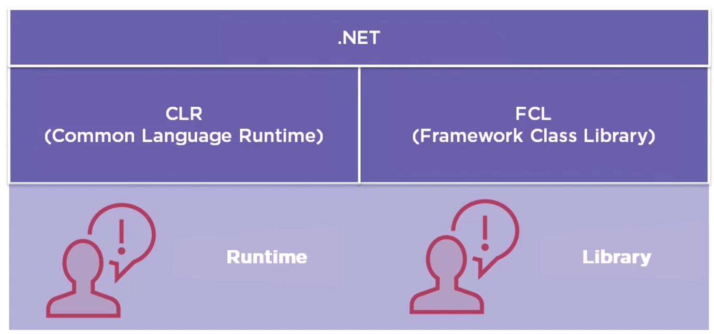

## Why C# ?

C# (pronounced "See Sharp") is a _modern_, _object-oriented_, _statically-typed_ and _type-safe_ programming language.

C# is an object-oriented, component-oriented programming language. C# provides language constructs to directly support these concepts, making C# a natural language in which to create and use software components. Since its origin, C# has added features to support new workloads and emerging software design practices. At its core, C# is an object-oriented language. You define types and their behavior

Several C# features help create robust and durable applications.

- [Garbage collection](https://learn.microsoft.com/en-us/09_dotnet/standard/garbage-collection/) automatically reclaims memory occupied by unreachable unused objects.
- [Nullable types](https://learn.microsoft.com/en-us/09_dotnet/csharp/nullable-references) guard against variables that don't refer to allocated objects.
- [Exception handling](https://learn.microsoft.com/en-us/09_dotnet/csharp/fundamentals/exceptions/) provides a structured and extensible approach to error detection and recovery.
- [Lambda expressions](https://learn.microsoft.com/en-us/09_dotnet/csharp/language-reference/operators/lambda-expressions) support functional programming techniques.
- [Language Integrated Query (LINQ)](https://learn.microsoft.com/en-us/09_dotnet/csharp/linq/) syntax creates a common pattern for working with data from any source.
- Language support for [asynchronous operations](https://learn.microsoft.com/en-us/09_dotnet/csharp/asynchronous-programming/) provides syntax for building distributed systems.
- C# has a unified [type system](https://learn.microsoft.com/en-us/09_dotnet/csharp/fundamentals/types/).
- All C# types, including primitive types such as `int` and `double`, inherit from a single root object type.
  - All types share a set of common operations.
  - Values of any type can be stored, transported, and operated upon in a consistent manner.
  - Furthermore, C# supports both user-defined `reference types` and `value types`.
- C# allows dynamic allocation of objects and in-line storage of lightweight structures.
- C# supports generic methods and types, which provide increased type safety and performance.
- C# provides iterators, which enable implementers of collection classes to define custom behaviors for client code.

## .Net Architecture

.Net has 2 major components as below

### Common Language Runtime (CLR)

`CLR` is the <ins>execution engine that handles running applications</ins>. It provides services like thread management, garbage collection, type-safety, exception handling, and more

> <ins>.NET is a runtime</ins>, which means .NET provides a space for you to run your programs in C#.

> .NET knows how to bring your program to life and manage memory for that program and send instructions to the Intel or AMD or ARM processor that's in your computer.

> And actually, .NET provides a space to run not just C# programs, but there's a number of other languages that work on top of the .NET runtime, including Visual Basic .NET and F# and others

When the C# program is executed, the assembly is loaded into the CLR. The CLR performs Just-In-Time `JIT` compilation to convert the IL code to native machine instructions. The CLR provides other services related to automatic garbage collection, exception handling, and resource management.

`managed Vs unmanaged code ❓`

Code that's executed by the CLR is sometimes referred to as `managed code`, `Unmanaged code` is compiled into native machine language that targets a specific platform.

Language interoperability is a key feature of .NET. IL code produced by the C# compiler conforms to the **Common Type Specification** `CTS`. `IL code` generated from C# can interact with code that was generated from the .NET versions of F#, Visual Basic, C++. There are more than 20 other CTS-compliant languages. A single assembly may contain multiple modules written in different .NET languages. The types can reference each other as if they were written in the same language.

### Class Library

FCL or BCL, for simplicity `Class Library`, <ins>provides a set of APIs and types for common functionality</ins> like strings, dates, numbers, etc. The Class Library includes APIs for reading and writing files, connecting to databases, drawing, and more

> In addition to a runtime, .NET also <ins>provides a library of code that is already written and tested by other developers, Microsoft developers and non‑Microsoft developers in .NET Core, since .NET Core is a true open source project</ins>

You can use the code from this library in your C# program to perform common activities, like if you need to communicate over the network with HTTP or if you need to encrypt and sign a message or you need to open a file, those are all activities that are already written for you, and you can take advantage of them from your program so that you don't have to spend your time writing all the low‑level code that is already in the .NET library
