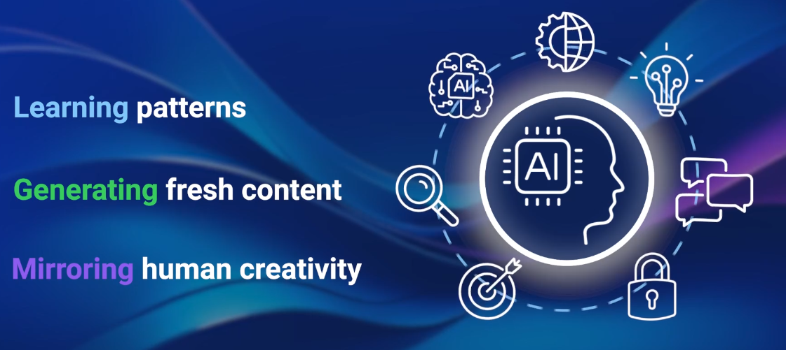
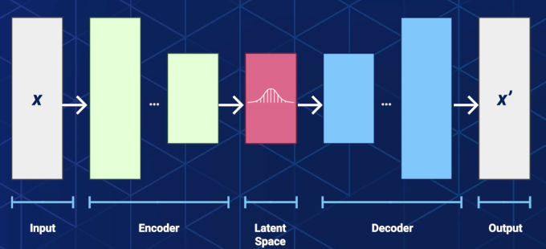
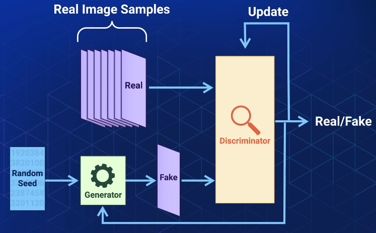
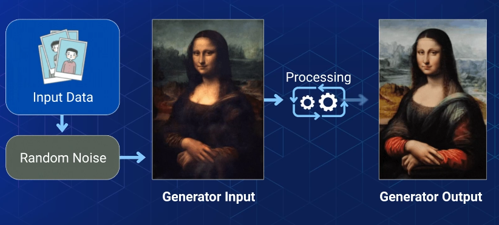
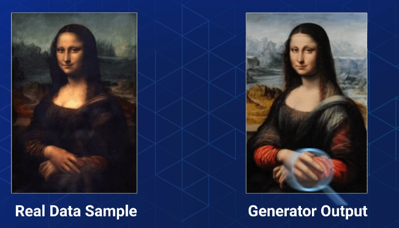
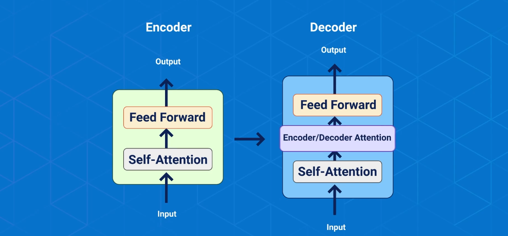

> GenAI is a system designed to emulate and understand human creativity

> GenAI uses **deep-learning** models, specially **neural network**s to generate output that mimics or enhance the pattern found in it's training data.

**Uses Case(s)**

1. Text Generation
2. Image Systensis
3. Music Composition
4. Code Generation

Making it a powerful tool for creativity, automationa and problem solving accross various domains, in simple words GenAI boots your productivity unlike traditional AI which is great of data analysis and making descisions

> GenAI is all about generating new content

## Core Priciples

1. **Learning patterns**

GenAI designed to understand underlying patterns, structures and sematics of the data they are trained on.

2. **Generation of new context**

GenAI once trained, these models are capable of generating new content following the patterns and rules they have learned

eg. text generation model, can produce coherant sentences as well as entire article

3. **Creativity simulation**

GenAI can simulate human creativity, capable of composing music, writing poetry, creating artwork, generates realistic images

## Generative Models

**Types models**

- Auto Encoders **AE**s
- Variational Auto Encoders **VAE**s
- Generative Adversarial Networks **GAN**s
- Transformers

Each model has its unique ability to generate content

> Models that create new data by putting 2 neural networks against each other

### **A**uto **E**ncoders

AutoEncoders `AE`s are a type of neural network used for unsupervised learning, primarily for dimensionality reduction and data reconstruction. They consist of two parts:

1. **Encoder** – Compresses the input data into a smaller representation (latent space).
2. **Decoder** – Reconstructs the original data from the compressed representation.

#### Example with Fruits

Imagine we have high-resolution images of various fruits—apples, bananas, grapes, etc. We want to reduce their storage size while still preserving their essential features.

1. **Encoding Phase** - `Compression`

- The autoencoder learns key characteristics of each fruit—its shape, color, texture—and compresses this information into a lower-dimensional form (latent space).
- For example, instead of storing a full 500x500 pixel image, the network might encode it into a vector of key attributes.

2. **Decoding Phase** - `Reconstruction`

- The decoder takes this compressed information and attempts to recreate the fruit image as closely as possible.
- Though some details may be lost, the overall essence (apple remains an apple) is preserved.

#### Use Cases

- **Noise Reduction**: If a fruit image has noise (blur or distortion), an autoencoder can remove unnecessary details and reconstruct a clearer version.
- **Anomaly Detection**: Suppose most apples are red, but one is blue. The autoencoder would struggle to reconstruct it properly, flagging it as an anomaly.
- **Compression**: It helps store fruit images efficiently without needing full resolution, similar to JPEG compression but learned through deep learning.

### **V**ariational **A**uto **E**ncoders

A Variational AutoEncoder `VAE` is an advanced version of a traditional autoencoder, but instead of just compressing and reconstructing data, it learns a probabilistic distribution over the latent space. This allows it to generate new, realistic variations of the original data!

#### Fruit Example: Generating New Fruits

Imagine we have a dataset of images containing different fruits—apples, bananas, and oranges.

1. **Encoding Phase** `Latent Space Representation`

- Instead of encoding a fixed vector for each fruit (like [0.9, 0.8, 0.5] for an apple), the VAE learns a probability distribution over latent space.
- This means each fruit's encoded representation isn’t a single fixed point but rather a range of possibilities (like mean = [0.9, 0.8, 0.5], with some variance).

2. **Sampling & Generating New Fruits**

- Since the latent space is probabilistic, we can sample new points from this distribution.
- If our dataset only contains apples, bananas, and oranges, the VAE might generate a new fruit that has blended features, like an apple-shaped banana or a citrus-like hybrid!

3. **Decoding Phase** `Reconstruction & Novel Fruits`

- The decoder takes this sampled latent representation and tries to reconstruct a fruit.
- If trained well, it can generate realistic-looking new fruit images, even if they don’t exist in the original dataset.

#### Application VAEs

- **Data Generation**: Helps create new variations (like synthetic fruit images).
- **Smooth Latent Space**: Unlike traditional autoencoders, VAEs ensure smooth transitions, meaning interpolating between a banana and an apple can result in realistic intermediate versions.
- **Anomaly Detection**: If a fruit sample doesn’t match the learned distribution, it can be flagged as an outlier

> Innovative models that can generate new data by creating a competetive setting between two neural networks

### **G**enerative **A**dversarial **N**etwork

- A Generative Adversarial Network `GAN` consists of two neural networks working against each other in a competitive game:

1. **Generator** – Creates new data (e.g., fake fruit images).
2. **Discriminator** – Evaluates whether the generated data is real or fake.

#### Fruit Example: Generating New Fruits

Imagine you have a dataset with images of apples, bananas, and oranges. You want to train a GAN to generate new, realistic fruit images.How GAN Works in This Case:

1. **The Generator's Role**

- The generator starts by creating random images that look nothing like real fruits.
- Over time, it learns patterns like fruit shapes, colors, and textures, improving its ability to generate realistic fruit images.

2. **The Discriminator's Role**

- The discriminator is trained on actual fruit images, so it knows what real fruits look like.
- When the generator produces a new fruit image, the discriminator checks:
  “Is this real, or was it generated?”
- If the discriminator correctly identifies fake fruits, the generator adjusts its technique to become better.

3. **The Adversarial Process**

- This competition continues for many rounds until the generator becomes so good that even the discriminator struggles to differentiate real vs. fake fruits.

Eventually, the GAN produces highly realistic fruit images that don't exist in the original dataset—like a new type of apple 🍏 or a banana with unique textures 🍌.

#### Application of GANs

- **Synthetic Image Generation** – Creates new realistic images (e.g., artificial fruit species).
- **Data Augmentation** – Helps increase dataset size by generating variations.
- **Style Transfer** – You could create a new fruit by blending features of apples and oranges!

### Transformers

> Processes input data, through a series of layer. These layers contain self-attention machanisms and feedforward neural networks

- Self-Attention mechanism - enables the model to
  - learn the contextual relationships between elements of input data sequence
  - Weighs the importance of words based on their context
- Transformers
  - process input in parallel, making it efficient in training and inference
  - overcome limitations in retaining context over long distances within the input - making them highly effective
- _Feedforward_ neural networks
  - capturing complex patterns
  - generating meaningful output

#### Application of Transformers

- Language Translations
- Text Generations
- Summarization

Transformers eg are BERT, GPT, Vision Transformers, etc

## GenAI Benefits

- **Improvements**

  - Automate **repetetive tasks**
  - Focus on **strategy**
  - Overall **productivity boost**

- **Enhanced customer experience**
  - Can be used to develop **conversartional interfaces** & **chatbots**
