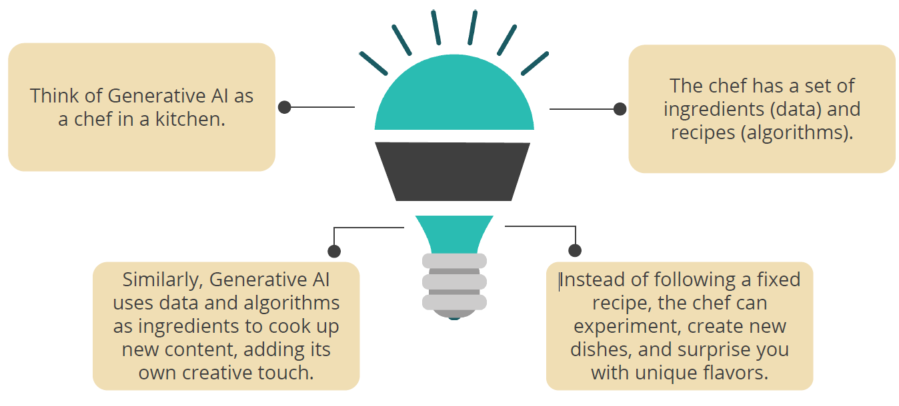
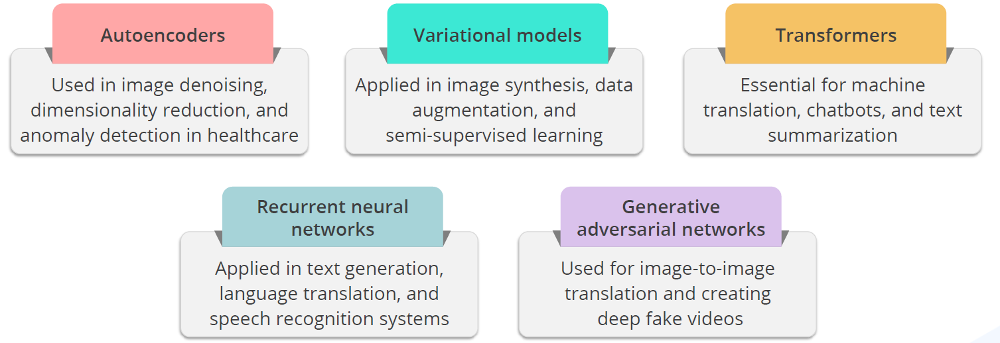
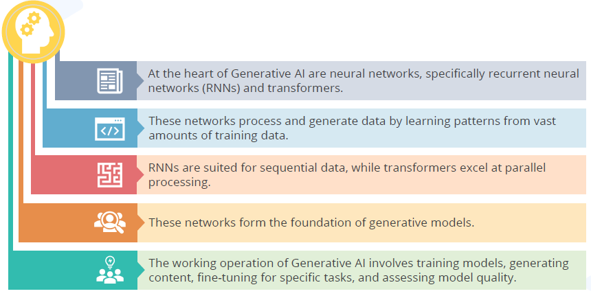
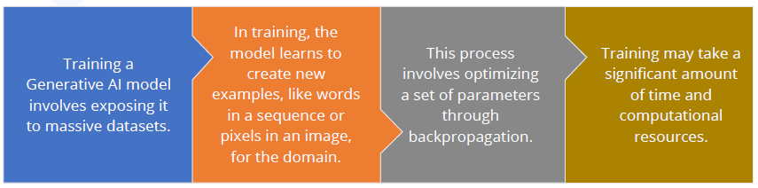
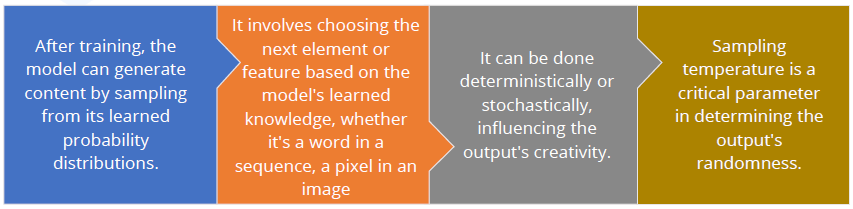
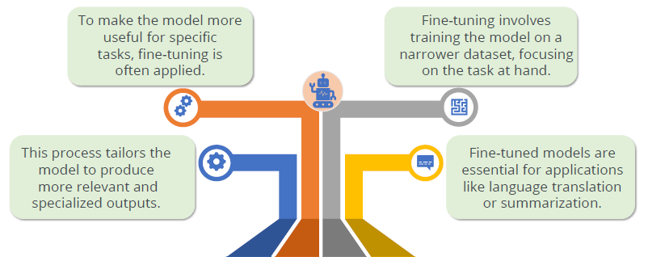
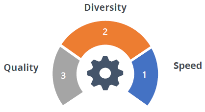
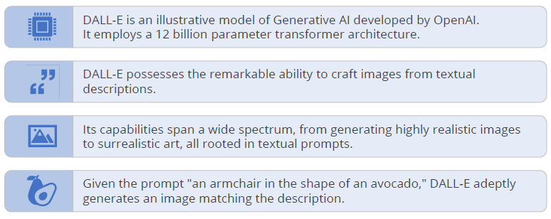

## What is Generative AI?

- Generative AI is like an AI artist that can create new artworks.
- Just as a painter combines colors and strokes to produce unique paintings, Generative AI combines data and algorithms to generate new content.
- It doesn't just follow preset rules; it learns patterns and can create something entirely new, just like an artist's imagination.

### GenAI analogy

### TraditionAI Vs GenAI

Unlike Traditional AI, Generative AI learns patterns and can create novel data,
empowering creativity, innovation, and personalization.

| UseCase              | GenAI                                                             | TraditionalAI                                             |
| -------------------- | ----------------------------------------------------------------- | --------------------------------------------------------- |
| Language Translation | achieves state of the art results with models like BERT and GPT-3 | Statistical machine translation systems                   |
| Art and Design       | creates unique digital art and designs with model like DALL-E     | Graphic design tools and artists's creativity             |
| Content Generation   | automates content creation for marketing, writing, and more       | requires human input and manual generation                |
| Healthcare           | Assists in medical diagnosis, drug discovery and genomics         | traditional medical data analysis and diagnosis by doctor |
| Finance              | enhances risk management, fraud detection and algorithmic trading | rule-based systems and manual analysis                    |

#### Example: 🍎 & 🍊

- for Non-Gen Model :: _Classification_ i.e. image of fruit -> label.

`P(y = AO | features of fruit)`, where model learns features of fruit (color, size, task, price, etc) so that it can classify 🍎 and 🍊.

- Classification is handled by

1. feature of fruit are extracted and classified by Neural Network (automated)
2. feature of fruit are extracted by a human and feed to Machine Learning model for classification (manual)

- for Gen Model :: _Generative_ i.e. label -> image of fruit

`P(x) -> A|O`, here a fruit image is generated (can be 🍎 can be 🍊)

or

`P(x|y=color is red) -> A`, since we provided a label `y`, a fruit image is generated (which 🍎)

✏️: Non-Gen AI learns the feature of 🍎 and 🍊 so that it can classify (label) the fruit feature where as Gen AI learns the feature of 🍎 and 🍊

## GenAI Model types

1. AutoEncoders `AE`: Autoencoders, a type of neural network, and decode data for tasks such as image generation.
2. Recurrent Neural Network `RNN`: RNNs handle sequences and generate text with LSTM networks for context-based tasks.
3. Variational AutoEncoders `VAE`: Models represent data distribution, enabling sampling. Example: VAEs for diverse images. Real-world eg imagine you have high resolution images and you want to save storage space without loosing too much quality.

✏️: In industries like e-commerce, using VAEs for image compression can save server space and improve website loading times without compromising image quality.

4. Generative Adversarial Network `GAN`: GANs, with a generator and discriminator, produce realistic images like StyleGAN.

✏️: While deepfake technology has raised concerns about misinformation and privacy, it also has promising applications in the entertainment and film industry. GANs continue to evolve and are making waves in fields like healthcare, art, and more, demonstrating their versatility and creative potential

5. Transformers : Transformers efficiently handle sequences with self-attention, popular in natural language processing.

✏️: Transformer-based models continue to revolutionize NLP and have a wide range of applications, including chatbot, content summarization, and sentiment analysis.

## How GenAI works?

### Training generative model

### Sampling and content generation

### Fine-Tuning for Specialized Tasks

## Evaluating Model Quality

Assessing the quality of content generated by Generative AI models is vital for choosing the right model and identifying areas for improvement.

> Selecting the right model for a task is crucial, given the distinct strengths and weaknesses of Generative AI models. One may excel in image generation, another in coherent text.

> Evaluating generative models is essential for selecting the best fit for a task and improving overall AI system success. It guides choices and enables model refinement for specific requirements.

1. **Speed**

Interactive applications, like real-time image editing, require swift generation. The model's speed is crucial in evaluating its efficacy.

2. **Diversity**

A quality generative model captures the full data range, maintaining diverse outputs, minimizing biases, and ensuring balanced results.

3. **Quality**

Quality matters, especially in user-facing applications. Poor speech or image quality hinders understanding and usability.in user-facing

## Example

DALL-E is an innovative generative model by OpenAI, creating diverse and imaginative images based on textual descriptions, showcasing the potential of Generative AI in visual creativity.

