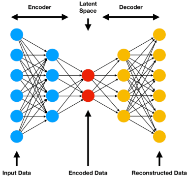
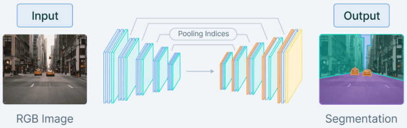
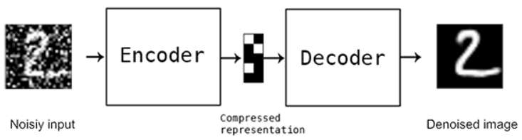
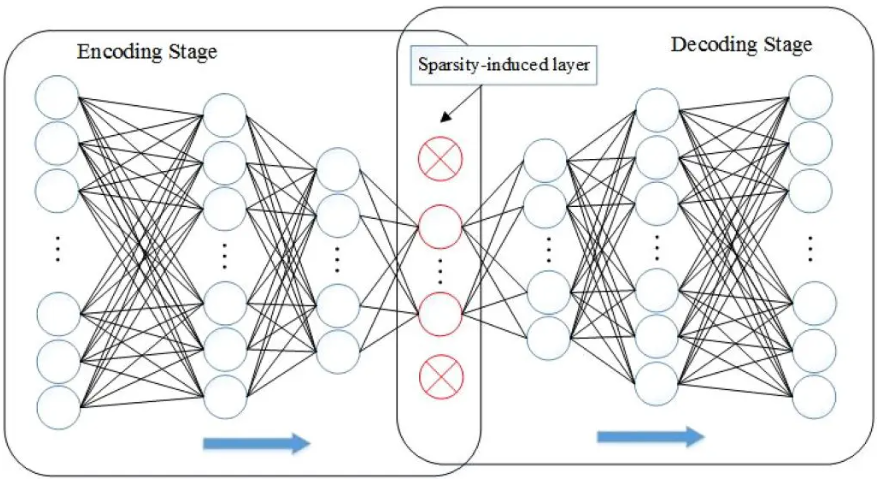
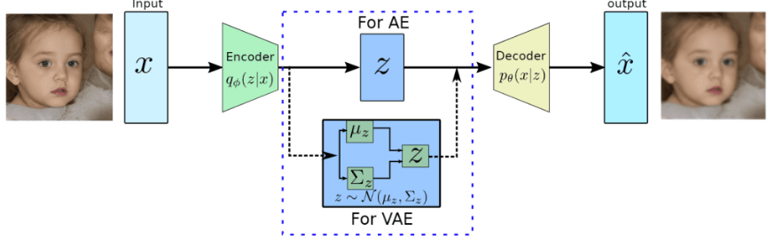
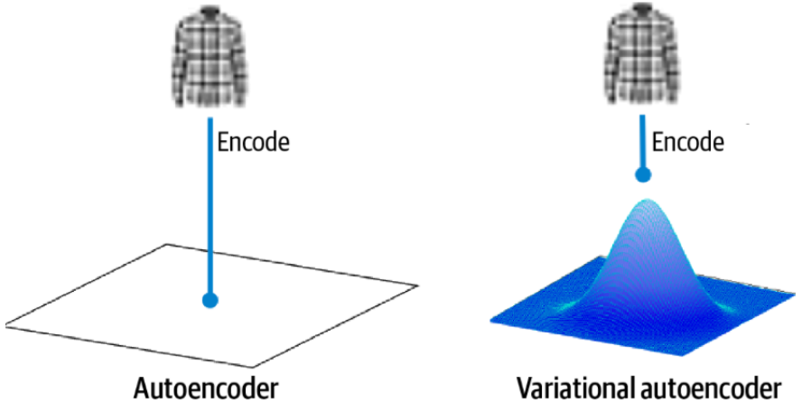
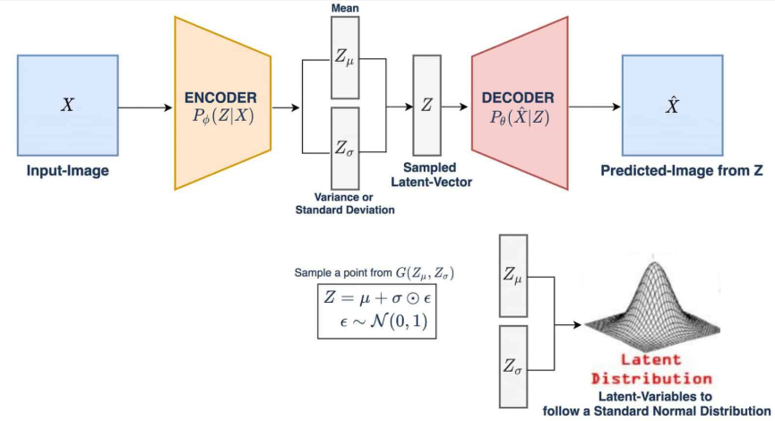
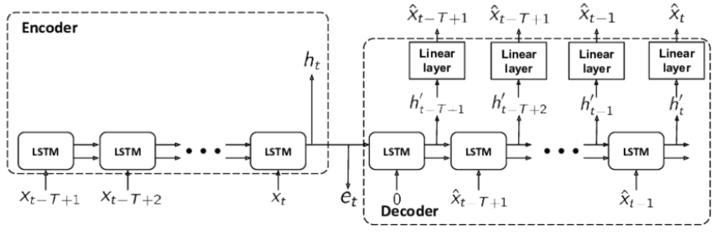

## Simple AutoEncoder `AE`

- consisting of one or more fully connected layers for both the encoder and decoder.
- It works well for simple data but may struggle with complex patterns.

## Convolutional AutoEncoder `CAE`

- Utilizes convolutional layers in both the encoder and decoder, making it suitable for handling image data.
- By exploiting the spatial information in images, CAEs can capture complex patterns and structures more effectively than vanilla autoencoders and accomplish tasks such as image segmentation

## Denoising AutoEncoder `DAE`

- This autoencoder is designed to remove noise from corrupted input data.
- During training, the input data is intentionally corrupted by adding noise, while the target remains the original, uncorrupted data.
- The autoencoder learns to reconstruct the clean data from the noisy input, making it useful for image denoising and data preprocessing tasks.

## Sparse AutoEncoder `SAE`

- This type of autoencoder enforces sparsity in the latent space representation by adding a sparsity constraint to the loss function (as shown above).
- This constraint encourages the autoencoder to represent the input data using a small number of active neurons in the latent space, resulting in more efficient and robust feature extraction.

## Variational AutoEncoder* `VAE`

- Generative model that introduces a probabilistic layer in the latent space, allowing for sampling and generation of new data.
- VAEs can generate new samples from the learned latent distribution, making them ideal for image generation and style transfer tasks

### `VAE` Vs `AE`

The key distinction between `VAE`s and traditional `AE`s is the design of their latent spaces. `VAE`s ensure continuous latent spaces, facilitating random sampling and interpolation, making them invaluable for generative modeling.

In a standard `AE`, every image corresponds to a singular point within the latent space. Conversely, as shown above, in a VAE, each image is associated with a multivariate normal distribution centered around a specific point in the latent space.

Unlike traditional autoencoders that learn deterministic encodings, VAEs introduce a probabilistic twist. The encoder in a VAE doesn’t produce a fixed point in the latent space. Instead, it outputs parameters (typically mean and variance) of a probability distribution, which we sample to obtain our latent representation.

### Components

**Encoder**

- Compresses input data into a latent space
  representation
- Produces the parameters (mean and variance) of a
  probability distribution

**Latent Space**

- Is a compressed representation of input data in the form
  of a probability distribution
- Encodes essential features for data reconstruction

**Decoder**

- Reconstructs input data from its latent space representation
- Ensures quality of reconstruction for optimal `VAE`
  performance

**VAE:Loss function**

has two components:
1. **Reconstruction Loss**

    - Measures how well the decoder reconstructs the input data
    - Commonly uses Mean Squared Error (MSE) or crossentropy
  loss
    - Acts as a guiding compass, nudging the `VAE` towards better
  capturing the important features of the input data

2. **KL Divergence Term**

    - Is essential for VAE's overall loss function
    - Measures the divergence of the latent space distribution
  from a prior (usually standard normal) distribution
    - Helps with generalization and prevents overfitting

read more about [VAE 👆](https://pyimagesearch.com/2023/10/02/a-deep-dive-into-variational-autoencoders-with-pytorch/)

## Sequence to Sequence AutoEncoder

- Also known as a Recurrent Autoencoder, this type of autoencoder utilizes recurrent neural network `RNN` layers (e.g., long short-term memory `LSTM` or gated recurrent unit `GRU`) in both the encoder and decoder shown above.
- This architecture is well-suited for handling sequential data (e.g., time series or natural language processing tasks).

✏️: These are just a few examples of the various autoencoder architectures available. Each type is designed to address specific challenges and applications, and by understanding their unique properties, you can choose the most suitable autoencoder for your problem.
