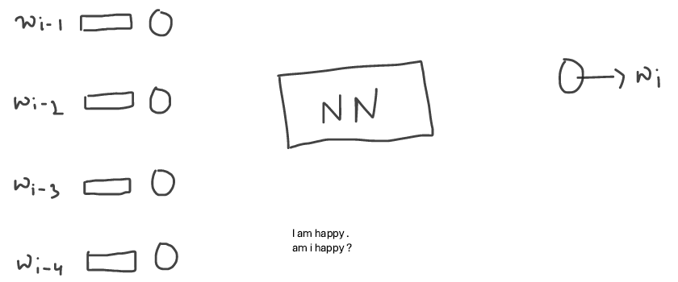

## Neural LM

Some limitation of nGram LM were overcome by Neural LM, for eg storage
with neural LM, we don't have to same bigrams and their count, but we need to store NN.

in Neural LM , we don't pass the word itself, but we pass its embeddings

read more on [Neural Networks](https://jalammar.github.io/visual-interactive-guide-basics-neural-networks/)

### Word Embeddings

> A vector representation of any word in your vocabulary

read more about tool [word2vec](https://en.wikipedia.org/wiki/Word2vec)

read more on [word embeddings](https://medium.com/data-science/a-guide-to-word-embeddings-8a23817ab60f) also check [OpenAI Embeddings](https://platform.openai.com/docs/guides/embeddings)

### Limitations

1. `Fixed size i/p` (i.e. less or more than 4 i/p is a problem)
2. `Long range dependency` (i.e. lets say to wi has dependency on past 10th word i.e. wi-10, that means I have to increase neurons of my NN and reciprocative trad-off between increasing # of neurons and performance of this architecture)
3. `No sequence memory` i.e. "I am Happy" or "Am I Happy" is same for this architecture, it won't make differentiation while predict punctuation mark `.` or `?` for given sequence.
