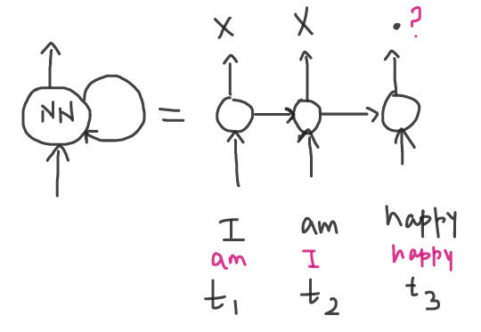

## Recurrent Neural Network

Let understand RNN by continuing above example

- So let's say, this is my. This is a neural network. I pass a word.
  It predicts main o/p, but at the same time it will feed back the word in the context of the word which it has seen in the past to the neural network for the next time.

To understand this better we will unroll the step with timestamps and we feed "I am happy":

- I have the 1st text. Let's say the 1st word `I` goes. Since I am doing the next word prediction. Let's say the next word is something. X. I'm not interested in this. X. This is time step `t1`.
- Then 2nd word `am` goes along with context from `t1` and the next word predicted as Y. I'm not interested in this. Y and this is time step `t2`
- Then 3rd word `happy` goes along with context from `t2` and the next word predicted is `.` and this is time step `t3`

if you now just jumble the first 2 words in above statement and pass it to RNN, prediction will be correct and as follows:

- Unrolling the step with timestamps and we feed "Am I happy"
- I have the 1st text. Let's say the 1st word `Am` goes. Since I am doing the next word prediction. Let's say the next word is something. X. I'm not interested in this. X. This is time step `t1`.
- Then 2nd word `I` goes along with context from `t1` and the next word predicted as Y. I'm not interested in this. Y and this is time step `t2`
- Then 3rd word `happy` goes along with context from `t2` and the next word predicted is `?` and this is time step `t3`

So it solved a lot of problems:

- Solved `Fixed size i/p` as it is able to handle variable length of i/p
- Solved `No sequence memory` since sequence is preserved and the sequence of words is being used to predict the next best token
- Solved `Long range dependency` by taking example with below statement.

  "The book that I read past summer _ `was` _ `nice`"

  `was` is the first word that i can think of as human, but to predict this word machine has to at least know about past words "The book that I read past summer"

  `nice` is the second word that i can think of as human, but to predict this word machine has to at least know about past words "The book that I read past summer was"

  So it was able to get the context from first word in context.

So that' how we evolved from NGram to RNN solving all basic challenges of sequence memory, variable length, long range dependency, etc.

Types of LSTM's (Memory cell to preserve historical information) and GRU's

With all this evolution, there were still few problems like training these model was complex and time consuming

**Limitations of RNN**

- Its does **not support parallel training or computation**.
- Very long context, there networks struggled such as text summarization.
