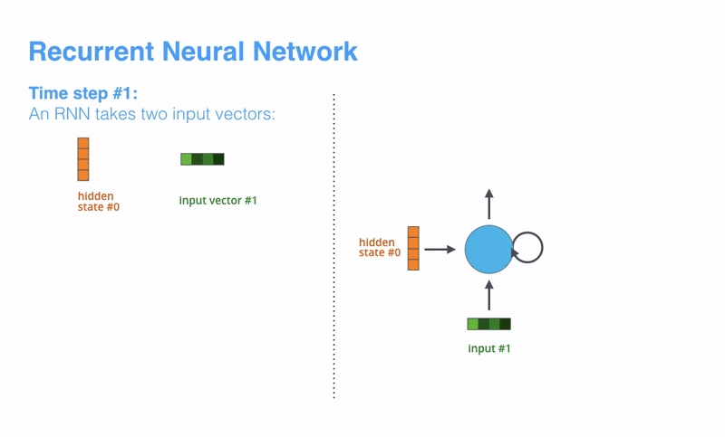
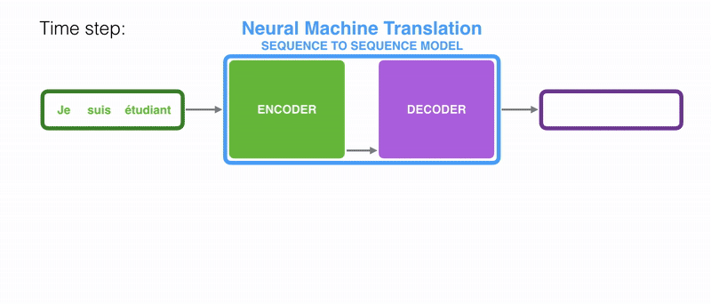
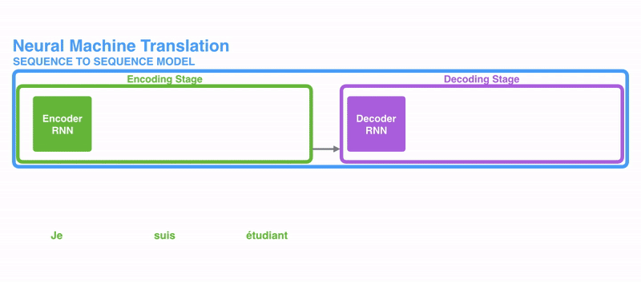
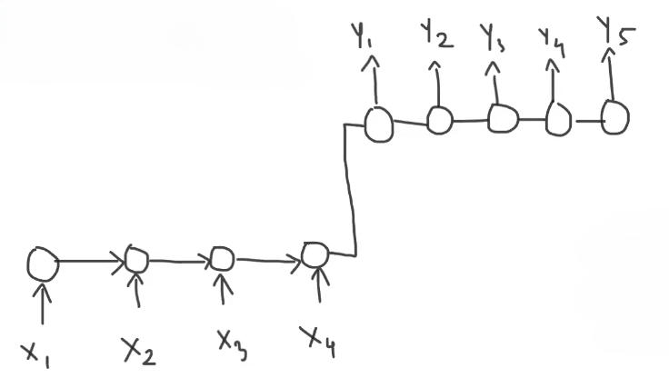
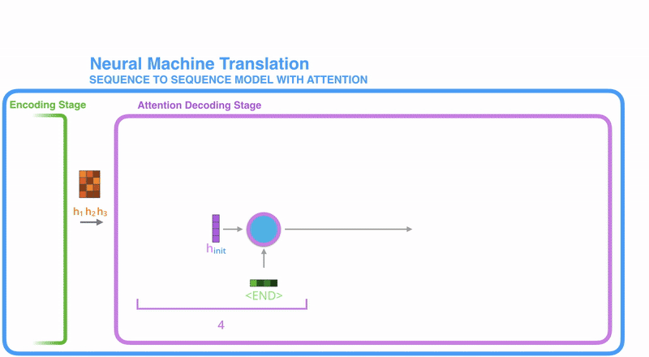
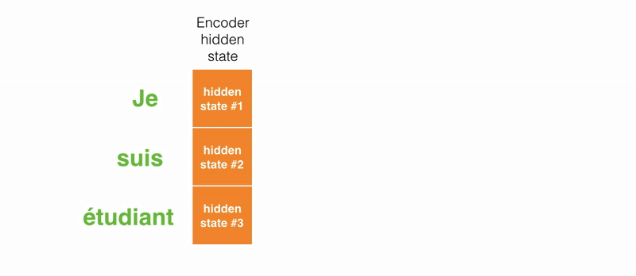
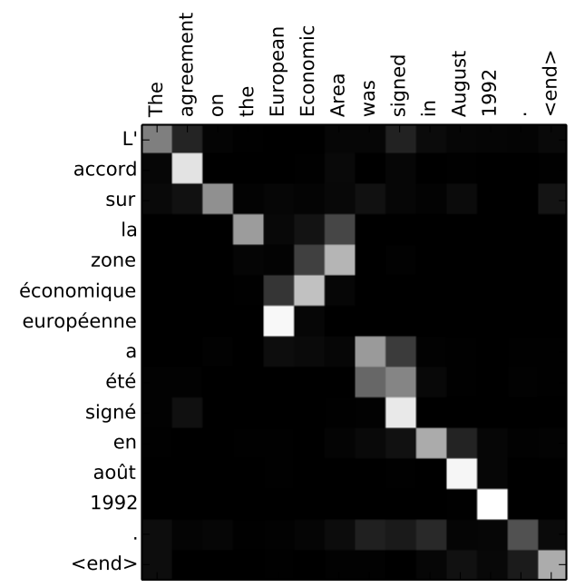
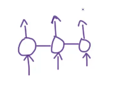
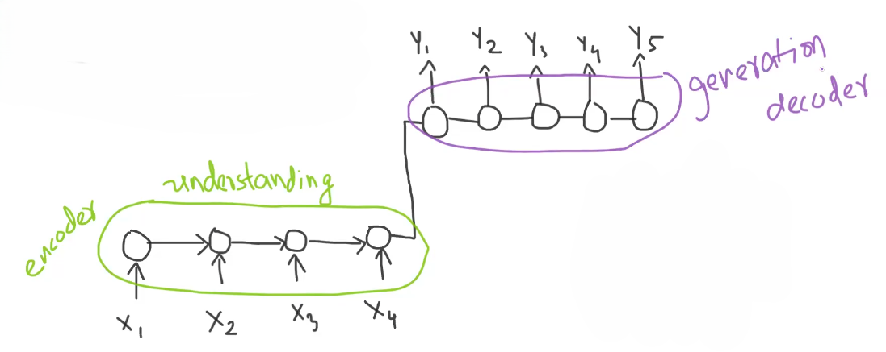

## Seq2Seq LM

A sequence-to-sequence model is a model that takes a sequence of items (words, letters, features of an images…etc) and outputs another sequence of items. A trained model would work like this:

In neural machine translation, a sequence is a series of words, processed one after another. The output is, likewise, a series of words:

Under the hood, the model is composed of an `encoder` and a `decoder`.

The `encoder` processes each item in the input sequence, it compiles the information it captures into a vector (called the `context`). After processing the entire input sequence, the `encoder` sends the `context` over to the `decoder`, which begins producing the output sequence item by item.

The same applies in the case of machine translation.

The `context` is a vector (an array of numbers, basically) in the case of machine translation. The `encoder` and `decoder` tend to both be recurrent neural networks (Be sure to check out Luis Serrano’s [A friendly introduction to Recurrent Neural Networks](https://www.youtube.com/watch?v=UNmqTiOnRfg) for an intro to RNNs).

Later in this post we will visualize vectors in color by assigning brighter colors to the cells with higher values

You can set the size of the `context` vector when you set up your model. It is basically the number of hidden units in the `encoder` RNN. These visualizations show a vector of size 4, but in real world applications the `context` vector would be of a size like 256, 512, or 1024.

By design, a RNN takes two inputs at each time step: an input (in the case of the `encoder`, one word from the input sentence), and a hidden state. The word, however, needs to be represented by a vector. To transform a word into a vector, we turn to the class of methods called [**word embedding**](https://machinelearningmastery.com/what-are-word-embeddings/) algorithms. These turn words into vector spaces that capture a lot of the meaning/semantic information of the words (e.g. [king - man + woman = queen](http://p.migdal.pl/2017/01/06/king-man-woman-queen-why.html)).

We can use pre-trained embeddings or train our own embedding on our dataset. Embedding vectors of size 200 or 300 are typical, we're showing a vector of size four for simplicity.

Now that we’ve introduced our main vectors/tensors, let’s recap the mechanics of an RNN and establish a visual language to describe these models:

The next RNN step takes the second input vector and hidden state #1 to create the output of that time step. Later in the post, we’ll use an animation like this to describe the vectors inside a neural machine translation model.

In the following visualization, each pulse for the encoder or decoder is that RNN processing its inputs and generating an output for that time step. Since the encoder and decoder are both RNNs, each time step one of the RNNs does some processing, it updates its hidden state based on its inputs and previous inputs it has seen.

Let’s look at the hidden states for the encoder. Notice how the last hidden state is actually the context we pass along to the decoder.

The decoder also maintains a hidden state that it passes from one time step to the next. We just didn’t visualize it in this graphic because we’re concerned with the major parts of the model for now.

Let’s now look at another way to visualize a sequence-to-sequence model. This animation will make it easier to understand the static graphics that describe these models. This is called an “unrolled” view where instead of showing the one decoder, we show a copy of it for each time step. This way we can look at the inputs and outputs of each time step.

- On Left, we see the RRN unrolled at different timestamps having i/p words i.e. x1, x2, x3 and x4
- the o/p of this is sent to another RRN unrolled at different timestamps to produce o/p i.e. y1, y2, y3, y4 and **y****5**

### Let’s Pay **Attention** Now

The context vector turned out to be a bottleneck for these types of models. It made it challenging for the models to deal with long sentences. A solution was proposed in Bahdanau et al., 2014 and Luong et al., 2015. These papers introduced and refined a technique called “Attention”, which highly improved the quality of machine translation systems. Attention allows the model to focus on the relevant parts of the input sequence as needed.

Let’s continue looking at attention models at this high level of abstraction. An attention model differs from a classic sequence-to-sequence model in two main ways:

First, the `encoder` passes a lot more data to the `decoder`. Instead of passing the last hidden state of the encoding stage, the `encoder` passes all the hidden states to the `decoder`:

Second, an attention `decoder` does an extra step before producing its output. In order to focus on the parts of the input that are relevant to this decoding time step, the `decoder` does the following:

1. Look at the set of `encoder` hidden states it received – each `encoder` hidden state is most associated with a certain word in the input sentence
2. Give each hidden state a score (let’s ignore how the scoring is done for now)
3. Multiply each hidden state by its softmaxed score, thus amplifying hidden states with high scores, and drowning out hidden states with low scores

This scoring exercise is done at each time step on the `decoder` side.

Let us now bring the whole thing together in the following visualization and look at how the attention process works:

1. The attention `decoder` RNN takes in the embedding of the <END> token, and an initial `decoder` hidden state.
2. The RNN processes its inputs, producing an output and a new hidden state vector `h4`. The output is discarded.
3. Attention Step: We use the `encoder` hidden states and the `h4` vector to calculate a context vector `C4` for this time step.
4. We concatenate `h4` and `C4` into one vector.
5. We pass this vector through a **feedforward neural network** (one trained jointly with the model).
6. The output of the **feedforward neural network**s indicates the output word of this time step.
7. Repeat for the next time steps

This is another way to look at which part of the input sentence we’re paying attention to at each decoding step:

✏️: the model isn’t just mindless aligning the first word at the output with the first word from the input. It actually learned from the training phase how to align words in that language pair (French and English in our example). An example for how precise this mechanism can be comes from the attention papers listed above:

You can see how the model paid attention correctly when outputing "European Economic Area". In French, the order of these words is reversed ("européenne économique zone") as compared to English. Every other word in the sentence is in similar order.

### Purpose

❓**What is the different in comparison to previous architecture**

Reason1:

When you ask for a translation, the translator first listens to the entire sentence to understand it fully. They don't start translating while you're still speaking. The translation process begins only after they have heard the complete sentence in the source language.

- 1st word you heard you processed it.
- 2nd word, you heard you processed it.
- 3rd word you heard you processed it.

That's not how translation happens.

You prefer not to translate while the i/p is being spoken because you want to wait for the entire i/p sequence to end. This allows you to identify nouns, adjectives, and their arrangement before translating them into a sequence of o/p words.

Reason2:

Variable length of both i/p and outpot. Its not necessary that if my i/p has 4 words, the translated o/p will also have 4 words, it may have 5,it may have 3

- on left, **N**atural **L**anguage **U**nderstanding `NLU` kicks-in i.e. this part of architecture is performing understanding, because its understanding the information aka `Encoder`
- on right, this part of architecture is performing generation of translation aka `Decoder`

### Limitations

1. **Information Bottleneck**

- As the size of the i/p grows, the context becomes larger.
- A larger context results in a heavier summary.
- At a certain point, this creates an information bottleneck.
- The bottleneck occurs because there is more information to pass but limited bandwidth to transmit it.
- This limitation means the generator won't receive enough information to produce the o/p sequence.
- Consequently, the quality of the o/p is compromised due to the information bottleneck.

  _Explanation_:

  When dealing with large i/ps, the context and the resulting summary become extensive. This can lead to an information bottleneck, where the amount of information exceeds the capacity to process and transmit it effectively. The generator, which relies on this information to create the o/p, may not receive all the necessary details. This lack of complete information can degrade the quality of the generated o/p, as the generator struggles to produce accurate and coherent results with limited data.

2. **1:1 mapping of decoder o/p to encoder i/p is not possible which is important for translation**

- Understanding the entire i/p sentence is crucial before transmitting the summary to the o/p.
- When producing a specific part of the o/p (e.g., y.4), it's important to know what appeared in the corresponding part of the i/p (e.g., x.3).
- The summary is often too condensed, losing direct information from the i/p.
- During translation, knowing the specific words from the i/p sentence is essential.
- Translating phrases like "I live in New Delhi" is straightforward, but recalling specific details (e.g., a year mentioned) can be challenging.
- Generating the o/p sequence requires knowing which part of the i/p to focus on.
- The focus may shift depending on the part of the o/p being generated (e.g., y.1 might focus on x.1 or x.2, while y.5 might focus on x.4).
- The one-to-one mapping of i/p to o/p is difficult due to the condensed summary.
- The summary alone doesn't provide enough information for accurate o/p generation.
- This results in an information bottleneck, where the generator lacks the necessary details to produce high-quality o/p.
- The lack of one-to-one mapping between i/p and o/p sequences further complicates the translation process.

  _Explanation_:

  When translating, it's essential to understand the entire i/p sentence before starting the translation process. This ensures that the context and specific details are clear. However, relying solely on a condensed summary can lead to information loss, making it difficult to recall specific details from the i/p. This is particularly challenging when translating detailed information, such as specific years or exact words.

  To generate accurate o/p, the translator needs to know which parts of the i/p to focus on at different stages of the translation. This focus can shift depending on the part of the o/p being generated. The lack of a direct one-to-one mapping between i/p and o/p sequences, combined with the condensed summary, creates an information bottleneck. This bottleneck limits the amount of information available to the generator, compromising the quality of the translation.

3. **No parallelization in this architecture which causes issues with training of the model (slow training)**

- Training Architecture Awareness

  During training, the model knows its inputs (x) and the correct outputs (y)—this is supervised learning using labeled data.

- Importance of Transfer Learning
  Acknowledges a personal realization: transfer learning is a crucial concept that many overlook. It allows reuse of knowledge from one task/domain to another, improving training efficiency and accuracy.
- Ground Truth at Training Time

  At each training step, the model knows the "actual" outputs—whether they’re labels, sequences, categories (possibly referred to metaphorically as “wife” or “Wi-Fi”).

- Sequence Generation Workflow

  Inputs (x1, x2, x3, etc.) are processed in order, producing outputs (y1, y2, y3, etc.) sequentially. This is typical in language models or time-series predictions.

- Delayed Feedback in Evaluation

  A challenge: the model may need to wait multiple time steps to evaluate if its prediction was correct—particularly in sequence generation where later outputs depend on earlier predictions.

- Need for Parallelization

  Without parallel processing, training would be extremely slow. To reach models with GPT-level capabilities, efficient parallelization is essential to avoid long training times.

  ❓**Why this matters**

  - **Efficiency**: Sequential models can be painfully slow if predictions are evaluated step-by-step without parallelism.
  - **Scalability**: Without parallel processing, training modern architectures like GPT-2 would take impractically long durations.
  - **Real-Time Evaluation**: Faster feedback loops in training enable better optimization and more accurate model convergence.

Read more on [Encoder Decoder Architecture with visualization](https://jalammar.github.io/visualizing-neural-machine-translation-mechanics-of-seq2seq-models-with-attention/)