## Simple AutoEncoder `AE`

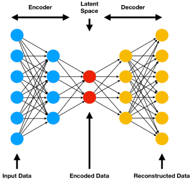

- consisting of one or more fully connected layers for both the encoder and decoder.
- It works well for simple data but may struggle with complex patterns.

## Convolutional AutoEncoder `CAE`

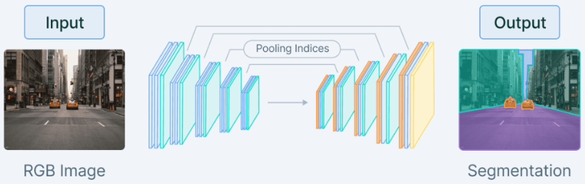

- Utilizes convolutional layers in both the encoder and decoder, making it suitable for handling image data.
- By exploiting the spatial information in images, CAEs can capture complex patterns and structures more effectively than vanilla autoencoders and accomplish tasks such as image segmentation

## De-noising AutoEncoder `DAE`

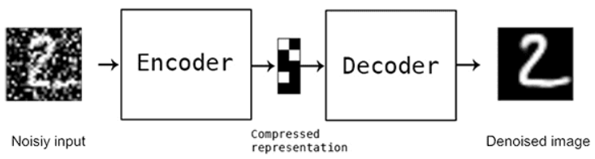

- This autoencoder is designed to remove noise from corrupted input data.
- During training, the input data is intentionally corrupted by adding noise, while the target remains the original, uncorrupted data.
- The autoencoder learns to reconstruct the clean data from the noisy input, making it useful for image de-noising and data preprocessing tasks.

## Sparse AutoEncoder `SAE`

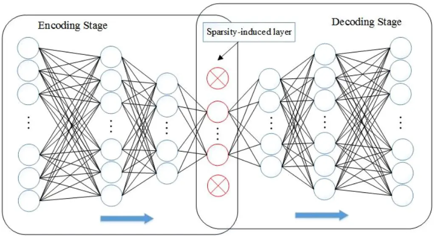

- This type of autoencoder enforces sparsity in the latent space representation by adding a sparsity constraint to the loss function (as shown above).
- This constraint encourages the autoencoder to represent the input data using a small number of active neurons in the latent space, resulting in more efficient and robust feature extraction.

## Variational AutoEncoder\* `VAE`

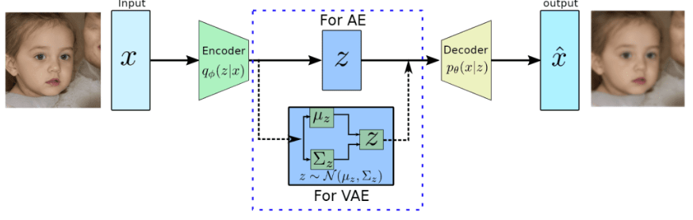

- Generative model that introduces a probabilistic layer in the latent space, allowing for sampling and generation of new data.
- VAEs can generate new samples from the learned latent distribution, making them ideal for image generation and style transfer tasks

### `VAE` Vs `AE`

The key distinction between `VAE`s and traditional `AE`s is the design of their latent spaces. `VAE`s ensure continuous latent spaces, facilitating random sampling and interpolation, making them invaluable for generative modeling.

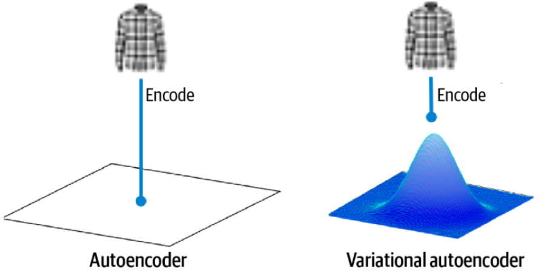

In a standard `AE`, every image corresponds to a singular point within the latent space. Conversely, as shown above, in a VAE, each image is associated with a multivariate normal distribution centered around a specific point in the latent space.

Unlike traditional autoencoders that learn deterministic encodings, VAEs introduce a probabilistic twist. The encoder in a VAE doesn’t produce a fixed point in the latent space. Instead, it outputs parameters (typically mean and variance) of a probability distribution, which we sample to obtain our latent representation.

### Components

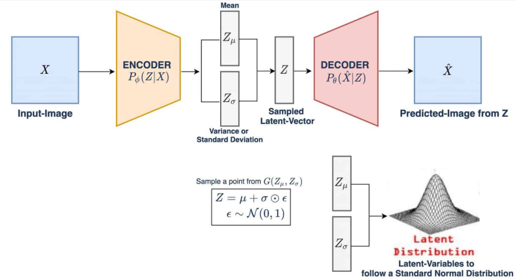

**Encoder**

- Compresses input data into a latent space
  representation
- Produces the parameters (mean and variance) of a
  probability distribution

**Latent Space**

- Is a compressed representation of input data in the form
  of a probability distribution
- Encodes essential features for data reconstruction

**Decoder**

- Reconstructs input data from its latent space representation
- Ensures quality of reconstruction for optimal `VAE`
  performance

**VAE:Loss function**

has two components:

1. **Reconstruction Loss**

   - Measures how well the decoder reconstructs the input data
   - Commonly uses Mean Squared Error (MSE) or cross-entropy
     loss
   - Acts as a guiding compass, nudging the `VAE` towards better
     capturing the important features of the input data

2. **KL Divergence Term**

   - Is essential for VAE's overall loss function
   - Measures the divergence of the latent space distribution
     from a prior (usually standard normal) distribution
   - Helps with generalization and prevents overfitting

read more about [VAE 👆](https://pyimagesearch.com/2023/10/02/a-deep-dive-into-variational-autoencoders-with-pytorch/)

### Training

Training a Variational Autoencoder (VAE) is a multi-step process that enables it to unlock its powerful generative capabilities.

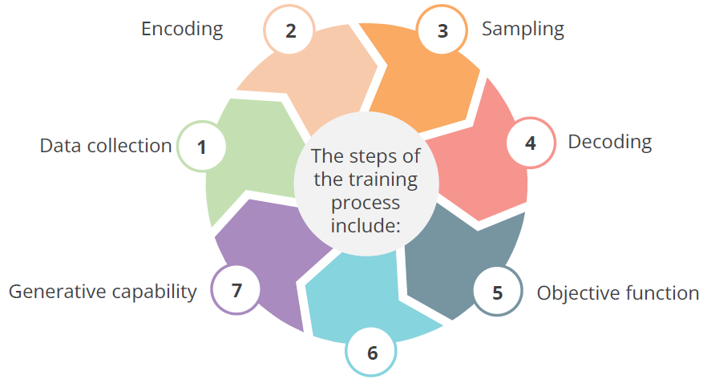

Here’re the steps for training process of a VAE, which provides valuable insights into how a language model captures and recreates complex data patterns:

- Gather a large dataset of existing content.
- Ensure the dataset represents the domain or type of data you aim for the VAE to generate.

**Data Collection**

Here’re the steps for training process of a VAE, which provides valuable insights into how a language model captures and recreates complex data patterns:

- Gather a large dataset of existing content.
- Ensure the dataset represents the domain or type of data you aim for the VAE to generate.

**Encoding**

- The next step involves the encoding process.
- The encoder, usually a neural network, maps the input data (𝑥) to a latent space (𝑧).
- It learns the mean 〖(𝜇〗*𝜙(𝑥))and variance (〖𝜎*𝜙〗^2 (𝑥)) of the Gaussian distribution in the latent space.

**Sampling**

- The model samples from the distribution it learned in the latent space.
- This sampling enables the creation of new data points from that distribution.
- This process introduces a crucial element of randomness necessary for the model's generative capabilities.

**Decoding**

- The decoder, which is another neural network, generates new data samples.
- It maps the latent representation (𝑧) back to the data space.
- The decoder learns the mean 〖(𝜇〗*𝜙(𝑧)) and variance (〖𝜎*𝜙〗^2 (𝑧)) in the data space.

**Objective Function**

- Training a VAE involves optimizing an objective function.
- This objective function comprises two components:
  - Minimizing the reconstruction error between the input and the generated data
  - Minimizing the Kullback-Leibler (KL) divergence between the learned distribution in the latent space and a standard Gaussian distribution

**Training and Back-propagation**

- Back-propagation trains the model.
- The process computes gradients in relation to the encoder and decoder parameters.
- The system updates the parameters to minimize the objective function.

**Capabilities**

- The unique feature of a VAE is its continuous
  latent space.
- It enables straightforward random sampling and
  interpolation between data points.
- This versatility allows VAEs to generate a wide
  variety of data types effectively.
- VAEs learn an efficient continuous latent space,
  allowing controlled data generation.
- Unlike standard autoencoders, VAEs introduce
  probabilistic sampling to generate diverse
  outputs.
- Unlike GANs, VAEs maintain smooth latent
  representations, making them ideal for controlled
  text, image, and speech synthesis.

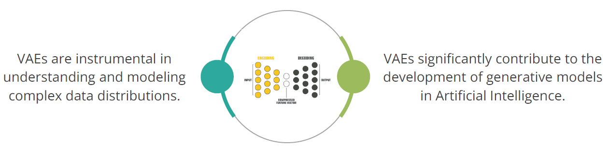

While LLMs like GPT, BERT, and LLaMA 2 use transformers, VAEs can enhance LLMs in two major ways

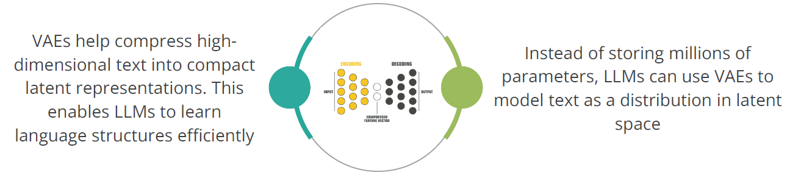

**Impact**

- Better generalization –Avoids overfitting to training data.
- Efficient memory usage –Reduces computational cost.
- Latent space interpolation –Creates hybrid text representations

### Applications

1. **Image Generation**: VAEs excel at creating new and realistic images.
2. **Text Generation**: VAEs can generate synthetic text with controllable attributes
3. **Anomaly Detection**: VAEs play a vital role in identifying anomalies or outliers in datasets like assist in spotting unusual financial transactions, improve manufacturing processes by identifying defects, etc
4. **Data Imputation**: VAEs help fill in missing or incomplete data.
   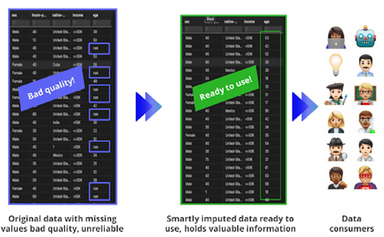

### limitations

The greatest disadvantage of VAEs is that they tend to produce _blurry_ and _unrealistic_ outputs

✏️: `GAN`s are known for producing high-quality, sharp, and realistic outputs, particularly in image generation.

## Sequence to Sequence AutoEncoder

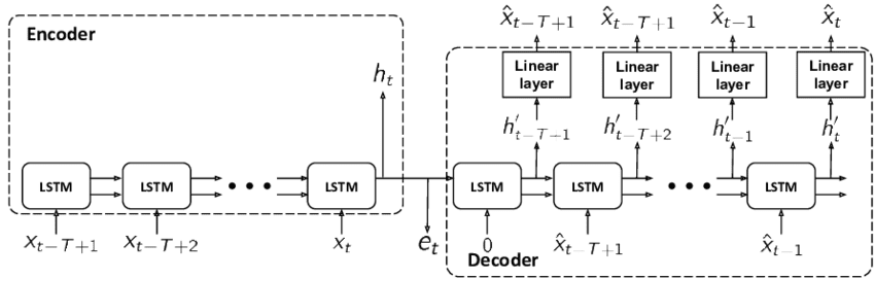

- Also known as a Recurrent Autoencoder, this type of autoencoder utilizes recurrent neural network `RNN` layers (e.g., long short-term memory `LSTM` or gated recurrent unit `GRU`) in both the encoder and decoder shown above.
- This architecture is well-suited for handling sequential data (e.g., time series or natural language processing tasks).

✏️: These are just a few examples of the various autoencoder architectures available. Each type is designed to address specific challenges and applications, and by understanding their unique properties, you can choose the most suitable autoencoder for your problem.
