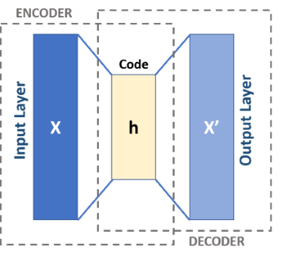
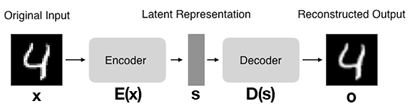

## AutoRegression

Continuing the example of 🍎 and 🍊

- When generating an image of fruit, model was considering feature of fruit

fruit = `P(y= AO | color, price, texture of friut, etc)`

- When generating price of a house, model will consider features of a house

rating = `P(y= HousePrice | carpet-area, floor, # of balcony, etc)`

- but when predicting the stock price. model will consider the past values of stock itself as features of stock

price = `P(y= StockPrice | past values of the stock price)`

✏️: In the stock price example, you are peeking into the past values of the same variable i.e.price

This is known as auto-regression or peeking into its own past values to predict the next value

NN -> Neural Network

## **A**uto **E**ncoders

> It is a NN that learns to compress and reconstruct input data.

- `AE`s are a type of neural network
- `AE`s are unsupervised learning model,
- `AE`s are dimensionality reduction, data compression, and feature extraction

### Components

**Encoder**

- Compresses the input data into a smaller representation (`latent space` or `code`).
- _Comprised of 780 neuron's to store feature of 🍎, Encoder will compress with objective to save some storage_

**Latent Space or Code**

- Often called `embedding`, aims to retain as much information as possible, allowing the decoder to reconstruct the data with high precision.
- If we denote our input data as `x` and the encoder as `E`, then the output latent space representation, `s`, would be `s=E(x)`
- _compressed and stored feature of 🍎 in may be 2 neurons_

**Decoder**

- reconstructs the original input data by accepting the latent space representation `s`.
- If we denote the decoder function as `D` and the output of the detector as `o`, then we can represent the decoder as `o = D(s)`
- _comprised of 780 neurons, will take feature of latest space and reconstruct 🍎_

_Now, depending on quality of reconstruction of image of 🍎, latest space of 2 neurons was efficient or we need to increase # of neurons but less than 780 neurons._

By using our mathematical notation, the entire training process of the autoencoder can be written as follows:

`o = D(E(x))`

**Observe the following steps:**

1. We input a digit into the autoencoder.
2. The encoder subnetwork generates a latent representation of the digit 4, which is considerably smaller in dimensionality than the input.
3. The decoder subnetwork reconstructs the original digit using the latent representation.

It reconstructs the image to be as close as possible to the original image, indicating that the network has learned a meaningful representation.

✏️: Both encoder and decoder are typically composed of one or more layers, which can be fully connected, convolutional, or recurrent, depending on the input data’s nature and the autoencoder’s architecture

### Use Cases

- **Noise Reduction**: If a fruit image has noise (blur or distortion), an autoencoder can remove unnecessary details and reconstruct a clearer version.
- **Anomaly Detection**: Suppose most apples are red, but one is blue. The autoencoder would struggle to reconstruct it properly, flagging it as an anomaly.
- **Compression**: It helps store fruit images efficiently without needing full resolution, similar to JPEG compression but learned through deep learning.

### Limitations

- **Data generation**: Traditional autoencoders were limited in generating new, unseen data.
- **Robustness in learning**: Autoencoders often learn oversimplified representations, missing the data's true complexity.
- **Handling variability**: Autoencoders struggled with the inherent variability and randomness in data, which is crucial for tasks like image generation or simulation.

✏️: limitations have led to the development of Variational
Autoencoders `VAE`s. `VAE`s overcome these challenges and create a more versatile and effective generative model.
