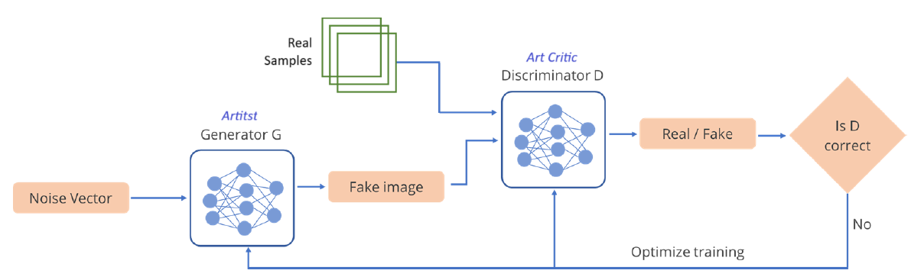
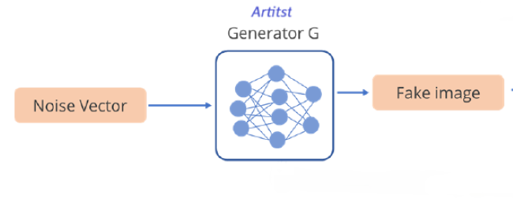
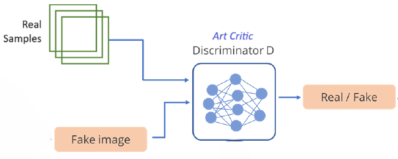
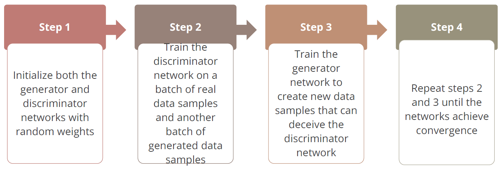
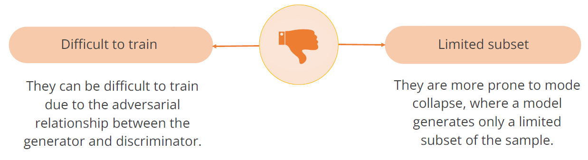

**Limitation of VAE**

- VAEs tend to produce samples that are often blurry or averaged representations.
- They may struggle to capture the full richness and diversity of the data distribution.

**How GAN solves it**

## GAN

- GANs excel at capturing high-frequency details and generating more realistic and diverse samples.
- They produce images that capture the complexity and variability of real data.

> `GAN`s are a type of generative models, which observe many sample distributions and generate more samples of the same distribution

✏️: `GAN`s get the word _adversarial_ in its name because the two networks are trained simultaneously and competing against each other, like in a zero-sum game such as chess.

- `GAN`s generate highly realistic samples with sharp details
  and intricate features.
- They are effective in producing natural-looking images
  closely resembling input data.
- For example, a new image can be generated from an old
  training set.

### Architecture

GANs use two neural networks: a generator and a discriminator. These networks engage in an adversarial relationship.

This adversarial dynamic forms a zero-sum game, where one network's progress is at the expense of the other.

### Components

**Generator- G**

The generator model generates new images. The goal of the generator is to generate images that look so real that it fools the discriminator. In the simplest GAN architecture for image synthesis, the input is typically random noise, and its output is a generated image.

**Discriminator - D**

The discriminator is just a binary image classifier which you should already be familiar with. Its job is to classify whether an image is real or fake.

✏️: Both the generator and discriminator are implemented using `CNN`s, particularly for image-related tasks.

### How `GAN` works?

Putting it all together, here is what a basic GAN architecture looks like:

- the generator makes fake images; we feed both the real images (training dataset) and the fake images into the discriminator in separate batches. -

- Both networks learn through adversarial training, generator tries to fool the system while discriminator distinguishes real from fake

- Job of discriminator is to look at both real image sample and fake images created by generator and decide which is which?

- During training,the generator creates and the discriminator evaluates and both use feedback to improve till the point the generator creates images so convincing that the discriminator evaluates it to be real.

- As the process iterates, both the generator and discriminator updates their method. Generator betters to create realistic images and discriminator becomes sharper at spotting the fakes.

### Trainings

### Applications

1. AI-Generated Portraits.
2. Art & Creativity.
3. Fashion & Design
4. Face Aging & De-Aging

**Example**

- StyleGAN generates the image.
- NVIDIA developed the Style Generative Adversarial Network. It generates highly realistic and customizable synthetic images.
- Its primary innovation is controlling content and style, leading to diverse, high-quality, personalized visuals.

### Advantages

- `GAN`s operate in an unsupervised learning framework and don't require labeled data during
  training.
- `GAN`s can be applied to image-to-image translation tasks, like converting satellite images to maps, black-and-white photos to color, or day-to-night scene translation.
- `GAN`s can be used for style transfer in images, allowing for the synthesis of images in the style of a particular artist or a given set of images.

### Limitations

