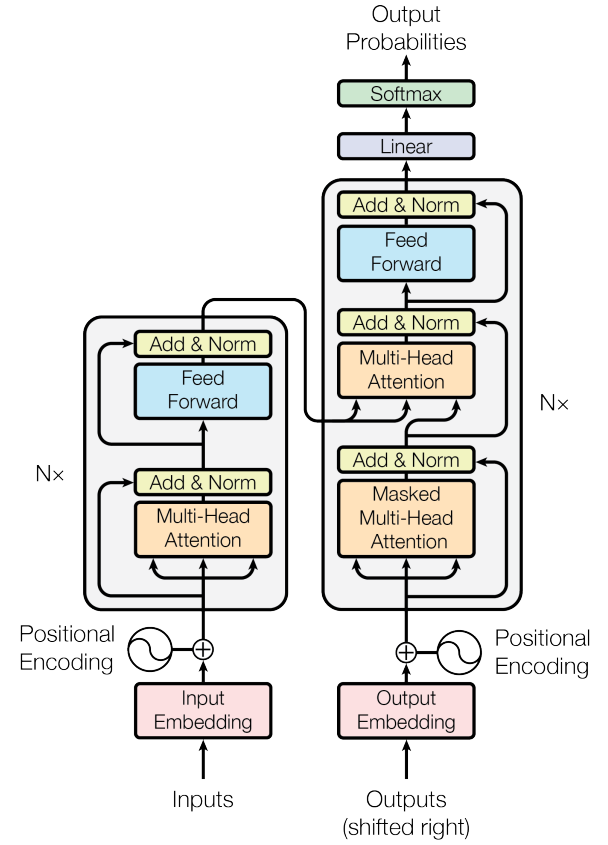

## Model Architecture

- Most competitive neural sequence transduction models have an **encoder-decoder** structure.
- Here, the encoder maps an input sequence of symbol representations (`x1`, ..., `xn`) to a sequence
  of continuous representations `z` = (`z1`, ..., `zn`). Given `z`, the decoder then generates an output
  sequence (`y1`, ..., `ym`) of symbols one element at a time. At each step the model is auto-regressive
  [10], consuming the previously generated symbols as additional input when generating the next.

## Encoder and Decoder Stacks

Let’s walk through the Transformer — the model behind today’s smartest AI systems.

Let’s begin by looking at the model as a single black box. In a _machine translation_ application, it would take a sentence in one language, and output its translation in another.

Popping open that Optimus Prime goodness, we see an **encoding** component, a **decoding** component, and connections between them.

The _encoding component is a stack of encoders_(the paper stacks six of them on top of each other – there’s nothing magical about the number six, one can definitely experiment with other arrangements). The _decoding component is a stack of decoders of the same number_.

The **encoder**’s inputs first flow through a `self-attention` layer – a layer that helps the **encoder** look at other words in the input sentence as it encodes a specific word. We’ll look closer at `self-attention` later in the post.

The outputs of the `self-attention` layer are fed to a **f**eed-**f**orward **n**eural **n**etwork `FFNN`. The exact same feed-forward network is independently applied to each position.

The **decoder** has both those layers, but between them is an **attention** layer _that helps the decoder focus on relevant parts of the input sentence_ (similar what attention does in seq2seq models).

### 🧠 Encoder Stack (Left)

- The encoder has 6 **identical layers**.
- Each layer has two parts:
  - **Multi-head self-attention**: Each word focuses on every other word in the sentence. <v>_This lets every word look at every other word_</v>.
  - **Feed-forward network**: Applies transformations to each word independently. <v>_These help refine each word’s meaning after attention_</v>.
- There's a **residual connection** (like a shortcut) around each part to keep the original information flowing.
- Everything is normalized and kept at the same size: **512 dimensions**. <v>_We clean and balance the signals so no word overwhelms the others._</v>.

### 🧠 Decoder Stack (Right)

- Also has **6 layers**, but adds a **third sub-layer**:
- **Masked self-attention**: Each word only looks at previous words (useful during generation). <v>_We hide future words so the model predicts one step at a time._</v>.
- **Encoder-decoder attention**: Connects to the encoder output, helping the decoder focus. <v>_This bridges understanding between the input and output_</v>.
- **Feed-forward network**: Like the encoder, applies transformation per position. <v>_Again, refining each generated word._</v>.
- Masking ensures that while generating output, each position only depends on **known words before it**, not the ones after.

✏️ **In Short**

- The **encoder reads and understands** the input.
- The **decoder generates output**, one token at a time, using the input's meaning — while carefully controlling what it can `see`.

🧠 **Real Use Cases:**

- Machine translation
- Chatbots
- Summarization

 
 
 
 

read more at [Attention is all you need - White paper](https://arxiv.org/pdf/1706.03762)

read more at [Illustrated Transformer](https://jalammar.github.io/illustrated-transformer/)