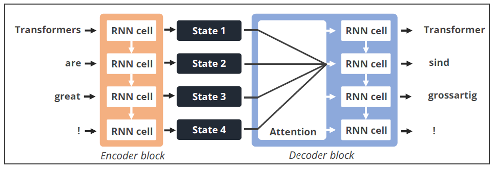
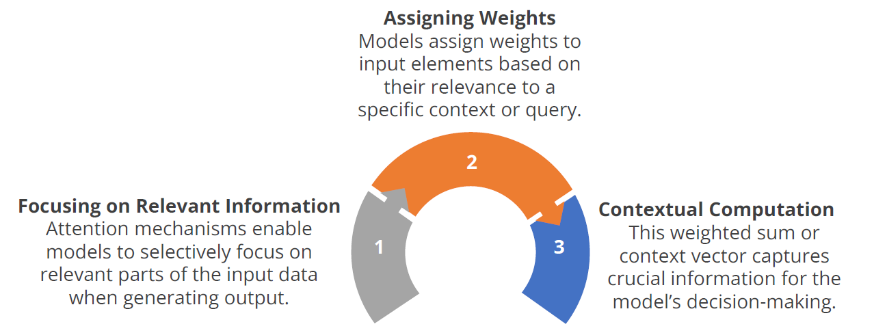

To address this bottleneck, a solution involves granting the decoder access to all the encoder's hidden states.

> The mechanism facilitating decoder access to all Encoder hidden states is termed **attention**.

## Types of Attention Mechanism

### Additive Attention
- Model creates a weighted sum of input elements by applying learned weights or parameters.
- This method calculates attention by learning the importance of each element in the input sequence.

### Multiplicative Attention
- Model generates attention weights through element-wise multiplication between the input elements and a learned parameter vector.
- This approach allows the model to capture complex interactions between elements.

### Self Attention 
- Model attends to different positions of the input sequence by comparing each position with all other positions.
- It involves comparing each element with every other element in the sequence, including itself, to reweigh their importance based on contextual relevance.
- Self-attention is fundamental in generative AI and is commonly used in Transformers.