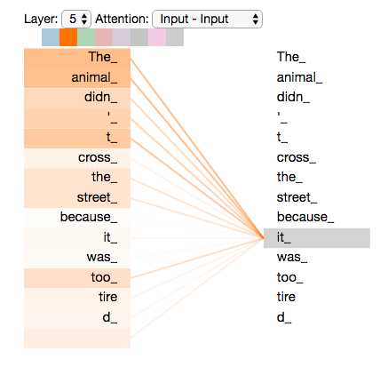

## Self-Attention

🧠 **What is Self Attention❓**

It’s a technique that lets the model **look at all the words in a sentence while processing each word** — not just the ones before or after.

🔍**Example**

Take the sentence:

`The animal didn't cross the street because it was too tired.`

When the model reads the word `it`, self-attention helps it figure out that `it` refers to `animal`, not `street`.

❓ **How It Works**

- For every word, self-attention **checks all other words in the sentence** to gather context.
- It **weights the importance** of each surrounding word and combines them to better understand the current one.
- This process runs for **each word independently**, but it still captures relationships.

❓ **Why It Matters**

- Unlike older models (like `RNN`s) that remember the past, Transformers using self-attention **can see everything at once**.
- It makes understanding complex meaning and long-range dependencies **faster** and **smarter**.

> Self-attention helps a word understand the full sentence while it’s being processed — even tricky references like `it` pointing to `animal`

Be sure to check out the [Tensor2Tensor notebook](https://colab.research.google.com/github/tensorflow/tensor2tensor/blob/master/tensor2tensor/notebooks/hello_t2t.ipynb) where you can load a Transformer model, and examine it using this interactive visualization.

## Calculating Self-Attention

Let’s first look at how to calculate self-attention using vectors, then proceed to look at how it’s actually implemented – using matrices.

> We break each word into three parts:\
> — a question <v>**Query**</v>\
> — a match reference <o>**Key**</o>\
> — and an information payload <bl>**Value**</bl>\
>  these help the model decide what each word should `pay attention` to.

### Step 1 : **Vectors Creation**

Self-attention starts by taking the embedding of each word (a vector with 512 numbers) and turning it into three new vectors:

- <v>**Query**</v> → used to ask `what am I looking for?`
- <o>**Key**</o> → used to say `what do I have?`
- <bl>**Value**</bl> → used to carry the actual information

❓ **How Are These Vectors Made**

Each word’s embedding (<g>**X1**</g> and <g>**X2**</g>) is multiplied by **three separate matrices** (one each for <v>**WQ**</v>, <o>**Wk**</o>, and <bl>**WV**</bl>). These matrices were **learned during training**.
So for every word, we get:

- <v>**Query Q**</v> vector (64 numbers) i.e. <v>**q1**</v> and <v>**q2**</v>
- <o>**Key K**</o> vector (64 numbers) i.e. <o>**k1**</o> and <o>**k2**</o>
- <bl>**Value V**</bl> vector (64 numbers) i.e. <bl>**v1**</bl> and <bl>**v2**</bl>

They’re smaller than the original 512 just to make things **efficient**, especially when doing **multi-head attention** (where multiple sets run in parallel).

> The Query looks for relevance, the Key signals it, and the Value delivers the content. `Self-attention` uses these to help each word **pay attention** to the most useful parts of a sentence.

🧠 **Think of each word as a person in a meeting...**

- <v>**Query Q**</v>: What the person is looking for (e.g., “I want smart ideas”).
- <o>**Key K**</o>: What the person offers (e.g., “I bring logic”).
- <bl>**Value V**</bl>: What the person actually says when they contribute.

### Step 2 : **Calculate Score**

- For each word, you compare its <v>Query</v> with every other word’s <o>Key</o> — like asking `Do you have what I’m looking for?`
- This comparison is done using a `dot product to get a score` — higher score means more relevance.
- These scores help decide how much weight (focus) to give to each word’s Value.
- Finally, you combine the weighted <bl>Values</bl> to get a new representation of the word — one that’s aware of its context.

So if we’re processing the self-attention for the word in position #1,

- The first score would be the dot product of <v>**q1**</v> and <o>**k1**</o>.
- The second score would be the dot product of <v>**q1**</v> and <o>**k2**</o>.

### Step 3 & Step 4 : **Scale & Softmax the Scores**

> You shrink the scores to keep learning stable, then turn them into weights that control attention across the sentence

- You divide each attention score by **8** (which is `√64`, since the key vectors are size 64).
- **Why**❓ This keeps the numbers smaller, which helps the model learn better by making the gradients more stable.
- The scaled scores are passed into a **softmax function**.
- This turns them into **probabilities** — all positive and adding up to 1.
- So now the model knows **how much attention to give to each word** in the sentence.

❓**What’s Happening Now**

Once we have softmax scores, they tell us how much attention each word should get. These scores are like weights — high scores mean “focus on this,” and low scores mean “ignore that.”

### Step 5 : **Weight the Values**

> It’s like adjusting the volume on each word\
> — boosting the ones we care about and quieting the rest\
> so that the final output focuses only on what truly matters.

- We take each word’s <bl>Value</bl> vector i.e. <bl>**v1**</bl> and <bl>**v2**</bl> (the actual information it holds).
- Then we **multiply** it by the corresponding **softmax score**.
- This means:
  - Important words (high score) stay loud and clear.
  - Unimportant words (low score) fade into the background.

❓ **What Happens After Self-Attention**

- Once the model finishes calculating self-attention, it produces a **new vector for each word** i.e. <pi>**z1**</pi> and <pi>**z2**</pi> — this vector now carries context from the whole sentence.
- This vector gets sent into a `FFNN`, which further refines it (like adding polish to the understanding).

✨ **Matrix Form for Speed**

> Self-attention builds a smart, context-aware vector for each word. Then the model speeds up everything by using matrix math to transform all those vectors at once.

- While we just walked through the logic using **individual word vectors**, the real model does it all at once using **matrices**.
- This means instead of processing word-by-word, it crunches all the data **in parallel** — making things much faster and efficient

## Matrix Calculation of Self-Attention

### Step 1 : **Calculate the <v>**Q**</v>, <o>**K**</o>, and <bl>**V**</bl> matrices**

We do that by packing our embeddings into a matrix <g>**X**</g>, and multiplying it by the weight matrices we’ve trained (<v>**WQ**</v>, <o>**Wk**</o>, and <bl>**WV**</bl>).

### Step 2-6 : One formula

Finally, since we’re dealing with matrices, we can condense steps two through six in one formula to calculate the outputs of the self-attention layer.

## Multi-Headed Attention

> Multi-headed attention helps the model learn more diverse and complex connections between words — all at the same time — making understanding deeper and more accurate.

❓**What Is Multi-Headed Attention**

It’s a smarter version of self-attention that lets the model focus on **different parts of a sentence simultaneously**.

❓**Why It’s Useful**

- **Focus on multiple relationships at once**
  - Example: In `The animal didn’t cross the street because it was too tired`
    - one attention head might learn that `it` refers to animal,
    - another head might look at `tired` or `street` to understand context better.
- **Multiple views of meaning**
  - Instead of one set of <v>Query</v>/<o>Key</o>/<bl>Value</bl> weights, the model uses **eight (or more)** — each creates a different interpretation.
  - Each head works in its **own space** `subspace`, capturing unique patterns or meanings.

❓**Why We Do Self-Attention 8 Times**

- Multi-headed attention means we run the self-attention calculation 8 separate times — each with different learned weights.
- This gives us 8 output matrices (<pi>Z0</pi> to <pi>Z7</pi>) — each offering a different “perspective” on the input.

✨ **Combining the Outputs**

- The model needs a single output per word, not 8 separate ones.
- So we concatenate all 8 matrices — stacking them side by side.
- Then we multiply the combined matrix by another learned weights matrix (WO).
- This compresses and transforms the data into the final shape expected by the feed-forward layer.

> We gather 8 “views” of each word, merge them, and polish the result into one clean output — ready for further processing.

🥜 Multi-headed self-attention is a way for a model (like a Transformer) to focus on different parts of a sentence **at the same time**. Each `head` learns a different kind of relationship between words—maybe one head focuses on grammar, another on meaning, and so on.
Here's the flow:

- <v>Query</v>, <o>Key</o>, <bl>Value</bl> matrices are used to figure out how much attention each word pays to others.
- **Multiple heads** run this attention separately to capture different patterns.
- Their **outputs are combined** (concatenated) and passed through a final layer **to produce one smart summary**.

Now that we have touched upon attention heads, let’s revisit our example from before to see where the different attention heads are focusing as we encode the word “it” in our example sentence:

If we add all the attention heads to the picture, however, things can be harder to interpret:

👉 [Understanding Positional Encoding](./00_positional_encoding/)

👉 [Understanding Residual Connection & Normalization Layer](./01_residual_connection_&_normalization/)

 
 
 
 

---

Landmark Transformer paper

- Vaswani, A., Shazeer, N., Parmar, N., Uszkoreit, J., Jones, L., Gomez, A. N., Kaiser, Ł., & Polosukhin, I. (2017). **Attention is all you need**. Proceedings of the 31st International Conference on Neural Information Processing Systems (NeurIPS), 6000–6010. Retrieved from https://arxiv.org/abs/1706.03762

For a visual deep dive, see

- Alammar, J (2018). The Illustrated Transformer [Blog post]. Retrieved from https://jalammar.github.io/illustrated-transformer/
