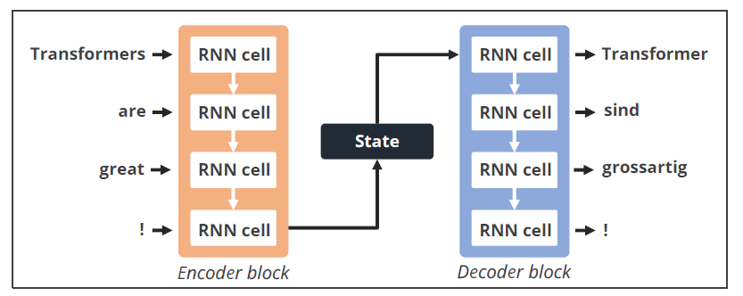
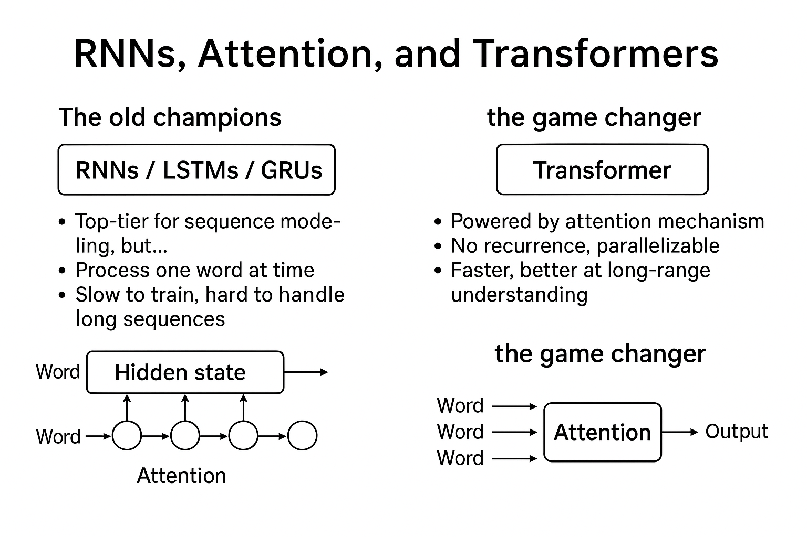
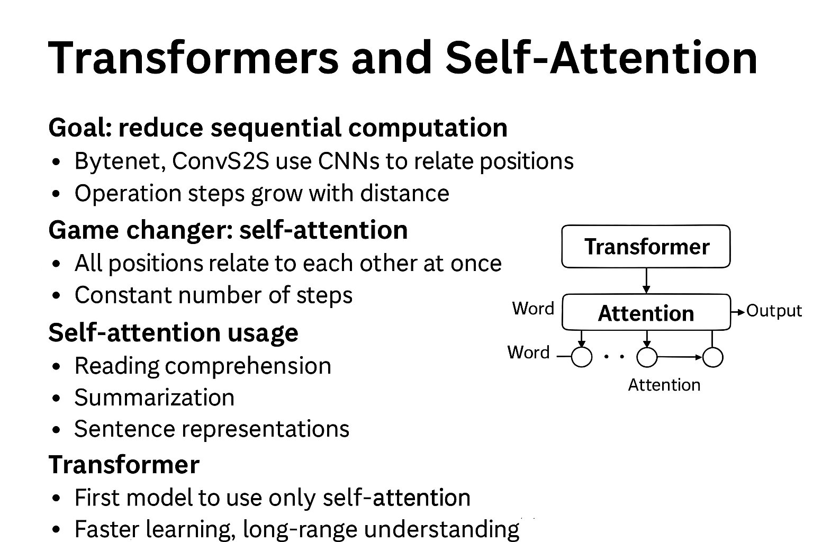

## Limitations of Traditional Model

### 🧠 RNNs, LSTMs, and GRUs — The Old Champions

- These models were once top-tier for sequence-based tasks like **language modeling** and **machine translation**.
- They work by processing one word or symbol at a time, passing information forward using **hidden states**.
- But because they’re sequential, they can’t run in parallel — training gets slow, especially with long sequences.
- Workarounds (like smarter memory and selective computation) helped, but didn’t fully solve the issue.

**Limitation of Traditional Architecture**

**Information Bottleneck**: The final hidden state of the encoder must encapsulate the entire input sequence, posing challenges for long sequences as early information might be lost.

**Challenges with Bottlenack** Traditional architectures struggle with long sequences as they compress all information into a single, fixed representation, making it difficult to maintain the integrity of the entire sequence.

### ✨ Attention Mechanisms — A Breakthrough

- Instead of just relying on previous words, **attention** lets the model “look around” at all words in the sequence, regardless of distance.
- Think of it like reading a whole paragraph at once, instead of word-by-word.

### 🚀 Transformers — The Game Changer

- No recurrence, no step-by-step processing.
- Fully powered by attention, so they learn relationships across the whole input instantly.
- They can train super fast and in parallel — reaching cutting-edge translation performance in just hours.

 
 
 
 

read more at [Attention is all you need - White paper](https://arxiv.org/pdf/1706.03762)

read more at [Illustrated Transformer](https://jalammar.github.io/illustrated-transformer/)
