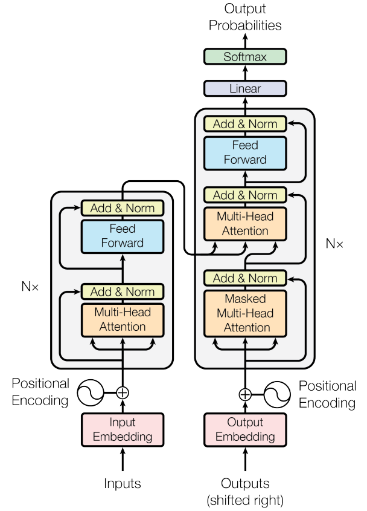

## Operations of LLMs

These represents the functions of components within an architecture.

### **Input Embeddings**

- The machine takes in a sentence and breaks it down into
  smaller pieces.
- Each of these pieces is turned into a special kind of code that
  the machine can understand.
- This code holds the meaning of the words.

### **Positional Encoding**

- The machine wants to understand not just what words are
  there but also their order in the sentence.
- So, it adds some extra information to the code to show
  where each word is in the sentence.

### **Encoder**

- `Encoder`: Now, the machine gets to work on analyzing the
  sentence. It creates a bunch of memories to remember what
  it has read.
- `Attention mechanism`: The machine pays more attention to
  some words depending on their importance in the sentence.
- `Feed forward`: After paying attention to words, the machine
  thinks hard about each word on its own.

### **Decoder**

- The machine not only understands but also generates new
  sentences.
- For this, it has a special part called the decoder.
- The decoder helps the machine predict what word comes
  next based on what it has understood so far.

### **Multi-headed attention**

- The machine looks at the words in different ways
  simultaneously.
- This helps the machine grasp different aspects of the
  sentence all at once.

### **Residual Connection & Normalization Layer**

- This layer is in place to keep everything in check and make
  sure the machine learns well.
- The machine normalizes its understanding at each step.

### **Output**

- Finally, the machine produces its own understanding or
  generates new sentences.
- The output depends on what the machine is designed to do.
- For example, if it's predicting the next word in a sentence, it
  gives a probability for each word.
