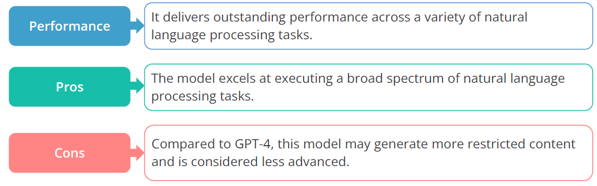
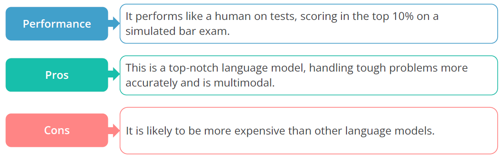
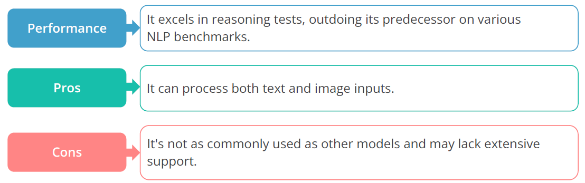
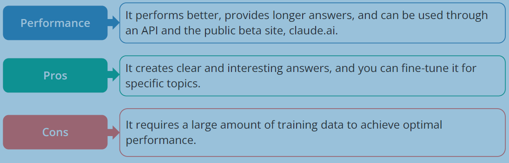
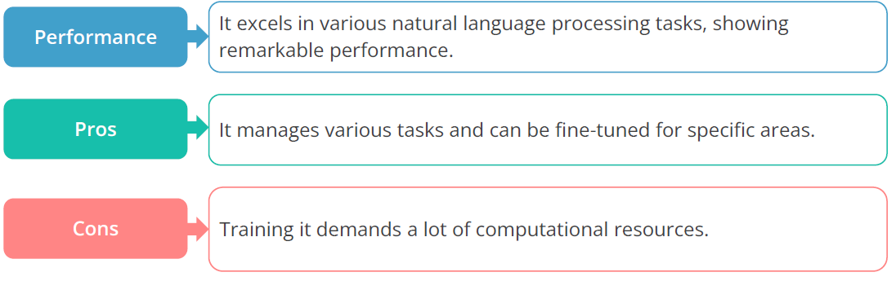
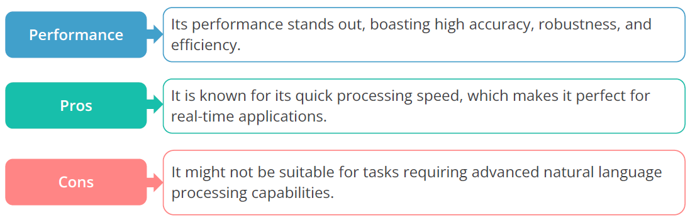
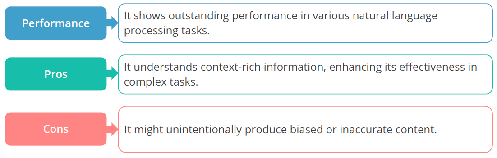

## GPT 3.5

This model is a sophisticated addition to OpenAI's GPT series, pushing the boundaries of language
processing.

## GPT 4

This is a big language model created by OpenAI. It uses GPT-3's strengths, reaching new levels of scale
and performance.

## PALM-2

This is a Google AI-developed next-gen LLM.

## Claude V1

This is a big language model crafted by Anthropic, an AI research company

## Cohere

This is a big language model made by Cohere Technologies.

## Falcon

This is a foundational large language model from the Technology Innovation Institute (TII) in the United Arab Emirates.

## LLaMA

This is a family of LLMs launched by Meta AI in February 2023.

