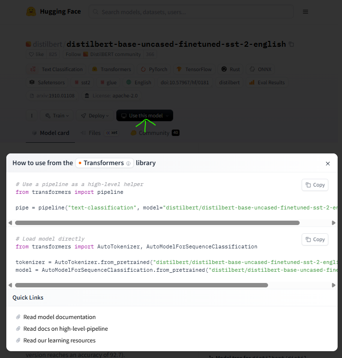
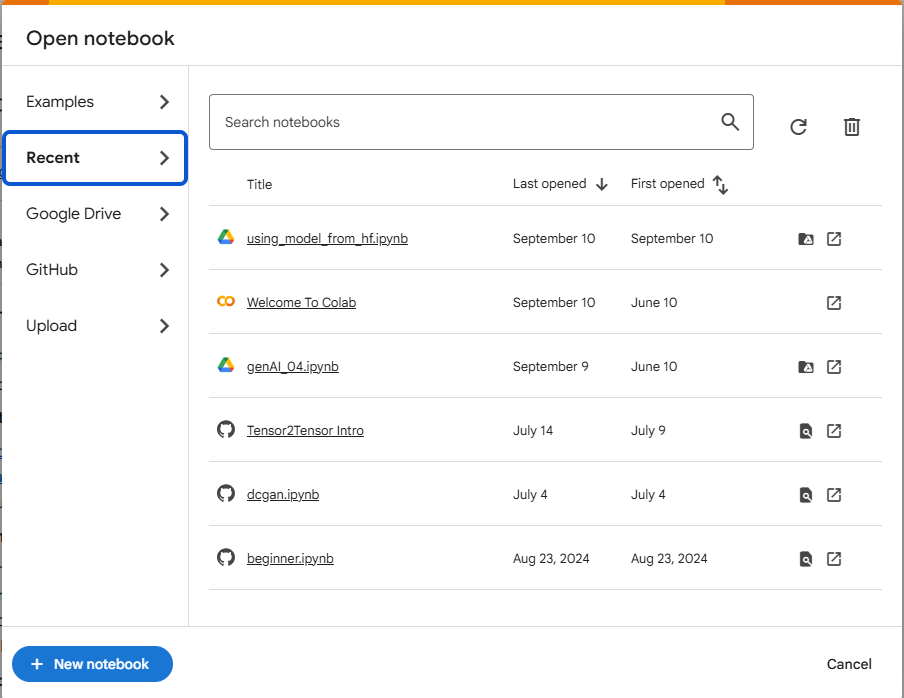

if you are interested in using models from `HF`, there are 2 ways:

1. Use `pipeline` as high level helper
2. Load model directly

## UseCase: Sentiment Analysis

**Steps**

1. Sign in to `HF` and you should see landing screen as below
   
2. Generate and set up an `llm_token` for accessing public LLMs

- Click on your profile picture (top-right) > Settings.
- In the left sidebar, click Access Tokens.
- Click **New Token**, name it `llm_token`, and select read access.
- Copy and save the generated token securely.
- Click secret from left panel and add token with key 'llm_token' and access as below

```py:title=token_set_up
from huggingface_hub import login
from google.colab import userdata

llm_token = userdata.get('llm_token')

login(llm_token)
```

2. Navigate to Models. From left menu, navigate **Tasks** > **Text Classification** under `NLP` section and select model of your choice for eg. [distilbert-base-uncased-finetuned](https://huggingface.co/distilbert/distilbert-base-uncased-finetuned-sst-2-english)
3. On Model Details page, click on `use this Model` button
   

### For using model as `pipeline`

4. Copy first section from popup

5. Now Navigate to [Colab Research by Google](https://colab.research.google.com/) and Sign in (if required)

   
   & Create new Notebook

   

6. Paste the code and you can rename `pipe` to sentiment_analyzer

   ```py:title=training.ipynb
   # Use a pipeline as a high-level helper
   from transformers import pipeline

   sentiment_analyzer = pipeline("sentiment-analysis", model="distilbert/distilbert-base-uncased-finetuned-sst-2-english")
   ```

   <op>
   /usr/local/lib/python3.12/dist-packages/huggingface_hub/utils/\_auth.py:94: UserWarning: The secret `HF_TOKEN` does not exist in your Colab secrets.
   To authenticate with the Hugging Face Hub, create a token in your settings tab (https://huggingface.co/settings/tokens), set it as secret in your Google Colab and restart your session.
   You will be able to reuse this secret in all of your notebooks.
   Please note that authentication is recommended but still optional to access
   public models or datasets.
   warnings.warn(
   config.json: 100%
   629/629 [00:00<00:00, 12.2kB/s] model.safetensors: 100%
   268M/268M [00:06<00:00, 51.7MB/s] tokenizer_config.json: 100%
   48.0/48.0 [00:00<00:00, 4.07kB/s] vocab.txt:
   232k/? [00:00<00:00, 5.78MB/s]

   Device set to use cpu

   </op>

   ***

   - If model-[distilbert-base-uncased-finetuned](https://huggingface.co/distilbert/distilbert-base-uncased-finetuned-sst-2-english) not specified, it will be supplied by defaulted to distilbert on you notebook in colab using pipeline.
   - Where is model coming from ? it's from `HF` @ [distilbert-base-uncased-finetuned](https://huggingface.co/distilbert/distilbert-base-uncased-finetuned-sst-2-english)
   - It also outputs the steps authenticate with `HF_TOKEN` and to use any other model from `HF`.

7. Let's test our brand new sentiment_analyzer with some sample input

   ```py:title=training.ipynb
   result = sentiment_analyzer("I loved learning transformers in today's session")

   result
   ```

   <op>
      [{'label': 'POSITIVE', 'score': 0.99791020154953}]

   </op>

   ***

   - It will execute blazing fast and the analysis has labelled the input as POSITIVE
   - Let try another input

   ```py:title=training.ipynb
   result = sentiment_analyzer("I hated learning transformers in today's session")

   result
   ```

   <op>
   [{'label': 'NEGATIVE', 'score': 0.9986257553100586}]
   </op>

   ***

   - Analysis has labelled the input as NEGATIVE

**💪 Try remove model and run test again as below**

```py:title=training.ipynb
# Use a pipeline as a high-level helper
from transformers import pipeline

#sentiment_analyzer = pipeline("sentiment-analysis", model="distilbert/distilbert-base-uncased-finetuned-sst-2-english")

sentiment_analyzer = pipeline("sentiment-analysis")
```

### For using model directly

4.  Copy second section from popup

5.  Now Navigate to [Colab Research by Google](https://colab.research.google.com/) and Sign in (if required) & Create new/Open Notebook

6.  Paste the code and Run

    ```py:title=training.ipynb
    # Load model directly
    from transformers import AutoTokenizer, AutoModelForSequenceClassification

    tokenizer = AutoTokenizer.from_pretrained("distilbert/distilbert-base-uncased-finetuned-sst-2-english")

    model = AutoModelForSequenceClassification.from_pretrained("distilbert/distilbert-base-uncased-finetuned-sst-2-english")
    ```

    

7.  Let's assume sample input and see how it looks in tokenized form

    ```py:title=training.ipynb
    input = "I loved learning huggingface today"

    tokenizer(input)
    ```

    {'input_ids': [101, 1045, 3866, 4083, 17662, 12172, 2651, 102], 'attention_mask': [1, 1, 1, 1, 1, 1, 1, 1]}

    ***

    - `tokenizer` converts the raw input string into token IDs and attention masks, formatted as PyTorch tensors ('pt' stands for PyTorch).

8.  Runs the forward pass of the model using the tokenized input

    ```py:title=training.ipynb
    import torch

    with torch.no_grad():
        output = model(**tokenizer(input, return_tensors='pt'))

    output
    ```

       <op>
       SequenceClassifierOutput(loss=None, logits=tensor([[-3.3122,  3.4629]]), hidden_states=None, attentions=None)
       </op>

    ***

- `**` unpacks the dictionary returned by the tokenizer, so you're passing the tokenized inputs directly into the model.

9.  Apply `softmax function` to the logits tensor along the last dimension (dim=-1), converting raw scores into a probability distribution.

    ```py:title=training.ipynb
    tensors = torch.nn.functional.softmax(output.logits, dim=-1)

    tensors
    ```

    <op>
    tensor([[0.0011, 0.9989]])
    </op>

    ***

    - Softmax transforms these into values between 0 and 1 that sum to 1, making them interpretable as probabilities.

10. Applies the `argmax` to tensors

    ```py:title=training.ipynb
    torch.argmax(tensors)
    ```

    <op>
    tensor(1)
    </op>

    ***

    - Returns the index of the largest value in the input tensor. i.e. tensor(1) as `Positive` and tensor(0) as `Negative`
    - If the tensor is multi-dimensional, you can specify the dim argument to get the index along a particular axis.

✨ : We just used transformer for sentiment analysis, but transformers can be used for various usecases as well, for eg machine translation

## UseCase: Translation

Transformers can be used for machine translations as below

**Task** : Translate from English to German

- Navigate to Models. From left menu, navigate **Tasks** > **Text Classification** under `NLP` section and select model of your choice for eg. [Helsinki-NLP](https://huggingface.co/Helsinki-NLP/opus-mt-en-de)

- You can repeat the steps learn so far to create english to german translator

  ```py:title=training.ipynb
  # Use a pipeline as a high-level helper
  from transformers import pipeline

  translator = pipeline("translation", model="Helsinki-NLP/opus-mt-en-de")
  ```

  <op>
  /usr/local/lib/python3.12/dist-packages/huggingface_hub/utils/\_auth.py:94: UserWarning:
  The secret `HF_TOKEN` does not exist in your Colab secrets.
  To authenticate with the Hugging Face Hub, create a token in your settings tab (https://huggingface.co/settings/tokens), set it as secret in your Google Colab and restart your session.
  You will be able to reuse this secret in all of your notebooks.
  Please note that authentication is recommended but still optional to access public models or datasets.

  warnings.warn(
  config.json:
  1.33k/? [00:00<00:00, 21.0kB/s] pytorch_model.bin: 100%
  298M/298M [00:03<00:00, 103MB/s] model.safetensors:  60%
  178M/298M [00:03<00:01, 61.4MB/s] generation_config.json: 100%
  293/293 [00:00<00:00, 6.59kB/s] tokenizer_config.json: 100%
  42.0/42.0 [00:00<00:00, 1.56kB/s] source.spm: 100%
  768k/768k [00:00<00:00, 4.78MB/s] target.spm: 100%
  797k/797k [00:00<00:00, 6.33MB/s] vocab.json:
  1.27M/? [00:00<00:00, 3.85MB/s])

  /usr/local/lib/python3.12/dist-packages/transformers/models/marian/tokenization_marian.py:175: UserWarning: Recommended: pip install sacremoses.

  warnings.warn("Recommended: pip install sacremoses.")
  Device set to use cpu

  </op>

  ***

  ```py:title=training.ipynb
  translator("I had visited Newyork couple of weeks ago")
  ```

  <op>
  [{'translation_text': 'Ich hate Newyork vor ein paar Wochen besucht'}]

  </op>

  ***
