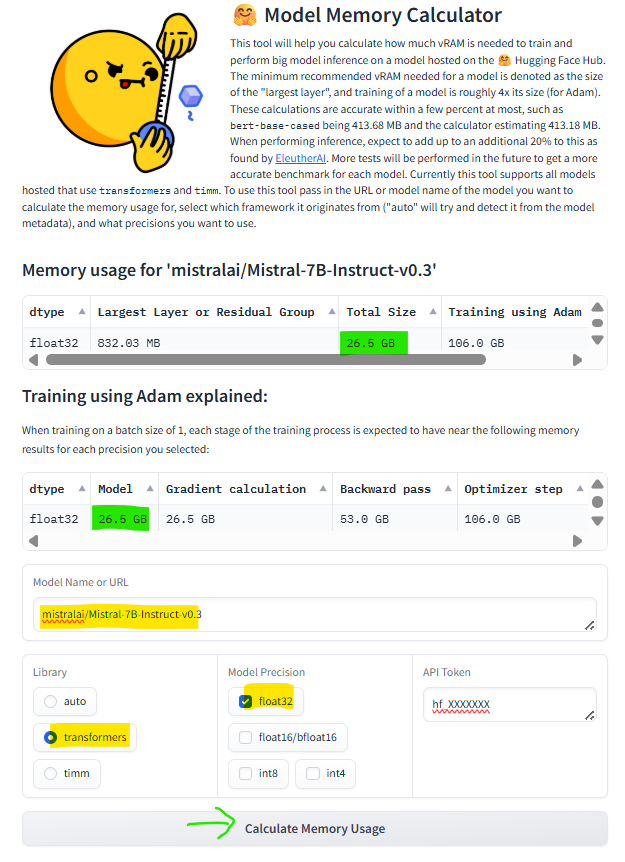

- As we know, Transformer has `Encoder` and `Decoder`.
- `Encoder` is good at understanding the text
- `Decoder` is good at generating the text

❓ **Do Transformer require to **understand** and **generate** for below use cases**

1. Sentiment Analysis Transformer
   - require only **Understanding**
   - Reason: In sentiment analysis, it undertands the text and labels it.
   - Hence, we need a model i.e. good at understanding the input
2. Translation Transformer
   - require both **Understanding** & **Generate**
   - Reason: In translation, it undertands the entire text and generate the stream of output tokens in traget language.
   - Hence, we need a model i.e. good at both understanding as well as generating text
3. Summarization Analysis Transformer
   - require both **Understanding** & **Generate**
   - Reason: In summarization, it undertands the entire text and generate the stream of output tokens of summarization.
   - Hence, we need a model i.e. good at both understanding as well as generating text
4. Semantic Similarity Transformer (pass 2 sentences and generate semantic similarity score)
   - require only **Understanding**
   - Reason: In sentiment analysis, it undertands the text and labels it.
   - Hence, we need a model i.e. good at understanding the input

This brings up with the questions,

**What variant of model you actually need**❓

**Do I need Encoder only model**❓

**Do I need Decoder only model**❓

## Encoder-only Models:

1. `BERT` - Bi-directional Encoder Respresentational Transformer
2. `RoBERTa` - Robustly Optimized BERT, for maximum accuracy
3. `AlBERT` - (A Lite BERT), lighter BERT, for balancing performance and efficiency.
4. `DistilBERT` - A compressed version of BERT, fastest and smallest model suitable for deployments with limited resource at slightly decreased performance.

They are good at tasks where only understanding is required i.e. tasks under `text classification` category for tasks like sentiment analysis, Named Entity Recognition `NER`, Sentence Similarity. Fill Mask

## Decoder-only Models

- `GPT` - **G**enerative **P**rompt **T**ransformer by [OpenAI](https://openai.com/)
  - [gpt-3.5-turbo](https://platform.openai.com/docs/models/gpt-3-5),
  - [gpt-4-turbo](https://platform.openai.com/docs/models/gpt-4-turbo-and-gpt-4), etc
- `LLaMa` - **L**arge **La**nguage **M**eta **a**i by [Meta](https://www.meta.ai/)
  - [LLaMa-3](https://www.llama.com/models/llama-3/),
  - [LLaMA-4](https://www.llama.com/models/llama-4/), etc.
- `Mistral` by [MistralAI](https://mistral.ai/)

  - [Mistral 7B](https://huggingface.co/plawanrath/minstral-7b-rust-fine-tuned) A foundational model focusing on balancing cost and performance with efficient inference features.
  - [Mixtral 8x7B](https://huggingface.co/mistralai/Mixtral-8x7B-Instruct-v0.1) An open-source model using a "Mixture of Experts" architecture. .

- AutoRegressive models (Time Series)
- Learn from left to right context (Unlike BERT)
- Trained via Next word predication technique (No Masking)

## **Data Preparation**

Take a sentence

Sentence : I am excited to learn about generative artificial intelligence

| Input                                                          | Output       |
| -------------------------------------------------------------- | ------------ |
| I                                                              | am           |
| I am                                                           | excited      |
| I am excited                                                   | to           |
| I am excited to                                                | learn        |
| I am excited to learn                                          | about        |
| I am excited to learn about                                    | generative   |
| I am excited to learn about generative                         | artificial   |
| I am excited to learn about generative artificial              | intelligence |
| I am excited to learn about generative artificial intelligence | EOS          |

❓ Training data preparation is easy ? for `Decoder-only` or `Encoder-only` models?

> Labelling or annotating data is difficult, expensive, some times require Human intervention, error-prone, etc

- Endcoder-only trains on `Supervised Learning Algorithm` which is diffcult to scale

- Docoder-only trains on `Self-Supervised Learning Algorithms` which is much easier to scale

So in terms of scalability, `Decoder-only` models are the best choice

OpenAI claims to be able to train their models with larger and larger datasets i.e. the `Decoder-only` models.

✏️: You can not use models which have gated permission on HF, you can request them on model details page by providing some info and submit as below screen


## Exercise-1

Use BERT model for these three use cases

1. Text Classification - Product Reviews (Get some actual reviews from internet)

2. Named Entity Recognition - Take a sample paragraph with mentions of entities ( name of person, name of organization, country, currency, location etc)

3. Question Answering - Take a random paragraph from the internet and a question based on that paragraph and see if it can answer it for you

## Does Decoder-only model has any understanding ?

Eg.

🙍‍♂️ : Who is the president of United States

Expected Output: Donald Trump

Actual Output : of America

- As we know, Language model works on Next best word prediction.
- By the definition of Language Model, the output should be **of America**, bBut my expectation was **Donald Trump**
- So on detailed analysis it becomes obvious that these models have limited ability (just to generate)
- We want it to understand not just the sequence of words but the intent behind that.
- So now we need to train our model with intent.

- The theory says that can we expect the model to learn everything just by training it on predicting the next best word. Yes. if you train on large corpus using a large model -> Large language model

GPT-3 and try to ask the same question

```py
input = "Who is president of United States"
```

<op>

Donald Trump

</op>

- `Finetuning` is used to further train the data either on a new data type or a new purpose.
- Refer [Exercise-2](#exercise-2) to see for same prompt, How different LLMs respond differently and without focus

## Exercise-2

### Using a public Model from HF

```py:title=Using_Public_Models
#!pip install transformers

from transformers import AutoTokenizer, AutoModelForCausalLM

def generate_text(model_name, prompt, max_len=50):
   try:
      print(f"Loading Model: {model_name}")

      # load tokenizer and model
      tokenizer = AutoTokenizer.from_pretrained(model_name)
      model = AutoModelForCausalLM.from_pretrained(model_name)

      # Toknize input text
      inputs = tokenizer(prompt, return_tensors="pt")

      # generate text
      output = model.generate(**inputs, max_lenght = max_len, num_return_sequences=1)

      # decode and return genererated text
      generated_text = tokenizer.decode(output[0], skip_special_token= True)
      print(f"\nGenerated Text:\n{generated_text}\n")
   except Exception as e:
      print(f"Error loading {model_name}: {e}")


# List of models to try
models = [
   "openai-community/gpt2",
   "EleutherAI/gpt-neo-125m",
   "facebook/opt-125m",
   "bigscience/bloom-560m"
]

# Input
prompt = "Once upon a time, in a land far away"

# run and analyze the output of each model for given input
for model in models:
   generate_text(model, prompt)
```

<op>

Loading Model: openai-community/gpt2

Generated Text:

Once upon a time, in a land far away, the world was a land of peace and harmony. The world was a land of peace and harmony. The world was a land of peace and harmony. The world was a land of peace and harmony

</op>

<op>

Loading Model: EleutherAI/gpt-neo-125m

Generated Text:

Once upon a time, in a land far away from the sea, the sea was the only thing that mattered.

The sea was the only thing that mattered.

The sea was the only thing that mattered.

The sea was

</op>

<op>

Loading Model: facebook/opt-125m

Generated Text:

&lt;/s&gt;Once upon a time, in a land far away from the world, a man named John was born.

John was a man of many talents. He was a man of many talents. He was a man of many talents. He was

</op>

<op>

Loading Model: bigscience/bloom-560m

Generated Text:

Once upon a time, in a land far away from the world, a man was born. He was a man of the world, a man of the world who had been born in the world. He was a man of the world who had been

</op>

### Using a Gated Model from HF

❓ Why some models require gated permissions

- As we have seen, `openai-community/gpt2`, `EleutherAI/gpt-neo-125m`, `facebook/opt-125m`, `bigscience/bloom-560m` were open-source, created to work on prompts of a specific domain and were not giving us relavant response for our given input.
- Bigger/smarter/reputed models like mistral work across domain to produce relavant responses and also abide by compliances across countries. So Gates Models creates an agreement of usage.
- Make sure model you are testing can be supported by current collab runtime
- To check for memory required to run a model in colab, mkae use of [HF Model Memory Calculator](https://huggingface.co/docs/accelerate/en/usage_guides/model_size_estimator)



- Gated Model @ [Mistral-7B-Instruct-v0.3](https://huggingface.co/mistralai/Mistral-7B-Instruct-v0.3) will crash to run on colab, but you can run this model on [Kaggle](https://www.kaggle.com/) which requires user registration.

- Settings Secret in kaggle
  1.  Open your Kaggle Notebook.
  2.  Click on "Add-ons": in the top menu bar.
  3.  Select "Secrets."
  4.  Click "Add a new secret."
  5.  Enter a "Label": for your secret (e.g., .llm_token). 6. This is the name you will use to reference it in your code.
      Paste the "Value": of your secret (e.g., your actual API key).
  6.  Ensure "Attach to Notebook" is ticked: for the current notebook if you want to use it immediately.
  7.  Click "Save."

```py:title=Using_Gated_Model
from huggingface_hub import login
from kaggle_secrets import UserSecretsClient

# Initialize the secrets client
user_secrets = UserSecretsClient()
# Get the value of your secret using its label
llm_token = user_secrets.get_secret("llm_token")
# Make sure you have been granted access to the model by the owner
login(token=llm_token)

models = [
   "mistralai/Mistral-7B-Instruct-v0.3"
]

# Input
prompt = "Once upon a time, in a land far away"

# run and analyze the output of each model for given input
for model in models:
   generate_text(model, prompt)

```

<op>

Loading Model: mistralai/Mistral-7B-Instruct-v0.3

Generate Text:

Once upon a time, in a land far away, a young dreamer discovered a hidden cave shimmering with moonlit whispers. Inside, ancient runes pulsed, leading to a forgotten kingdom where hope forged destiny. The traveler vowed to protect the realm’s future.

</op>

📌 Notice the output of gated LLM which was having 7B parameters, pretrained on much larger datasets is much meaningful and than public LLMs with less than 1B parameters and pretrained on smaller datasets.
