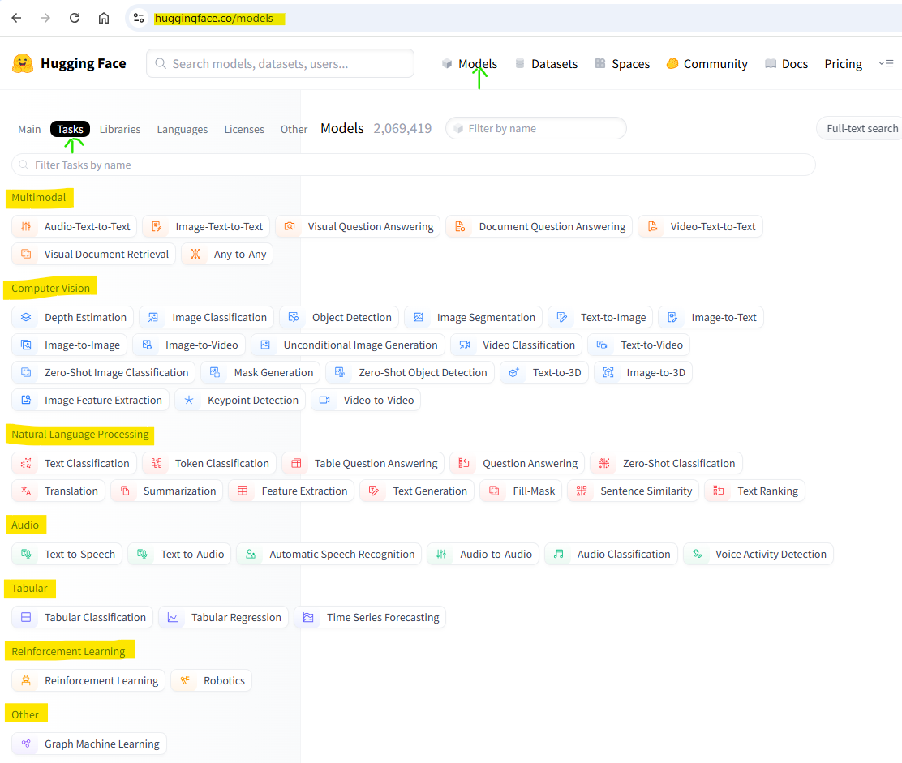
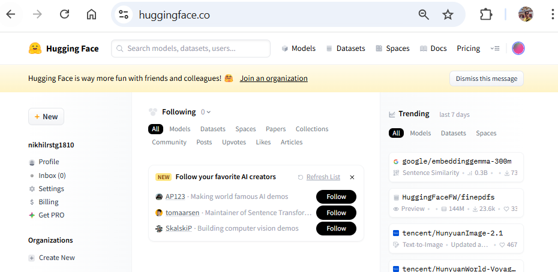
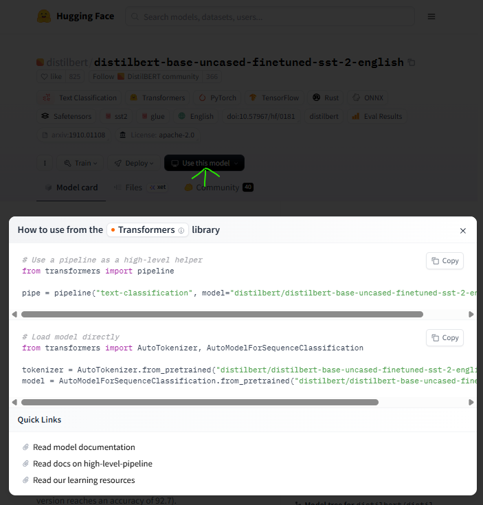
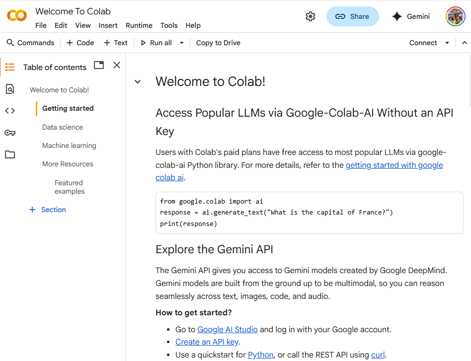
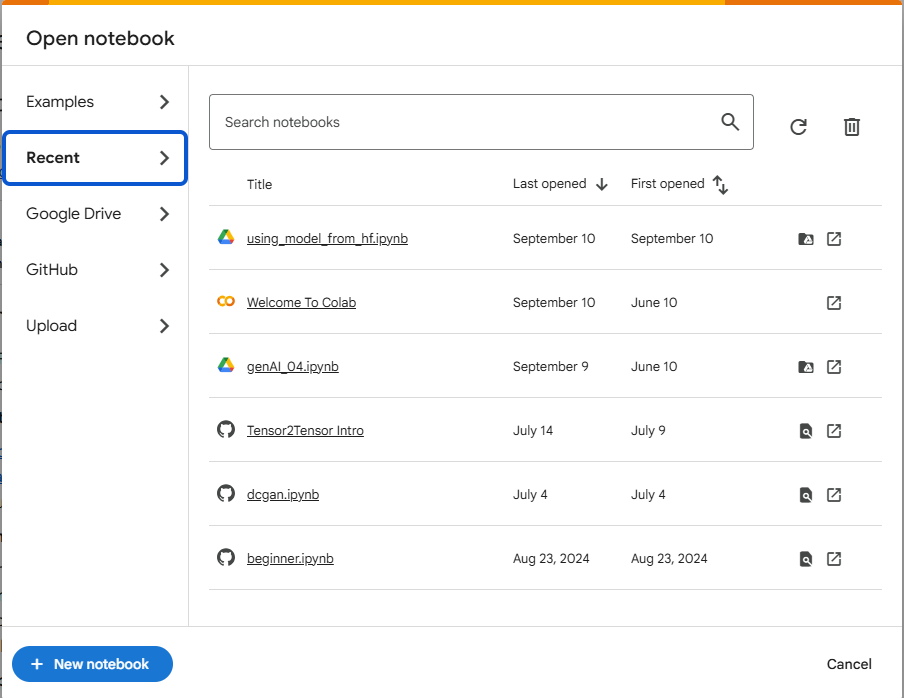
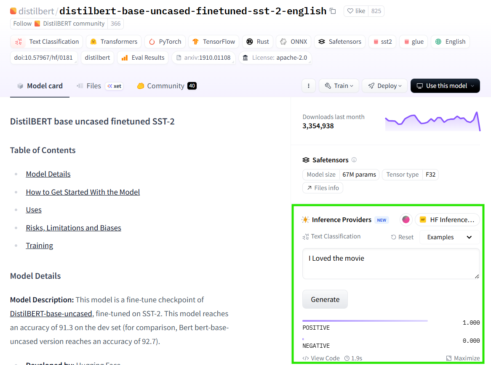
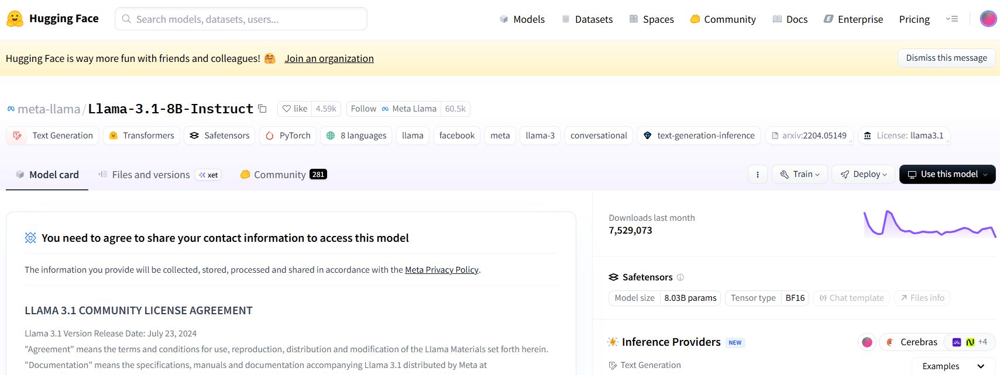

<style>
op { 
   background: #d8efd3;
   padding: 1rem .5rem;
   border-radius: .5rem 0;
   display:block;
   font-family:Consolas;
   margin-top: 1rem;
}
op::before {
  content: "🤖";
  width:2rem;
  position:relative;
  top: -1.5rem;
  left:.5rem
}
</style>

> You don't build LLM instead you fine-tune or use pre-trained model in an enterprise

- We don't tend to train LLMs from scratch, because the amount of data that you need and the amount of compute you need is massive.
- It even requires knowledge on distributes systems, parallelism, memory, compliances, etc
- So you never heard a **normal person** training transformers. Instead they talk about using pre-trained models (`GPT`, `BERT`, `Llama`, etc) or fine-tuning a model

✏️: **normal person** having limited access to compute

## Where to find these Transformer Models?

- If you are interested you can fine largest collection of open-source models @ [huggingface](http://huggingface.co/)
- So you can consider hugging face as one-stop shop for [models](https://huggingface.co/models) under category as below
  
- Not only models, but it also provide huge [datasets](https://huggingface.co/datasets)

**Example: Translation: `google-t5`**

[google-t5/t5-small](https://huggingface.co/google-t5/t5-small)

When you visit above link, you can view related information like:

1. Model Details
2. Uses
3. Bias, Risks, and Limitations
4. Training Details
5. Evaluation
6. Environmental Impact
7. Citation
8. Model Card Authors
9. How To Get Started With the Model

✏️: For each open-source model, you can access respective code and generate the model by your self

## Using models from `HF` and `Colab`

if you are interested in using models from `HF`, there are 2 ways:

1. Use `pipeline` as high level helper
2. Load model directly

### UseCase: Sentiment Analysis

**Steps**

1. Sign in to `HF` and you should see landing screen as below
   
2. Navigate to Models. From left menu, navigate **Tasks** > **Text Classification** under `NLP` section and select model of your choice for eg. [distilbert-base-uncased-finetuned](https://huggingface.co/distilbert/distilbert-base-uncased-finetuned-sst-2-english)
3. On Model Details page, click on `use this Model` button
   

#### For using model as `pipeline`

4. Copy first section from popup

5. Now Navigate to [Colab Research by Google](https://colab.research.google.com/) and Sign in (if required)

   
   & Create new Notebook

   

6. Paste the code and you can rename `pipe` to sentiment_analyzer

   ```py:title=training.ipynb
   # Use a pipeline as a high-level helper
   from transformers import pipeline

   sentiment_analyzer = pipeline("sentiment-analysis", model="distilbert/distilbert-base-uncased-finetuned-sst-2-english")
   ```

   <op>
   /usr/local/lib/python3.12/dist-packages/huggingface_hub/utils/\_auth.py:94: UserWarning: The secret `HF_TOKEN` does not exist in your Colab secrets.
   To authenticate with the Hugging Face Hub, create a token in your settings tab (https://huggingface.co/settings/tokens), set it as secret in your Google Colab and restart your session.
   You will be able to reuse this secret in all of your notebooks.
   Please note that authentication is recommended but still optional to access
   public models or datasets.
   warnings.warn(
   config.json: 100%
   629/629 [00:00<00:00, 12.2kB/s] model.safetensors: 100%
   268M/268M [00:06<00:00, 51.7MB/s] tokenizer_config.json: 100%
   48.0/48.0 [00:00<00:00, 4.07kB/s] vocab.txt:
   232k/? [00:00<00:00, 5.78MB/s]

   Device set to use cpu

   </op>

   ***

   - If model-[distilbert-base-uncased-finetuned](https://huggingface.co/distilbert/distilbert-base-uncased-finetuned-sst-2-english) not specified, it will be supplied by defaulted to distilbert on you notebook in collab using pipeline.
   - Where is model coming from ? it's from `HF` @ [distilbert-base-uncased-finetuned](https://huggingface.co/distilbert/distilbert-base-uncased-finetuned-sst-2-english)
   - It also outputs the steps authenticate with `HF_TOKEN` and to use any other model from `HF`.

7. Let's test our brand new sentiment_analyzer with some sample input

   ```py:title=training.ipynb
   result = sentiment_analyzer("I loved learning transformers in today's session")

   result
   ```

   <op>
      [{'label': 'POSITIVE', 'score': 0.99791020154953}]

   </op>

   ***

   - It will execute blazing fast and the analysis has labelled the input as POSITIVE
   - Let try another input

   ```py:title=training.ipynb
   result = sentiment_analyzer("I hated learning transformers in today's session")

   result
   ```

   <op>
   [{'label': 'NEGATIVE', 'score': 0.9986257553100586}]
   </op>

   ***

   - Analysis has labelled the input as NEGATIVE

**💪 Try remove model and run test again as below**

```py:title=training.ipynb
# Use a pipeline as a high-level helper
from transformers import pipeline

#sentiment_analyzer = pipeline("sentiment-analysis", model="distilbert/distilbert-base-uncased-finetuned-sst-2-english")

sentiment_analyzer = pipeline("sentiment-analysis")
```

**Inference provider on HF**

If you want to try out any model and see its performance, you don't have to set it up in collab, instead you can do that from HF inferace provider section on model detail page.



✏️ Not all model with have inference providers, but if its there you can try them without any setup

#### For using model directly

4.  Copy second section from popup

5.  Now Navigate to [Colab Research by Google](https://colab.research.google.com/) and Sign in (if required) & Create new/Open Notebook

6.  Paste the code and Run

    ```py:title=training.ipynb
    # Load model directly
    from transformers import AutoTokenizer, AutoModelForSequenceClassification

    tokenizer = AutoTokenizer.from_pretrained("distilbert/distilbert-base-uncased-finetuned-sst-2-english")

    model = AutoModelForSequenceClassification.from_pretrained("distilbert/distilbert-base-uncased-finetuned-sst-2-english")
    ```

    

7.  Let's assume sample input and see how it looks in tokenized form

    ```py:title=training.ipynb
    input = "I loved learning huggingface today"

    tokenizer(input)
    ```

    {'input_ids': [101, 1045, 3866, 4083, 17662, 12172, 2651, 102], 'attention_mask': [1, 1, 1, 1, 1, 1, 1, 1]}

    ***

    - `tokenizer` converts the raw input string into token IDs and attention masks, formatted as PyTorch tensors ('pt' stands for PyTorch).

8.  Runs the forward pass of the model using the tokenized input

    ```py:title=training.ipynb
    import torch

    with torch.no_grad():
        output = model(**tokenizer(input, return_tensors='pt'))

    output
    ```

       <op>
       SequenceClassifierOutput(loss=None, logits=tensor([[-3.3122,  3.4629]]), hidden_states=None, attentions=None)
       </op>

    ***

- `**` unpacks the dictionary returned by the tokenizer, so you're passing the tokenized inputs directly into the model.

9.  Apply `softmax function` to the logits tensor along the last dimension (dim=-1), converting raw scores into a probability distribution.

    ```py:title=training.ipynb
    tensors = torch.nn.functional.softmax(output.logits, dim=-1)

    tensors
    ```

    <op>
    tensor([[0.0011, 0.9989]])
    </op>

    ***

    - Softmax transforms these into values between 0 and 1 that sum to 1, making them interpretable as probabilities.

10. Applies the `argmax` to tensors

    ```py:title=training.ipynb
    torch.argmax(tensors)
    ```

    <op>
    tensor(1)
    </op>

    ***

    - Returns the index of the largest value in the input tensor. i.e. tensor(1) as `Positive` and tensor(0) as `Negative`
    - If the tensor is multi-dimensional, you can specify the dim argument to get the index along a particular axis.

✨ : We just used transformer for sentiment analysis, but transformers can be used for various usecases as well, for eg machine translation

### UseCase: Translation

Transformers can be used for machine translations as below

**Task** : Translate from English to German

- Navigate to Models. From left menu, navigate **Tasks** > **Text Classification** under `NLP` section and select model of your choice for eg. [Helsinki-NLP](https://huggingface.co/Helsinki-NLP/opus-mt-en-de)

- You can repeat the steps learn so far to create english to german translator

  ```py:title=training.ipynb
  # Use a pipeline as a high-level helper
  from transformers import pipeline

  translator = pipeline("translation", model="Helsinki-NLP/opus-mt-en-de")
  ```

  <op>
  /usr/local/lib/python3.12/dist-packages/huggingface_hub/utils/\_auth.py:94: UserWarning:
  The secret `HF_TOKEN` does not exist in your Colab secrets.
  To authenticate with the Hugging Face Hub, create a token in your settings tab (https://huggingface.co/settings/tokens), set it as secret in your Google Colab and restart your session.
  You will be able to reuse this secret in all of your notebooks.
  Please note that authentication is recommended but still optional to access public models or datasets.

  warnings.warn(
  config.json:
  1.33k/? [00:00<00:00, 21.0kB/s] pytorch_model.bin: 100%
  298M/298M [00:03<00:00, 103MB/s] model.safetensors:  60%
  178M/298M [00:03<00:01, 61.4MB/s] generation_config.json: 100%
  293/293 [00:00<00:00, 6.59kB/s] tokenizer_config.json: 100%
  42.0/42.0 [00:00<00:00, 1.56kB/s] source.spm: 100%
  768k/768k [00:00<00:00, 4.78MB/s] target.spm: 100%
  797k/797k [00:00<00:00, 6.33MB/s] vocab.json:
  1.27M/? [00:00<00:00, 3.85MB/s])

  /usr/local/lib/python3.12/dist-packages/transformers/models/marian/tokenization_marian.py:175: UserWarning: Recommended: pip install sacremoses.

  warnings.warn("Recommended: pip install sacremoses.")
  Device set to use cpu

  </op>

  ***

  ```py:title=training.ipynb
  translator("I had visited Newyork couple of weeks ago")
  ```

  <op>
  [{'translation_text': 'Ich hatte Newyork vor ein paar Wochen besucht'}]

  </op>

  ***

## Variants of Transformers

- As we know, Transformer has `Encoder` and `Decoder`.
- `Encoder` is good at understanding the text
- `Decoder` is good at generating the text

❓ **Do Transformer require to **understand** and **generate** for below use cases**

1. Sentiment Analysis Transformer
   - require only **Understanding**
   - Reason: In sentiment analysis, it undertands the text and labels it.
   - Hence, we need a model i.e. good at understanding the input
2. Translation Transformer
   - require both **Understanding** & **Generate**
   - Reason: In translation, it undertands the entire text and generate the stream of output tokens in traget language.
   - Hence, we need a model i.e. good at both understanding as well as generating text
3. Summarization Analysis Transformer
   - require both **Understanding** & **Generate**
   - Reason: In summarization, it undertands the entire text and generate the stream of output tokens of summarization.
   - Hence, we need a model i.e. good at both understanding as well as generating text
4. Semantic Similarity Transformer (pass 2 sentences and generate semantic similarity score)
   - require only **Understanding**
   - Reason: In sentiment analysis, it undertands the text and labels it.
   - Hence, we need a model i.e. good at understanding the input

This brings up with the questions,

**What variant of model you actually need**❓

**Do I need Encoder only model**❓

**Do I need Decoder only model**❓

### Encoder-only Models:

1. `BERT` - Bi-directional Encoder Respresentational Transformer
2. `RoBERTa` - Robustly Optimized BERT, for maximum accuracy
3. `AlBERT` - (A Lite BERT), lighter BERT, for balancing performance and efficiency.
4. `DistilBERT` - A compressed version of BERT, fastest and smallest model suitable for deployments with limited resource at slightly decreased performance.

They are good at tasks where only understanding is required i.e. tasks under `text classification` category for tasks like sentiment analysis, Named Entity Recognition `NER`, Sentence Similarity. Fill Mask

### Decoder-only Models

- `GPT` - **G**enerative **P**rompt **T**ransformer by [OpenAI](https://openai.com/)
  - [gpt-3.5-turbo](https://platform.openai.com/docs/models/gpt-3-5),
  - [gpt-4-turbo](https://platform.openai.com/docs/models/gpt-4-turbo-and-gpt-4), etc
- `LLaMa` - **L**arge **La**nguage **M**eta **a**i by [Meta](https://www.meta.ai/)
  - [LLaMa-3](https://www.llama.com/models/llama-3/),
  - [LLaMA-4](https://www.llama.com/models/llama-4/), etc.
- `Mistral` by [MistralAI](https://mistral.ai/)

  - [Mistral 7B](https://huggingface.co/plawanrath/minstral-7b-rust-fine-tuned) A foundational model focusing on balancing cost and performance with efficient inference features.
  - [Mixtral 8x7B](https://huggingface.co/mistralai/Mixtral-8x7B-Instruct-v0.1) An open-source model using a "Mixture of Experts" architecture. .

- AutoRegressive models (Time Series)
- Learn from left to right context (Unlike BERT)
- Trained via Next word predication technique (No Masking)

❓ **Data Preparation**

Take a sentence

Sentence : I am excited to learn about generative artificial intelligence

| Input                                                          | Output       |
| -------------------------------------------------------------- | ------------ |
| I                                                              | am           |
| I am                                                           | excited      |
| I am excited                                                   | to           |
| I am excited to                                                | learn        |
| I am excited to learn                                          | about        |
| I am excited to learn about                                    | generative   |
| I am excited to learn about generative                         | artificial   |
| I am excited to learn about generative artificial              | intelligence |
| I am excited to learn about generative artificial intelligence | EOS          |

❓ Training data preparation is easy ? for `Decoder-only` or `Encoder-only` models?

> Labelling or annotating data is difficult, expensive, some times require Human intervention, error-prone, etc

- Endcoder-only trains on `Supervised Learning Algorithm` which is diffcult to scale

- Docoder-only trains on `Self-Supervised Learning Algorithms` which is much easier to scale

So in terms of scalability, `Decoder-only` models are the best choice

OpenAI claims to be able to train their models with larger and larger datasets i.e. the `Decoder-only` models.

✏️: You can not use models which have gated permission on HF, you can request them on model details page by providing some info and submit as below screen



## Exercise

Use BERT model for these three use cases

1. Text Classification - Product Reviews (Get some actual reviews from internet)

2. Named Entity Recognition - Take a sample paragraph with mentions of entities ( name of person, name of organization, country, currency, location etc)

3. Question Answering - Take a random paragraph from the internet and a question based on that paragraph and see if it can answer it for you
