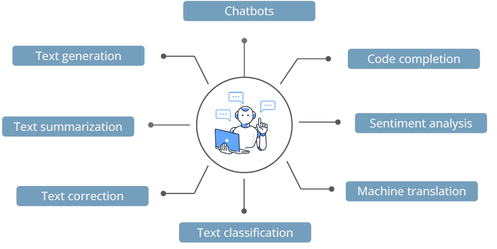

## Evolution

> A language model is a probabilistic machine learning entity.

- It resembles a complex function, designed to predict the probability of word sequences within a specific language corpus.

- It is represented as: `𝑃(Y|X)`, read as Probability of `Y` given `X`

**Equation**

Language models operate by assigning probabilities to sequences of words

Mathematically,

For given sequence of words,
<v>W</v> = <v>w1</v>, <v>w2</v>, <v>w3</v>, ... ,<v>wn</v>

Probability of next word

<g>P</g>( <v>w1</v>, <v>w2</v>, <v>w3</v>, ... ,<v>wn</v> ) = <g>P</g>( <v>wi</v>) _ <g>P</g>( <v>w2</v> | <v>w1</v> ) _ <g>P</g>( <v>w3</v> | <v>w2</v>, <v>w1</v> ) \* <g>P</g>( <v>wi</v> | <v>w1</v>,... , <v>wi-1</v> ) where i = 1 to n

**Example**

Consider the sentence: `This is a new technology`.

The language model calculates the probability of the sentence as:
<g>𝑃</g>( "<v>This is a new technology</v>" )

Mathematically,
<g>𝑃</g>( "<v>This is a new technology</v>" ) = <g>𝑃</g>( "<v>This</v>" ) _ <g>𝑃</g>( "<v>is</v>" | "<v>This</v>" ) _ <g>𝑃</g>( "<v>a</v>"|"<v>This is</v>" ) _ <g>𝑃</g>( "<v>new</v>"|"<v>This is a</v>" ) _ <g>𝑃</g>( "<v>technology</v>"|"<v>This is a new</v>" )

**Calculation**

To illustrate, let's calculate the probability of two different sentences:

1. <g>𝑃</g>( "<v>This is a fluffy dog</v>" )
2. <g>𝑃</g>( "<v>This are a purple flying deer</v>" )

**Solution**: Sentence 1 gets a high probability, leveraging common context, and in sentence 2, rare and challenging words result in a lower probability.

**Power**

**Evolution**

1. Rule-based & Statistical Models (1950s-2010)
   - N-Gram Models
   - Hidden Markov Models `HMM`s
2. Neural Language Models (2010-2017)
   - Word Embeddings
   - Recurrent Neural Networks `RNN`s
3. Transformer- based Models (2017-present) - `BERT` (2018) – Bidirectional model for text understanding - `GPT-2`-1.5b (2019) – Autoregressive model for text generation - `T5`, `GPT-3`-175b (2020) – Encoder-Decoder for multi-task NLP - `GPT-3.5` (2022) - Served as Bridge between `GTP-3` and `GTP-4` - `Enables` long-range dependencies by comparing all words in
   a sentence
4. LLMs
   - e.g. LLaMA2
   - The Next-Gen Open-Source Model
   - 7B, 13B, and 65B parameter models for flexibility
   - Trained on 2 trillion tokens, outperforming GPT-3
   - Efficient Training – Uses optimized attention mechanisms

## Large Language Models

> Large Language Models `LLMs` are state-of-the-art AI models designed to comprehend and generate human language.

