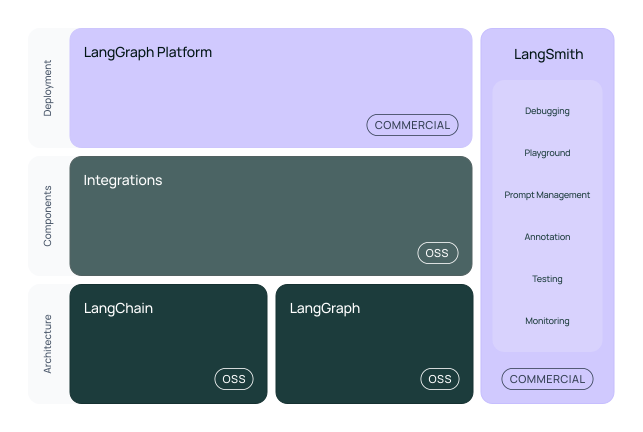
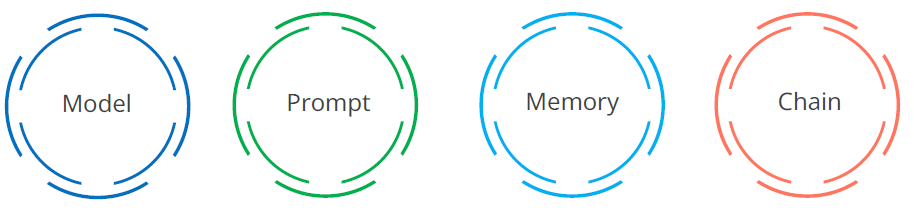

- read more @ [LangChain Cookbook](https://github.com/langchain-ai/langchain-cookbook)

## Background: Why LangChain Was Created

`LangChain` was founded in 2022 by Harrison Chase to address a key limitation in `LLM`s:
While models like GPT-4 are powerful, they lack memory, tool access, and contextual grounding out of the box.

`LangChain` introduced a framework to:

- Orchestrate `LLM`s with external tools and data sources
- Manage multi-step workflows and agent behavior
- Enable memory, chaining, and retrieval for dynamic applications

### Why LangChain Is Needed

LangChain solves critical gaps in LLM-based systems:

- `Memory`: Track user context across sessions
  - Example: A virtual HR assistant remembers past queries and employee preferences.
- `Tool` Use: Connect LLMs to APIs, databases, or calculators
  - Example: A finance bot fetches real-time stock data and performs calculations.
- `Retrieval-Augmented Generation (RAG)`: Ground responses in enterprise documents
  - Example: An audit assistant answers questions using internal policy PDFs.
- `Agents`: Enable decision-making and multi-step reasoning
  - Example: A procurement bot compares vendor quotes, checks compliance, and drafts emails.
- `Observability`: Monitor and debug LLM behavior
  - Example: LangSmith tracks prompt inputs, outputs, and errors for auditability.

read more on [Why Langchain?](https://python.langchain.com/docs/concepts/why_langchain/)

## Intro

> It simplifies linking language models to data, environments, and applications.

- The name LangChain is a merged word of Lang and Chain.
  - **Lang**: It is the short form of the term _language_
  - **Chain**: It emphasizes the connection of various elements to create advanced applications around LLMs.

### Framework

The LangChain framework enables applications that are:

**Reason-based**:

Rely on a language model to reason (about how to answer based on the
provided context, what actions to take, and so on).

**Context-aware**:

Connect a language model to sources of context (prompt instructions,
few-shot examples, content to ground its response in, and so on).

### Evolution

| Phase | Milestone            | Description                                                                                               |
| ----- | -------------------- | --------------------------------------------------------------------------------------------------------- |
| 2022  | Initial Release      | Focussed on chaining prompts and managing memory                                                          |
| 2023  | Tool Integration     | Added support for APIs, Databases and search engines                                                      |
| 2024  | LangGraph, LangSmith | Introduced Agentic workflows and observability tools                                                      |
| 2025  | Modular Ecosystem    | split into langchain-core, langchain, langgraph, langserve and langsmith for production-grade flexibility |

LangChain evolved from a simple chaining library into a modular ecosystem for building robust, scalable GenAI applications.

### Architecture

Summary: Modular, Scalable, Enterprise-Ready
| Layer | package | Role |
|-|-|-|
| Foundation | langchain-core |Abstract interfaces |
| Composition | langchain | chains, agents, RAG |
| Integrations | langchain-openai, langchain-community | Model / tool connectors |
| Workflow | langgraph | Stateful orchestration |
| Deployment | langserve | REST API exposure |
| Observability | langsmith | Debugging, test, evaluation |

### Real-World Use Cases

LangChain powers applications across industries:

- `Healthcare`: Patient triage bots with memory and retrieval
- `Legal`: Contract review agents using RAG and tool use
- `Finance`: Portfolio assistants with real-time data access
- `Education`: Tutoring systems that adapt to student progress
- `Enterprise Ops`: Internal assistants for release readiness, documentation search, and compliance checks

### Components

LangChain’s architecture is modular by design, giving developers the flexibility to build everything from simple LLM wrappers to complex agentic systems. Here's a breakdown of its core components, with examples to show how they fit into real-world enterprise workflows like yours:

1. 🧠 Models & Prompt Templates

- Models: Abstractions for calling LLMs like OpenAI, Anthropic, or Hugging Face.
- Prompt Templates: Reusable, parameterized prompts that support dynamic input.

**E.g.**

In your POI pipeline, you might use a prompt template to generate release notes based on structured metadata from multiple environments.

2. 🔗 Chains
   Chains are sequences of steps that automate workflows involving one or more LLM calls.

- LLMChain: Connects a prompt to a model.
- SequentialChain: Executes multiple chains in order.
- RouterChain: Dynamically selects chains based on input.

**E.g.**

A SequentialChain could summarize audit logs, then generate a compliance report, and finally email it to stakeholders.

3. 🧰 Tools & Agents

- Tools: External functions the model can call (e.g., calculator, search, database query).
- Agents: Decision-making entities that choose which tools to use based on context.

**E.g.**

An agent could analyze Preferred Offer Intelligence data, query a pricing API, and draft a recommendation—all autonomously.

4. 🧠 Memory
   Memory allows the system to retain context across interactions.

- ConversationBufferMemory: Stores recent messages.
- EntityMemory: Tracks specific entities across sessions.

**E.g.**

Your internal assistant could remember which environments were flagged in previous test cycles and surface them during release planning.

5. 📚 Retrievers & Vector Stores

- Retrievers: Pull relevant documents based on a query.
- Vector Stores: Store embeddings for similarity search (e.g., FAISS, Pinecone).

**E.g.**

LangChain can retrieve relevant Confluence pages or Jira tickets based on a user’s query about release blockers.

6. 📦 Document Loaders
   These ingest data from various formats—PDFs, HTML, CSV, APIs—and prepare it for retrieval or processing.

**E.g.**

Load SIT, Stage, and Prod environment specs from your documentation into a vector store for contextual grounding.

7. 🧭 LangGraph (Advanced)
   LangGraph enables stateful, multi-step workflows with branching logic—ideal for agentic systems.

**E.g.**

A LangGraph agent could validate CFO scope, check readiness across apps, and escalate blockers based on decision nodes.

LangChain’s modularity means you can start simple—just a model and a prompt—and evolve into full-fledged agents with memory, retrieval, and observability.
Would you like help mapping these components to a specific workflow in your Mavericks 0702 scope or POI release cycle? I can sketch out a tailored architecture.

### Model

https://python.langchain.com/api_reference/openai/llms/langchain_openai.llms.base.OpenAI.html

### Prompt

### Memory

### Chain

## Working With LangChain

### System Requirements

### Installation

### Building Applications

### Customizing Language Model
