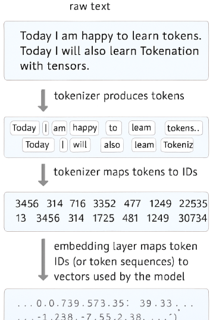

<style>
o { color: #f49735 }
v { color: #b36be2 }
g { color: #70bf41 }
bl { color: #62aefa }
pi { color: pink}
a:has( picture:has(img[alt="Connection between tokenization and embeddings"] { width: "50%"!important;height: "50%"!important }) )
</style>

## Tokenization

Breaking text into small units (tokens) like words, subwords, or bytes so models can process them.

❓ **Why it matters**

- Converts variable-length text into discrete sequence of token IDs for models.
- Determines model context usage and cost because models operate on token counts.
- Affects model behavior, generation boundaries, and how punctuation/whitespace are interpreted.

❓ **Use Case**

- Counting tokens for prompt limits
- Chunking long documents for embeddings or summarization
- Debugging prompt formatting
- Preparing inputs for translation
- Classification
- Generation

### Example

What the code does

- **Imports the tokenizer**: import tiktoken loads OpenAI’s fast BPE tokenizer library.
- **Selects an encoding**: enc = `tiktoken.get_encoding("cl100k_base")` obtains the tokenizer instance for the cl100k_base encoding.
- **Tokenizes a string**: `enc.encode(...)` converts the supplied multi‑sentence string into a list of integer tokens.
- **Prints token mapping**: The loop prints each token id and the decoded text for that single token using `enc.decode([token])`, showing how token ids map back to text fragments.

```py:title=UnderStanding_Tokenization
import tiktoken

enc = tiktoken.get_encoding("cl100k_base")

tokens = enc.encode("Today I am happy to learn tokens. Today I will also learn Tokenization with tensors")

for token in tokens:
    print(f"{token} -> {enc.decode([token])}")

```

<op>

<o>15724 -> Today</o>

<g>358 -> I</g>

1097 -> am

6380 -> happy

311 -> to

<g>4048 -> learn</g>

11460 -> tokens

13 -> .

<o>11450 -> Today</o>

<g>358 -> I</g>

690 -> will

1101 -> also

<g>4048 -> learn</g>

9857 -> Token

2065 -> ization

449 -> with

78187 -> tensors

</op>

📌 "I" is used twice in input but is represented by same tokenID 358.

📌 "Today" is used twice in input but is represented by different tokenID 15724 and 11450(This is due space)

**What an encoding is and why cl100k_base matters**

- **Encoding concept**: An encoding defines how raw text is split into tokens and how those tokens map to integer IDs. Tokenization is not character-by-character; it uses subword pieces from a learned vocabulary.
- **cl100k_base**: This is the encoding used by many of the modern OpenAI models (for example gpt-4 and gpt-3.5-turbo family). It uses a byte-level BPE-like scheme designed to handle Unicode robustly and provide efficient tokenization for English and other languages.
- Different models use different encodings; token counts vary with encoding choice. So, _Choose the encoding matching the model you plan to call_

**Why tokens look like fragments rather than whole words**

- **Subword tokens**: Tokens often represent partial words, punctuation, or multi-word common substrings. This is why you see pieces like "The", " long", "‑standing", " demand" rather than just whole words.
- **Efficiency**: Frequent sequences are single tokens to reduce token count and model context usage. Rare words are split into multiple tokens.

### Use Cases

- **Token counting**: Determine how many tokens a prompt or document consumes before sending to a model to avoid exceeding model limits and to estimate cost.
- **Inspecting tokenization**: Debug prompt formatting issues by seeing exactly how the model will view text.
- **Truncation and chunking**: When preparing long texts (embeddings, summarization, retrieval), split by token count reliably.
- **Prompt design**: Understand where the tokenizer splits to craft prompts with predictable token lengths.
- **Tool inputs and outputs**: Validate that generated content fits the expected token budget for downstream calls.

## Embeddings



### Example

📌 **Problem Statement**

- Build and test a search system that uses Ollama embeddings to match user questions to short technical support paragraphs.
- Measure how accurately and quickly it finds relevant paragraphs, check how reliable it is with small or noisy text, and identify common failure modes like mismatches in embedding size or semantic drift.

**Steps**

- Build dataset of support paragraphs and labeled queries.
- Generate document and query embeddings with Ollama.
- Rank documents by cosine similarity (with/without L2 normalization).
- Measure precision@k, MRR, latency, memory.
- Analyze failures; apply preprocessing/chunking and re-evaluate.

```py:title=Demo_Search_System
# Import the Ollama embeddings integration for LangChain
from langchain_ollama import OllamaEmbeddings

# LangChain Document convenience wrapper for text + metadata
from langchain_classic.docstore.document import Document

# NumPy for vector math (cosine similarity)
import numpy as np

# Create an embeddings client using a local or hosted Ollama model
# model="mxbai-embed-large" is the chosen embedding model name
embeddings = OllamaEmbeddings(model="mxbai-embed-large")

# Small knowledge base: support paragraphs (strings)
support_paragraphs = [
    "The HP LaserJet Pro M404dn often encounters paper jam issues in Tray 2...",
    "Wi-Fi connection problems with HP printers are often resolved by restarting...",
    "If your HP laptop shuts down randomly, check battery health...",
    "The HP Smart app may fail to detect the printer if the firewall...",
    "Frequent disconnections in wireless printers are resolved by assigning...",
    "When encountering faded prints, run a printhead cleaning cycle...",
    "To troubleshoot slow printing, verify if the driver is set to PCL...",
    "Blue screen errors in HP laptops are commonly related to outdated...",
    "If your printer is unresponsive, check USB cable, try another port...",
    "Scanning errors may be due to incompatible Twain drivers..."
]

## Since the para in our example are small we are not splitting them.

# Wrap each paragraph in a LangChain Document (keeps text and optional metadata together)
docs = [Document(page_content=p) for p in support_paragraphs]

# Cosine similarity function between two vectors a and b
def cosine_similarity(a, b):
    # Return dot(a,b) / (||a|| * ||b||)
    return np.dot(a, b) / (np.linalg.norm(a) * np.linalg.norm(b))

# Extract raw text content from Document objects
content = [doc.page_content for doc in docs]

# Produce embeddings for all documents (batch call)
# doc_embeddings is a list of fixed-length numeric vectors (one per paragraph)
doc_embeddings = embeddings.embed_documents(content)

#(10, 1024) means 10 embeddings of 1024 dimension
print(np.array(doc_embeddings).shape)

# Embed a single user query for semantic search
random_query_embedding = embeddings.embed_query("what to do when printer is slow")

# Print the query and then each paragraph with its similarity score to the query
print("What to do when printer is slow \n")
for index, embedding in enumerate(doc_embeddings):
    score = cosine_similarity(np.array(random_query_embedding), np.array(embedding))
    print(f"{content[index]} \n-> Score : {score}")
```

- **Embeddings client**: OllamaEmbeddings connects LangChain to an Ollama embedding model; it turns text into numeric vectors that capture semantics.
- **Documents**: LangChain Document objects bundle text and metadata; here we only use the page_content field.
- **embed_documents vs embed_query**: embed_documents produces vectors for many texts; embed_query produces one vector for a query.
- **Cosine similarity**: measures semantic closeness of vectors; higher score means more similar.
- **Workflow**: embed the KB, embed the query, compute similarity for ranking relevant paragraphs.

**Practical tips and best practices**

- Persist doc_embeddings (e.g., in a vector store) so you don't re-embed on every query.
- Use a vector index (FAISS, Milvus, etc.) for large KBs to avoid linear scans.
- Normalize or clean text before embedding to reduce noise.
- Monitor embedding dimensionality and dtype to ensure numeric compatibility with cosine computations.
- Guard against zero vectors before dividing in cosine_similarity to avoid NaNs.

<op>
(10, 1024)

Given: <bl>What to do when printer is slow</bl>

<o>The HP LaserJet Pro M404dn often encounters paper jam issues in Tray 2...</o>
-> <bl>Score : 0.7004528016698077</bl>

Wi-Fi connection problems with HP printers are often resolved by restarting...
-> <bl>Score : 0.6878569254123414</bl>

If your HP laptop shuts down randomly, check battery health...
-> <bl>Score : 0.504745372779547</bl>

The HP Smart app may fail to detect the printer if the firewall...
-> <bl>Score : 0.6413030816989475</bl>

Frequent disconnections in wireless printers are resolved by assigning...
-> <bl>Score : 0.6476563650987529</bl>

<o>When encountering faded prints, run a printhead cleaning cycle...</o>
-> <bl>Score : 0.7220583739609726</bl>

<g>To troubleshoot slow printing, verify if the driver is set to PCL...</g>
-> <bl>Score : 0.8077687978045475</bl>

Blue screen errors in HP laptops are commonly related to outdated...
-> <bl>Score : 0.546161768176944</bl>

<o>If your printer is unresponsive, check USB cable, try another port...</o>
-> <bl>Score : 0.7362574844211208</bl>

Scanning errors may be due to incompatible Twain drivers...
-> <bl>Score : 0.6005954444472213</bl>

</op>

**Interpreting your example results**

- What you printed: each document is shown with its cosine score vs the query "what to do when printer is slow".
- **Highest match**: "To troubleshoot slow printing, verify if the driver is set to PCL..." scored ~0.808 — this is the best match and likely directly answers the query.
- **Close matches**: scores ~0.72–0.74 (e.g., faded prints, unresponsive printer) are also relevant but less direct.
- **Lower scores**: ~0.50–0.60 indicate weaker topical overlap (laptop BSOD, scanning drivers) and are less likely to solve the specific query.
- **Use case**: pick the top result(s) for a concise answer, or aggregate several high-scoring docs to build a more complete response.

### Dimension

```py:title=Demo_Embedding_Dimension
from langchain_ollama import OllamaEmbeddings

embeddings = OllamaEmbeddings(model="mxbai-embed-large")

vector = embeddings.embed_query("I am happy")

print("Embedding dimension:", len(vector))
print("Sample values:", vector[:8])
```

<op>

Embedding dimension: 1024

Sample values: [-0.012549687, 0.005115742, -0.032611296, 0.001609288, -0.051561583, -0.009396014, 0.0238854, 0.03505384]

</op>

❓ **What is `embedding dimension` of an embedding model**

- The **embedding dimension** is the fixed size of the vector the model produces for every input (for example, 512, 768, 1024, 1536, etc.).
- It defines the vector space in which similarity comparisons (cosine, dot product) and indexing in vector stores are performed.
- All vectors produced by the same model will have the same length.
- E.g. embedding dimension of `mxbai-embed-large` model is **1024**.

❓ **Why it matters**

- **Vector store schema**: when creating or loading a vector index (`FAISS`, `Milvus`, `Pinecone`, etc.), you must use the same embedding dimension used to generate vectors.
- **Storage & performance**: larger dimensions increase memory and storage per vector and can affect retrieval latency and indexing cost

📌 Generating embeddings on the fly will cost you credit for each run.We can generate once and persist our embeddings with **Vector Store** to do the same with better efficiency, let dive into it next.
