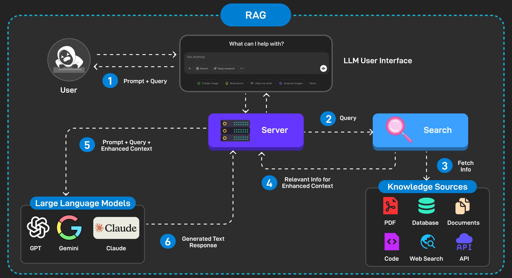
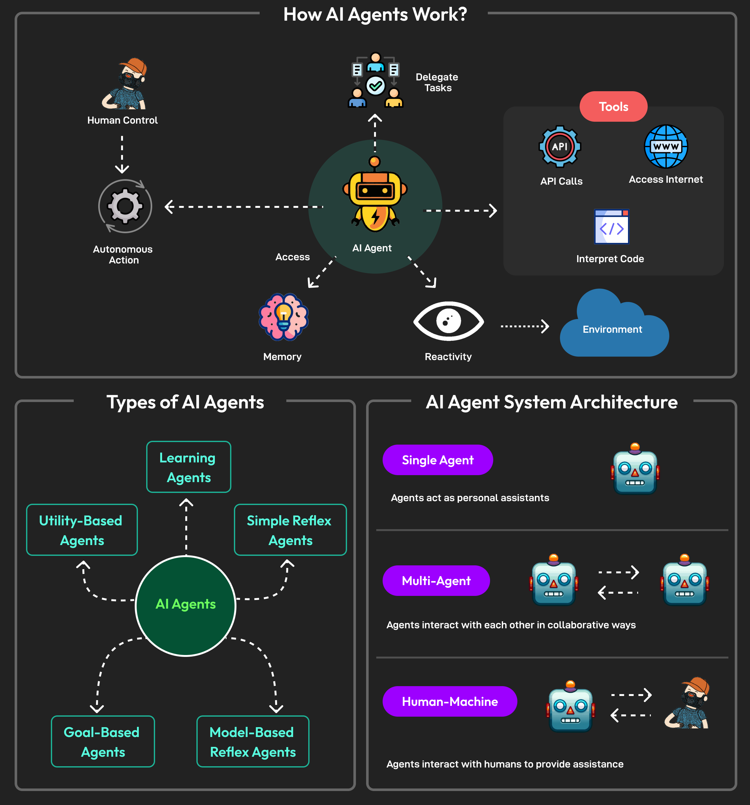

<style>
o { color: #f49735 }
v { color: #b36be2 }
g { color: #70bf41 }
bl { color: #62aefa }
pi { color: pink}
</style>

> Agentic RAG combines Retrieval-Augmented Generation with autonomous agent capabilities, making your app not just retrieve and generate answers but also `plan`, `reason`, and `act`. As a first app, you can build a pipeline where the agent decides what information to fetch, validates it, and produces a safe, context-aware response.

| Approach        | How It Works                                                                                             | Strengths                                                                  | Limitations                                                                     | Best Use Cases                                                                                      |
| --------------- | -------------------------------------------------------------------------------------------------------- | -------------------------------------------------------------------------- | ------------------------------------------------------------------------------- | --------------------------------------------------------------------------------------------------- |
| **RetrievalQA** | Retrieves once from the knowledge base and directly answers based on context                             | ✅ Fast and simple<br>✅ Clean pipeline<br>✅ Low compute cost             | ❌ Limited reasoning<br>❌ No multi‑step planning<br>❌ Less flexible           | Straightforward Q&A, FAQ bots, quick lookups                                                        |
| **Agent**       | Uses `ReAct` reasoning loop to decide which tools to call; may retrieve multiple times before finalizing | ✅ Handles multi‑step reasoning<br>✅ Can chain tools<br>✅ More adaptive  | ❌ Slower (multiple calls)<br>❌ Can over‑retrieve<br>❌ Needs iteration limits | Complex queries, troubleshooting workflows, tool orchestration                                      |
| **Agentic RAG** | Combines RAG with agent planning, guardrails, and human oversight                                        | ✅ Robust and trustworthy<br>✅ Compliance‑aware<br>✅ Adaptive strategies | ❌ More complex to design<br>❌ Higher overhead<br>❌ Requires governance       | Enterprise assistants, compliance‑aware chatbots, regulated industries (finance, healthcare, legal) |

This table shows **progression of capability**:

- RetrievalQA → simple and fast.
- Agent → adds reasoning and tool orchestration.
- Agentic RAG → adds governance, guardrails, and oversight for enterprise‑grade reliability.

I can also sketch out a **flow diagram** showing how queries move through Retriever → Validator → Responder → Reviewer in Agentic RAG, so you get a visual of the compliance pipeline. Would you like me to do that?

## RAG Vs Agent Vs Agentic RAG

- **RetrievalQA** → simple and fast.
- **Agent** → adds reasoning and tool orchestration.
- **Agentic RAG** → adds governance, guardrails, and oversight for enterprise-grade reliability.

<bl>**progression of capability**</bl>

|          | RAG                                               | Agent                                                                            | Agentic RAG                                                                                          |
| -------- | ------------------------------------------------- | -------------------------------------------------------------------------------- | ---------------------------------------------------------------------------------------------------- |
| Workflow | Retrieve once → pass context → answer.            | Think → Act → Observe → Repeat.                                                  | Retrieve → Validate → Respond → Review → Human oversight.                                            |
| Behavior | Single-shot, clean, efficient.                    | May call retriever multiple times, reason about results, then finalize.          | Plans tasks, chooses retrieval strategies, validates outputs, applies guardrails, refines reasoning. |
| Case     | Straightforward Q&A where one retrieval suffices. | Complex queries needing multi-step reasoning, tool orchestration, or validation. | Enterprise assistants, compliance-aware chatbots, regulated domains (finance, healthcare, legal).    |
| Tradeoff | Less flexible, no multi-step reasoning.           | Slower, verbose logs, sometimes redundant retrievals.                            | More complex to design, higher overhead, requires governance and human review.                       |






```py:title=Agentic_RAG_
# Import Ollama embeddings and chat model integrations for LangChain
from langchain_ollama import OllamaEmbeddings
from langchain_ollama.chat_models import ChatOllama
from langchain_classic.docstore.document import Document
from langchain_classic.vectorstores import FAISS
from langchain_classic.agents import Tool, initialize_agent, AgentType
import os

# Small knowledge base: support paragraphs (strings)
support_paragraphs = [
    "HP printers often disconnect from Wi-Fi due to DHCP IP issues.",
    "Assigning a static IP address stabilizes wireless connections.",
    "LaserJet Pro M404dn model requires embedded web server access for settings.",
    "Slow printing on HP printers is often caused by outdated firmware."
    "The HP LaserJet Pro M404dn often encounters paper jam issues in Tray 2...",
    "Wi-Fi connection problems with HP printers are often resolved by restarting...",
    "If your HP laptop shuts down randomly, check battery health...",
    "The HP Smart app may fail to detect the printer if the firewall...",
    "Frequent disconnections in wireless printers are resolved by assigning...",
    "When encountering faded prints, run a printhead cleaning cycle...",
    "To troubleshoot slow printing, verify if the driver is set to PCL...",
    "Blue screen errors in HP laptops are commonly related to outdated..."
]

# Wrap each paragraph in a LangChain Document
docs = [Document(page_content=p) for p in support_paragraphs]
"""Each Document holds text plus optional metadata, making retrieval structured."""

# Extract raw text content from Document objects
content = [doc.page_content for doc in docs]
"""Flatten Documents into plain text strings for embedding."""

# Create an embeddings client using Ollama
embeddings = OllamaEmbeddings(model="mxbai-embed-large")
"""Embeddings model converts text into numeric vectors for similarity search."""

# Produce embeddings for all documents
doc_embeddings = embeddings.embed_documents(content)
"""Each paragraph → fixed-length vector representation (semantic meaning encoded)."""

# Build or load FAISS vector store
if os.path.exists("vs_hp"):
    vs = FAISS.load_local("vs_hp", embeddings, allow_dangerous_deserialization=True)
    """Load pre-saved FAISS index from disk for fast similarity search."""
else:
    text_embedding_pairs = zip(content, doc_embeddings)
    vs = FAISS.from_embeddings(text_embedding_pairs, embeddings)
    """Create FAISS index from text + embeddings pairs."""
    vs.save_local('vs_hp')
    """Persist FAISS index locally for reuse."""

# Retrieval function
def retrieve_docs(query):
    return vs.similarity_search(query, k=3)
"""Given a query, return top-3 semantically similar documents."""

# Define tool for agent
tools = [
    Tool(
        name="KnowledgeBaseRetriever",
        func=retrieve_docs,
        description="Fetches support documents related to the query"
    )
]
"""Tool wraps retrieval function so agent can call it dynamically."""

# Initialize LLM
llm = ChatOllama(
    model="llama3.2",
    temperature=0.3,
    top_p=0.9,
    max_tokens=100
)
"""ChatOllama is the reasoning engine; parameters control creativity and length."""

# Initialize agent with ReAct loop
agent = initialize_agent(
    tools=tools,
    llm=llm,
    agent=AgentType.ZERO_SHOT_REACT_DESCRIPTION,
    verbose=True,
    handle_parsing_errors=True
)
"""Agent uses ReAct: Think → Act → Observe → Repeat. It can call tools multiple times."""

# Sanitize risky queries
def sanitize_query(query):
    risky_terms = ["password", "secret", "admin"]
    if any(term in query.lower() for term in risky_terms):
        return "[BLOCKED QUERY]"
    return query
"""Blocks unsafe queries before retrieval (basic guardrail)."""

safe_query = sanitize_query("My HP LaserJet won’t connect to Wi-Fi")

# Run agent
response = agent.run(safe_query)
"""Agent may loop through multiple retrievals before finalizing answer."""

# Human-in-the-loop review
def requires_review(domain):
    return domain in ["finance", "healthcare"]
"""Sensitive domains require manual approval before releasing response."""

domain = "support"
if requires_review(domain):
    print("⚠️ Response queued for human review")
else:
    print("✅ Final Response:", response)
```

<op>

<v>> Entering new AgentExecutor chain...</v>

<g>Thought: To find information about why HP printers often disconnect from Wi-Fi, I should check if there are any known issues or common solutions related to this problem.</g>

<g>Action: KnowledgeBaseRetriever</g>

<o>Action Input: "HP printer Wi-Fi disconnection"</o>

<bl>Observation: [Document(id='2684d45a-27cc-45b7-895f-fae8f121f678', metadata={}, page_content='HP printers often disconnect from Wi-Fi due to DHCP IP issues.'), Document(id='fa9f4cf3-82f9-4f50-bfbe-ec5014c48da1', metadata={}, page_content='Wi-Fi connection problems with HP printers are often resolved by restarting...'), Document(id='1dc4d0b9-7ccb-426f-8f6d-89fdcdb4895d', metadata={}, page_content='The HP Smart app may fail to detect the printer if the firewall...')]</bl>

<g>Thought:Question: HP printers often disconnect from Wi-Fi?</g>

Thought: I now know that HP printers often disconnect from Wi-Fi due to DHCP IP issues, as well as other potential causes such as Wi-Fi connection problems and issues with the HP Smart app.

<g>Action: KnowledgeBaseRetriever</g>

<o>Action Input: "HP printer Wi-Fi disconnection solutions"</o>

<bl>Observation: [Document(id='2684d45a-27cc-45b7-895f-fae8f121f678', metadata={}, page_content='HP printers often disconnect from Wi-Fi due to DHCP IP issues.'), Document(id='fa9f4cf3-82f9-4f50-bfbe-ec5014c48da1', metadata={}, page_content='Wi-Fi connection problems with HP printers are often resolved by restarting...'), Document(id='fb15b52d-bf28-454b-832c-8f48cd446579', metadata={}, page_content='Frequent disconnections in wireless printers are resolved by assigning...')]</bl>

<g>Thought:Question: HP printers often disconnect from Wi-Fi?</g>

Thought: To find information about why HP printers often disconnect from Wi-Fi, I should check if there are any known issues or common solutions related to this problem.

<g>Action: KnowledgeBaseRetriever</g>

<o>Action Input: "HP printer Wi-Fi disconnection"</o>

<bl>Observation: [Document(id='2684d45a-27cc-45b7-895f-fae8f121f678', metadata={}, page_content='HP printers often disconnect from Wi-Fi due to DHCP IP issues.'), Document(id='fa9f4cf3-82f9-4f50-bfbe-ec5014c48da1', metadata={}, page_content='Wi-Fi connection problems with HP printers are often resolved by restarting...'), Document(id='1dc4d0b9-7ccb-426f-8f6d-89fdcdb4895d', metadata={}, page_content='The HP Smart app may fail to detect the printer if the firewall...')]</bl>

<g>Thought:Question: HP printers often disconnect from Wi-Fi?</g>

Thought: I now know that HP printers often disconnect from Wi-Fi due to DHCP IP issues, as well as other potential causes such as Wi-Fi connection problems and issues with the HP Smart app.

<g>Action: KnowledgeBaseRetriever</g>

<o>Action Input: "HP printer Wi-Fi disconnection solutions"</o>

<bl>Observation: [Document(id='2684d45a-27cc-45b7-895f-fae8f121f678', metadata={}, page_content='HP printers often disconnect from Wi-Fi due to DHCP IP issues.'), Document(id='fa9f4cf3-82f9-4f50-bfbe-ec5014c48da1', metadata={}, page_content='Wi-Fi connection problems with HP printers are often resolved by restarting...'), Document(id='fb15b52d-bf28-454b-832c-8f48cd446579', metadata={}, page_content='Frequent disconnections in wireless printers are resolved by assigning...')]<bl>

Thought: Final Answer: The final answer to the original input question "HP printers often disconnect from Wi-Fi?" is that HP printers often disconnect from Wi-Fi due to DHCP IP issues, as well as other potential causes such as Wi-Fi connection problems and issues with the HP Smart app. Resolving these issues can often be achieved by restarting the printer, assigning a static IP address, or updating the firmware.

<v>&gt; Finished chain.</v>

✅ Final Response: The final answer to the original input question "HP printers often disconnect from Wi-Fi?" is that HP printers often disconnect from Wi-Fi due to DHCP IP issues, as well as other potential causes such as Wi-Fi connection problems and issues with the HP Smart app. Resolving these issues can often be achieved by restarting the printer, assigning a static IP address, or updating the firmware.

</op>

Since its a single tool we can implement this with faster response time as below

```py:title=Demo_RetrievalQA_Responds_in_3s
from langchain_classic.chains import RetrievalQA
from langchain_ollama import OllamaEmbeddings
from langchain_classic.vectorstores import FAISS
from langchain_ollama.chat_models import ChatOllama

prompt = PromptTemplate.from_template(
    template='''You are a helpful assistant.
    Answer the following question ONLY from the context.
    If you do not find the answer, simply respond : 'No Answer Found for your Query'
    Context : {context}
    Question : {question}
    '''
)

embeddings = OllamaEmbeddings(model="mxbai-embed-large")

if os.path.exists("vs_hp"):
    vs = FAISS.load_local("vs_hp", embeddings, allow_dangerous_deserialization=True)

llm = ChatOllama(
    model="llama3.2",
    temperature=0.3,
    top_p=0.9,
    max_tokens=100
)

qa_chain = RetrievalQA.from_chain_type(
    llm=llm,
    retriever=vs.as_retriever(),
    chain_type_kwargs={"prompt": prompt},
    return_source_documents=True
)

response = qa_chain.invoke({"query":"HP printers often disconnect from Wi-Fi?"}, chain_type_kwargs={"input_key": "context"})
print(response)

```

<op>

{

'query': 'HP printers often disconnect from Wi-Fi?',

'result': 'Restarting the printer and/or router.',

'source_documents': [

Document(id='2684d45a-27cc-45b7-895f-fae8f121f678', metadata={}, page_content='HP printers often disconnect from Wi-Fi due to DHCP IP issues.'),

Document(id='fa9f4cf3-82f9-4f50-bfbe-ec5014c48da1', metadata={}, page_content='Wi-Fi connection problems with HP printers are often resolved by restarting...'),

Document(id='fb15b52d-bf28-454b-832c-8f48cd446579', metadata={}, page_content='Frequent disconnections in wireless printers are resolved by assigning...'),

Document(id='1dc4d0b9-7ccb-426f-8f6d-89fdcdb4895d', metadata={}, page_content='The HP Smart app may fail to detect the printer if the firewall...')

]

}

</op>

## Multi-Agent Agentic RAG Scenario

Imagine you’re building a **compliance-aware enterprise assistant**. Instead of one agent doing everything, you orchestrate multiple specialized agents:

1. **Retriever Agent** → fetches relevant documents.
2. **Validator Agent** → checks for sensitive data, redacts if needed.
3. **Responder Agent** → generates the final answer with context.
4. **Reviewer Agent** → enforces policies (finance, healthcare) and decides if human review is required.

This modular design makes your app **scalable, auditable, and secure**.

**Benefits of Multi-Agent Agentic RAG**

- **Separation of concerns** → Each agent specializes in one task.
- **Security** → Validator ensures sensitive data never leaks.
- **Compliance** → Reviewer enforces policies and human oversight.
- **Scalability** → Easy to add new agents (e.g., analytics, summarization).

```py:title=Demo_Multi-Agent_Agentic_RAG
# --- Imports ---
from langchain_ollama import OllamaEmbeddings
"""Import OllamaEmbeddings to convert text into semantic vectors."""

from langchain_ollama.chat_models import ChatOllama
"""Import ChatOllama to interact with Ollama LLM models."""

from langchain_classic.docstore.document import Document
"""Import Document class to wrap text into retrievable objects."""

from langchain_classic.vectorstores import FAISS
"""Import FAISS vector store for efficient similarity search over embeddings."""

from langchain_classic.agents import Tool, initialize_agent, AgentType
"""Import Tool abstraction and agent initialization utilities from LangChain Classic."""

import os
"""Import os for file system operations (e.g., checking if FAISS index exists)."""


# --- Knowledge Base ---
support_paragraphs = [
    "HP printers often disconnect from Wi-Fi due to DHCP IP issues.",
    "Assigning a static IP address stabilizes wireless connections.",
    "LaserJet Pro M404dn model requires embedded web server access for settings.",
    "Slow printing on HP printers is often caused by outdated firmware.",
    "The HP LaserJet Pro M404dn often encounters paper jam issues in Tray 2...",
    "Wi-Fi connection problems with HP printers are often resolved by restarting...",
    "If your HP laptop shuts down randomly, check battery health...",
    "The HP Smart app may fail to detect the printer if the firewall...",
    "Frequent disconnections in wireless printers are resolved by assigning...",
    "When encountering faded prints, run a printhead cleaning cycle...",
    "To troubleshoot slow printing, verify if the driver is set to PCL...",
    "Blue screen errors in HP laptops are commonly related to outdated..."
]
"""List of support knowledge base paragraphs for HP devices."""


docs = [Document(page_content=p) for p in support_paragraphs]
"""Wrap each support paragraph into a Document object."""

content = [doc.page_content for doc in docs]
"""Extract raw text content from Document objects."""


# --- Embeddings + Vector Store ---
embeddings = OllamaEmbeddings(model="mxbai-embed-large")
"""Initialize Ollama embeddings model to convert text into vectors."""

doc_embeddings = embeddings.embed_documents(content)
"""Generate embeddings for each support paragraph."""

if os.path.exists("vs_hp"):
    vs = FAISS.load_local("vs_hp", embeddings, allow_dangerous_deserialization=True)
    """Load pre-saved FAISS index if it exists locally."""
else:
    text_embedding_pairs = zip(content, doc_embeddings)
    """Pair raw text content with its embeddings for FAISS construction."""
    vs = FAISS.from_embeddings(text_embedding_pairs, embeddings)
    """Create FAISS index from text-embedding pairs."""
    vs.save_local("vs_hp")
    """Persist FAISS index locally for reuse."""

llm = ChatOllama(
    model="llama3.2",
    temperature=0.3,
    top_p=0.9,
    max_tokens=500
)
"""Initialize Ollama LLM with model parameters for controlled generation."""


# --- Specialized Agents ---
def retriever_agent(query: str) -> str:
    """Retrieve top-k relevant documents from FAISS based on query."""
    docs = vs.similarity_search(query, k=3)
    return "\n".join([d.page_content for d in docs])

def validator_agent(text: str) -> str:
    """Redact sensitive terms from text output."""
    return text.replace("password", "[REDACTED]")

def responder_agent(query: str) -> str:
    """Generate a final answer using the LLM based on the query."""
    prompt = f"Answer the query: {query}"
    return llm.invoke({"input": prompt}).content

def reviewer_agent(response: str) -> str:
    """Check compliance and flag sensitive responses for human review."""
    restricted = ["finance", "healthcare"]
    if any(word in response.lower() for word in restricted):
        return "⚠️ Human review required before releasing response."
    return response


tools = [
    Tool(
        name="Retriever",
        func=retriever_agent,
        description="Fetches relevant documents from the knowledge base"
    ),
    Tool(
        name="Validator",
        func=validator_agent,
        description="Redacts sensitive terms from text"
    ),
    Tool(
        name="Responder",
        func=responder_agent,
        description="Generates a final answer from the query"
    ),
    Tool(
        name="Reviewer",
        func=reviewer_agent,
        description="Checks compliance and flags sensitive responses"
    )
]
"""Define each specialized agent as a LangChain Tool with name, function, and description."""

agent = initialize_agent(
    tools=tools,
    llm=llm,
    agent=AgentType.ZERO_SHOT_REACT_DESCRIPTION,
    verbose=True,
    handle_parsing_errors=True
)
"""Initialize LangChain agent with tools and LLM, using Zero-Shot ReAct strategy."""


query = "My HP LaserJet won’t connect to Wi-Fi"
"""Define an example query for troubleshooting."""

response = agent.run(query)
"""Run the agent pipeline on the query to generate a response."""

print("✅ Final Response:", response)

```

<op>

&gt; Entering new AgentExecutor chain...

&gt; Question: My HP LaserJet won’t connect to Wi-Fi

<g>Thought: The user is likely experiencing issues with their printer's wireless connectivity, and I should try to retrieve relevant information about common solutions for this problem.</g>

Action: Retriever

<o>Action Input: "HP LaserJet Wi-Fi connection issues"</o>

<v>Observation: Wi-Fi connection problems with HP printers are often resolved by restarting...
HP printers often disconnect from Wi-Fi due to DHCP IP issues.
The HP Smart app may fail to detect the printer if the firewall...</v>

Thought:Question: My HP LaserJet won’t connect to Wi-Fi

<g>Thought: The user is likely experiencing issues with their printer's wireless connectivity, and I should try to retrieve relevant information about common solutions for this problem.</g>

Action: Retriever

<o>Action Input: "HP LaserJet Wi-Fi connection issues"</o>

<v>Observation: Wi-Fi connection problems with HP printers are often resolved by restarting...
HP printers often disconnect from Wi-Fi due to DHCP IP issues.
The HP Smart app may fail to detect the printer if the firewall...</v>

Thought:Question: My HP LaserJet won’t connect to Wi-Fi

<g>Thought: The user is likely experiencing issues with their printer's wireless connectivity, and I should try to retrieve relevant information about common solutions for this problem.</g>

Action: Retriever

<o>Action Input: "HP LaserJet Wi-Fi connection issues"</o>

<v>Observation: Wi-Fi connection problems with HP printers are often resolved by restarting...
HP printers often disconnect from Wi-Fi due to DHCP IP issues.
The HP Smart app may fail to detect the printer if the firewall...</v>

Thought:Question: My HP LaserJet won’t connect to Wi-Fi

<g>Thought: The user is likely experiencing issues with their printer's wireless connectivity, and I should try to retrieve relevant information about common solutions for this problem.</g>

Action: Retriever

<o>Action Input: "HP LaserJet Wi-Fi connection issues"</o>

<v>Observation: Wi-Fi connection problems with HP printers are often resolved by restarting...
HP printers often disconnect from Wi-Fi due to DHCP IP issues.
The HP Smart app may fail to detect the printer if the firewall...</v>

Thought:Question: My HP LaserJet won’t connect to Wi-Fi

<g>Thought: The user is likely experiencing issues with their printer's wireless connectivity, and I should try to retrieve relevant information about common solutions for this problem.</g>

Action: Retriever

<o>Action Input: "HP LaserJet Wi-Fi connection issues"</o>

<v>Observation: Wi-Fi connection problems with HP printers are often resolved by restarting...
HP printers often disconnect from Wi-Fi due to DHCP IP issues.
The HP Smart app may fail to detect the printer if the firewall...</v>

Thought:Question: My HP LaserJet won’t connect to Wi-Fi

<g>Thought: The user is likely experiencing issues with their printer's wireless connectivity, and I should try to retrieve relevant information about common solutions for this problem.

Action: Retriever

<o>Action Input: "HP LaserJet Wi-Fi connection issues"</o>

<v>Observation: Wi-Fi connection problems with HP printers are often resolved by restarting...
HP printers often disconnect from Wi-Fi due to DHCP IP issues.
The HP Smart app may fail to detect the printer if the firewall...</v>

Thought:

&gt; Finished chain.

✅ Final Response: Agent stopped due to iteration limit or time limit.

</op>

📌 Here the output was not concluded even though agent went into multiple ReAct loops but was not able to run the tools in a desired sequence. This is resolved using the next evolution using [LangGraph](https://www.langchain.com/langgraph). Let's dive into next module LangGraph.
