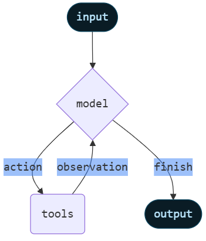

## Agents

- Agents combine language [models](https://docs.langchain.com/oss/python/langchain/models) with [tools](https://docs.langchain.com/oss/python/langchain/tools) to create systems that can reason about tasks, decide which tools to use, and iteratively work towards solutions.

- [create_agent](https://reference.langchain.com/python/langchain/agents/) provides a production-ready agent implementation.

- An agent runs until a stop condition is met - i.e., when the model emits a final output or an iteration limit is reached.



> [create_agent](https://reference.langchain.com/python/langchain/agents/) builds a graph-based agent runtime using LangGraph.

- A graph consists of `nodes` (steps) and `edges` (connections) that define how your agent processes information.
- The agent moves through this graph, executing nodes like the model node (which calls the model), the tools node (which executes tools), or `middleware`.

## Invocation

You can invoke an agent by passing an update to its [State](https://docs.langchain.com/oss/python/langgraph/graph-api#state). All agents include a [sequence of messages](https://docs.langchain.com/oss/python/langgraph/use-graph-api#messagesstate) in their state; to invoke the agent, pass a new message:

```py
result = agent.invoke(
    {"messages": [{"role": "user", "content": "What's the weather in San Francisco?"}]}
)

```

For streaming steps and / or tokens from the agent, refer to the [streaming](https://docs.langchain.com/oss/python/langchain/streaming) guide.
Otherwise, the agent follows the LangGraph [Graph API](https://docs.langchain.com/oss/python/langgraph/use-graph-api) and supports all associated methods, such as `stream` and `invoke`.

<br/>
<br/>
<br/>
<br/>

---

- 👉 [create_agent](https://reference.langchain.com/python/langchain/agents/)
- 👉 [Doc](https://docs.langchain.com/oss/python/langchain/agents)
