## Intro

**🔍 Understanding Prompting: It's About Communication, Not Code**

- At its core, prompting isn’t about mastering formulas or writing code — `it’s about communicating clearly`.
- The most powerful tool you have is your own `human language`. That’s all you need to harness the potential of AI.
- Today’s AI tools are much better at understanding your `intent`, handling `ambiguity`, and working with `imperfect inputs`.
- You don’t need to be an engineer — you just need to `guide`, `adapt`, and `refine` your requests.

**🛠️ What Prompting Really Involves**

Prompting is `less` about `engineering` and `more` about `purposeful communication`. It’s about:

- Asking **clearly**
- Adjusting **thoughtfully**
- Keeping the **momentum**
  To get useful results, you need to guide the AI with clarity and intent. That’s where frameworks like **CARE** come in (we’ll cover that soon).

**🚀 How to Get Started**

Here are practical ways to begin:

- Try _simple prompts and iterate_
- Use _helpful frameworks_
- Learn how to _reduce hallucinations_
- Understand how to _protect your data_

**🧠 Why Context Matters**

Large Language Models `LLMs` don’t follow strict logic or grammar rules. They generate responses by `recognizing patterns`

1. Spotting correlations
2. Mimicking structures
3. Predicting what comes next.

That’s why `context` is key. The more `clearly` you define your `intent` and provide relevant background, the more `consistent` and `useful the response` will be.

**💡 Bottom Line**

Prompting isn’t programming — it’s purposeful communication. The better you express what you want, the better AI can help you get there.

## Creativity = Remix

You start with a simple prompt but than you try remix it with tone, creative twists, context

- Changing the audience, `changes how the AI shape its response.`
  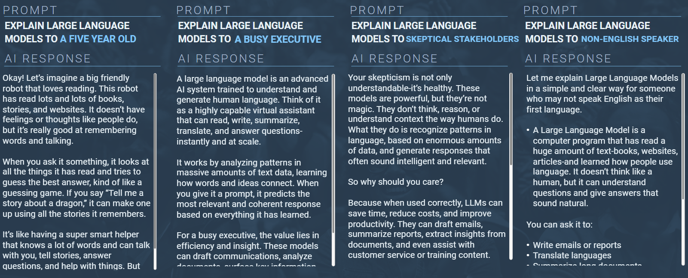

- Changing the tone, `changes there personality of the AI response`

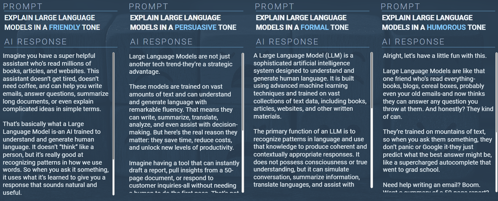

- When you take your prompts in unique or unexpected directions, the AI adjusts and can match whatever style , scenarios, or perspective you throw at it.
- Creative prompts lead to creative outputs, and the more imaginative your input, the more original and surprising the response will be
- This is key to using AI to think outside the box and enhance human creativity
- AI can spark fresh, inventive ideas, you might not have considered on your own and its only limited by your own imagination.

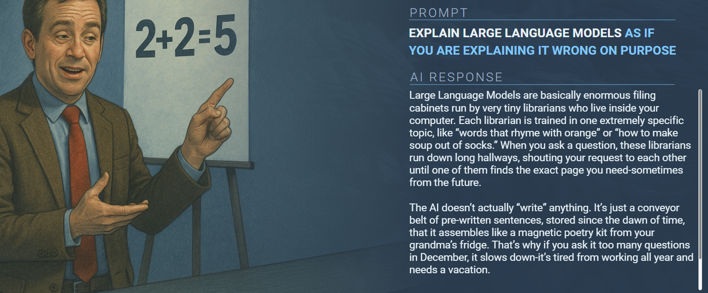

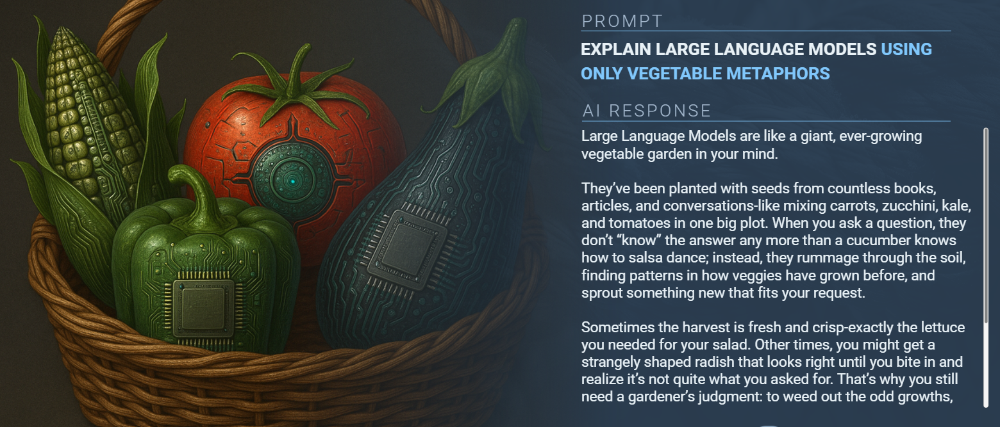

**🔁 Prompting Is a Creative, Iterative Process**

- You begin with a small shift in purpose — maybe a different goal, a new angle, or a refined question.
- Then you remix: adjust the audience, tweak the tone, add a twist. These changes help the AI better understand your intent and shape its response.
- Each iteration is an opportunity to learn, adapt, and guide the AI toward something more useful or insightful.
- These small changes in input can lead to dramatic differences in output — because prompting is a dynamic, responsive process.
- You set the direction, the AI responds, and you refine. That’s the rhythm of effective collaboration.

**✍️ Prompting: It’s Less Like Engineering, More Like Editing**

- Prompting isn’t about getting the input `perfect`.
- It’s `not a rigid formula` — it’s a `flexible`, `creative process`.
- Think of it `less` like `engineering` and `more` like `editing`.
- Your real job is to provide better `context`. That’s what helps the AI make smarter judgments and deliver more relevant results.
- Prompting can be as `simple` or as `complex` as the situation demands. What matters most is **how you shape the input** — pushing it to be deeper, sharper, and clearer. That’s the **power of iteration**.

**🔁 But Iteration Alone Isn’t Enough**

- You still need to ask: _Does this work for my team? My business?_
- AI can generate ideas, structure, and speed — but _it can’t replace your critical thinking_.
- You’re the one who turns the output into something `real`, something `valuable`.
- Don’t let AI become a substitute for your thinking. Instead, `think better with it`.

## Collaborative Processes

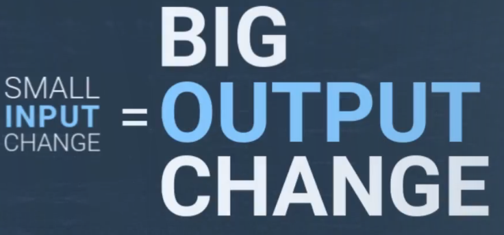

Let's learn simple method for crafting your prompts making it structure, clear from the start

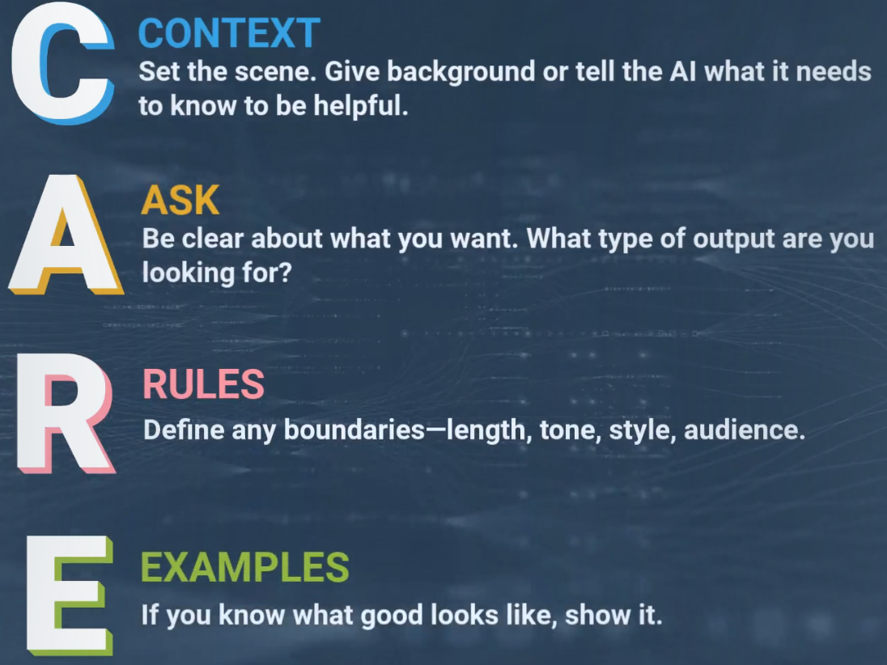

Eg.

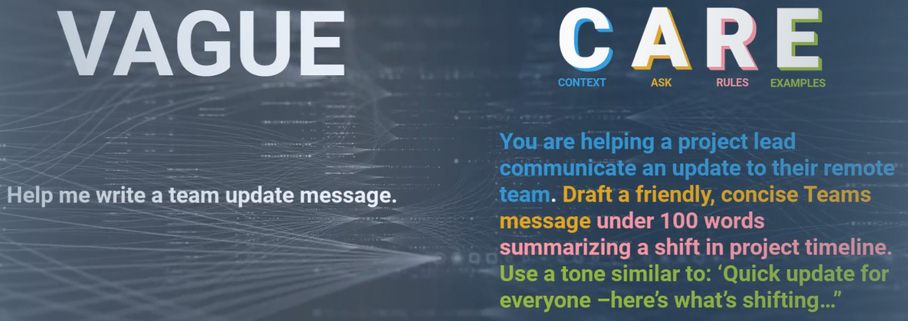

<op>

You are an insightful prompt coach and skilled at AI collaboration and iteration.
The user will provide a prompt in the variable {care_prompt}.
First, evaluate how well the prompt follows the CARE framework: Context – Does it provide enough background for the AI to understand the situation? Ask – Is the main request or question clear? Rules – Are there specific instructions, constraints, or requirements? Examples – Are there examples or models to guide the AI’s response?
Give constructive, to-the-point feedback for each element, highlighting strengths and offering specific suggestions for improvement when something is missing.
Second, generate a high-quality response to {care_prompt} so the user can see how the prompt might perform in practice.
Return your answer in this format: CARE Feedback [Feedback here]
Sample AI Response [Response here]
{care_prompt} = I’m leading a new cross-functional initiative involving engineering, product, and operations teams. the project is strategically important and requires early alignment across stakeholders, clarity on goals, and a shared understanding of execution priorities. the kickoff will span three days and should foster collaboration, trust, and momentum. Generate a detailed 3-day kickoff plan outline. each day should include:

- a thematic focus (e.g., vision, planning, execution)
- session titles and objectives
- suggested formats (e.g., workshops, breakout groups, presentations)
- expected outcomes and deliverables the plan should cover:
- stakeholder introductions and role clarity
- goal alignment and success metrics
- initial task planning and dependency mapping
- risk identification and mitigation
- tooling and communication setup. - use executive-ready language suitable for cross-functional leaders
- ensure each session has a clear purpose and outcome
- prioritize collaboration, clarity, and momentum
- make it adaptable for hybrid or remote teams
- avoid jargon; keep it accessible across disciplines
- structure the output for easy presentation or documentation. - day 1: vision & alignment
- welcome & stakeholder introductions
- project charter review
- success metrics workshop
- day 2: collaboration & planning
- team norms & working agreements
- task breakdown & ownership
- dependency mapping
- day 3: execution readiness
- risk planning & mitigation
- tooling setup & access
- next steps & checkpoint scheduling.

</op>

## Reverse Prompt Engineering

By now you have seen a well-structured prompt can dramatically shape the quality, tone and clarity of AI response.

But what if your could see the prompt behind the output, you need to flip the script i.e. reverse engineer the prompt

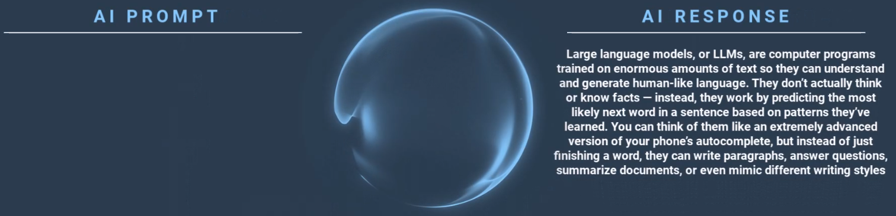

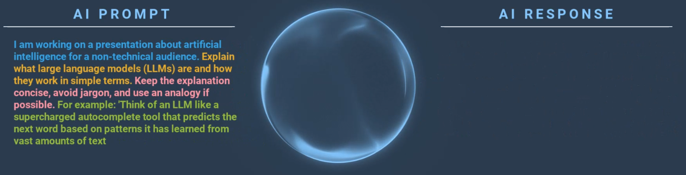

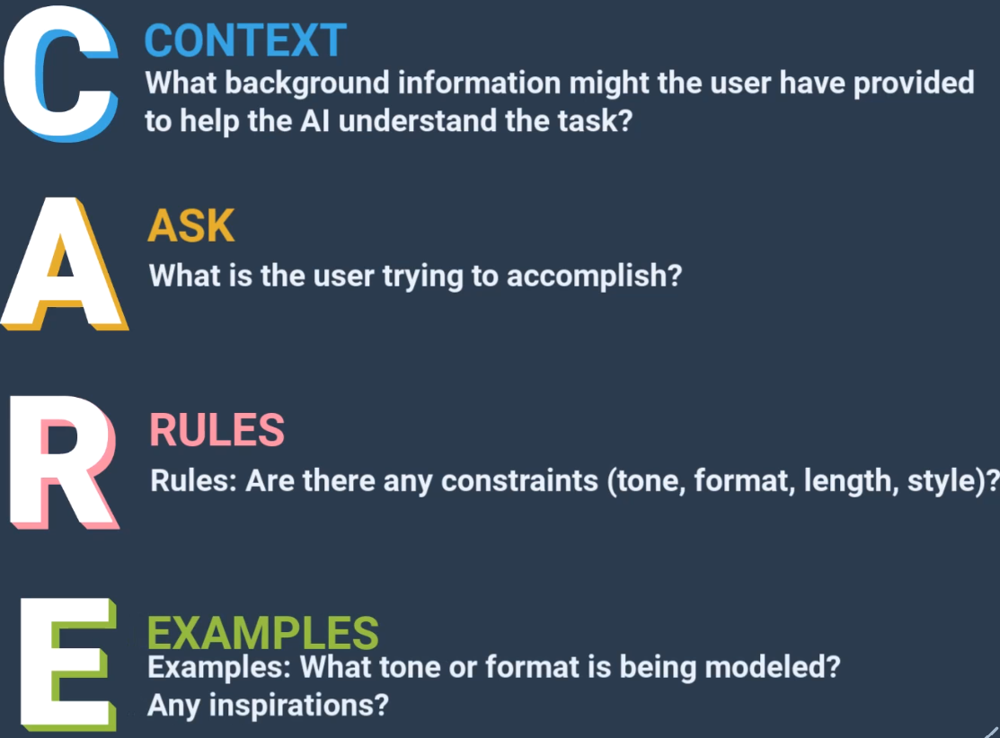

This kind of reverse prompt engineering helps you to:

- Notice how prompting influence AU output
- Practice identifying tone, format and intention
- Strengthen your intuition for shaping useful AI outputs

By now you move from _How that prompt works?_ to `I know why that prompt works.`

> Remember there is no silver bullet for prompting, it how you sharpen, deepen your input to get the accurate results

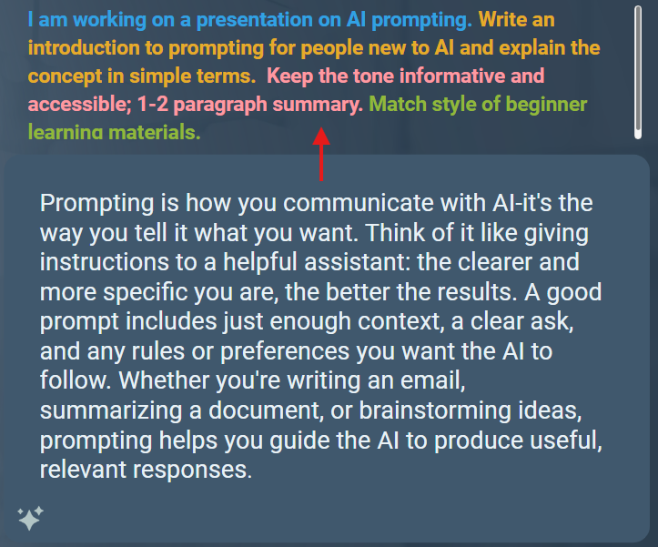

While `CARE` is one popular framework for prompting, there are other frameworks like

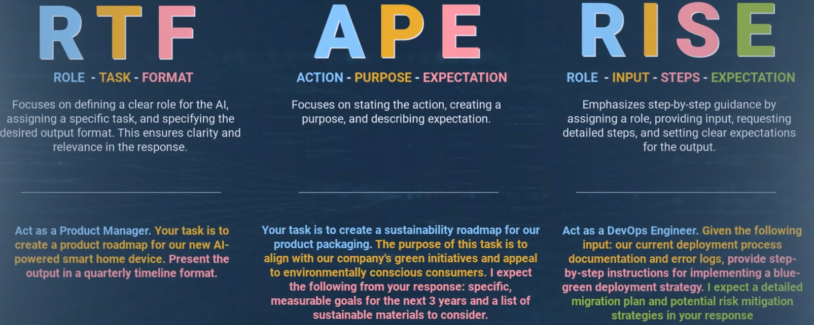

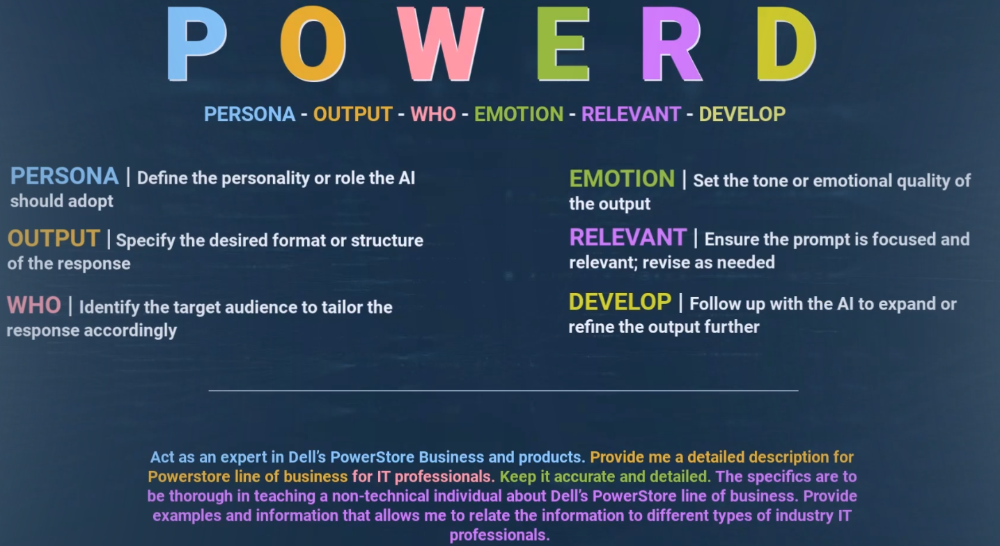

## Reducing hallucinations

- AI systems are improving at `reducing hallucinations`, but they still occur and likely will for the `foreseeable future`.
- Part of using `AI responsibly` means recognizing this and taking simple steps to `minimize` the `risk`.

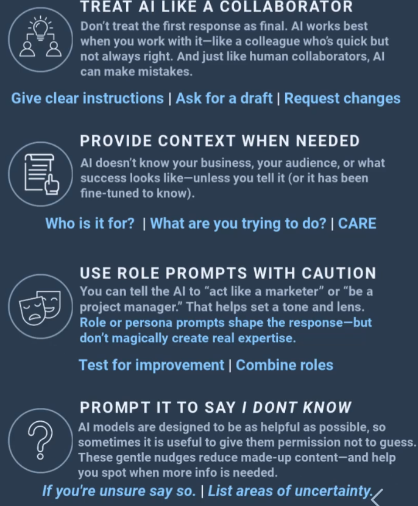

- For high-stacks or unfamiliar content, confirm with a trusted source.
- Don't assume the tone of authority equals truth.
- Let AI draft the outline, but you decide what's real.

> Use AI in your area of `expertise` or bring in an expert

- Hallucinations are easier to cache when you know the domain, Start with topics you understand well so that you spot errors faster.
- If you go outside your domain, loop-in SME

> Let the `AI` do the `Heavy lifting`, then let a `human` apply the `nuance`

- Hallucinations are not overcome by AI systems, that's why **Trust but Verify**
- No matter how smart an AI system get, your `context`, `expertise`, and `critical thinking` are what make the output truly `reliable`

## Data Protection

Tools that are not secure or approved risk exposing confidential business data.
for eg. summarizing details including new product launch details, product schemas, pricing, market share, etc using an AI tool that is not approved will come at risk of privacy, compliance and company reputation.

- Risks can be subtle and once data is outside firewall it can create risk.
- For internal work, there are approved tools, like copilot, etc
- Unapproved tools (such as public ChatGPT, BARD, etc) must never be used for Company Data, even if you think you've **anonymized** it

**Data Synthesis**
Synthesis is a safe-guard `within approved contexts`. Its purpose is to reduce exposure risk when you are working in `cleared tools`

Always ask your self, is the input data is ok to go public, before entering in. If answer is No, then you should not
