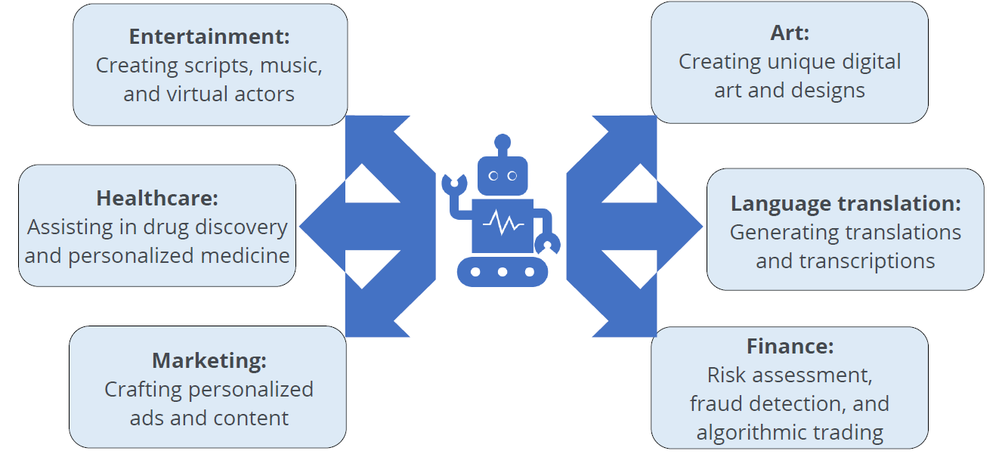

## Importance of GenAI

GenAI is a subset of AI that focuses on creating models capable of generating new content, such as text, images, music and more.

**Creativity and Innovation**

- Foster creativity and innovation.
- Creates novel content for various fields.
- Empowers content creatrs, designers and innovators.
- Drvies advancements in art, desing and product development

**Automation and Efficiency**

- Automates various tasks.
- Ehance efficiency, saves time and reduces costs.
- Excels in tasks like content generations and data analysis.
- Excels in busness finance and research.

**Personalization and Problem Solving**

- Tailors content to individual preferences.
- Enhances user experiences in various applications.
- Assist in complex problem-solving, such as healthcare.
- learns and adapts refining its capabilities.

**Industry Applications**

